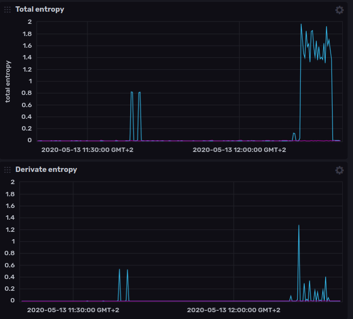

# Peng

A simple **port scanner detector** library, with focus on **lightweight memory** usage.

### Description 
`Peng` uses a probabilistic algorithm to detect if you're under a port scan attack. Right now, it **only detects tcp opening
connection** packets (SYN flag only).

### Idea

The general idea is to use the **minimum amount of memory**, to store information regarding a possible port scan threat. 
The **data structure** that fits the most for this task is the **bitmap**. This bitmap is **divided into** an arbitrary number of 
**bin**, which can store **information** about **requested ports**. 
After an amount of time specified by the user, `Peng` will **calculate** the **entropy** of each bin and return the total entropy 
of the entire bitmap. With this result **we can estimate if we were under a port scan attack.** 

### Implementation

The algorithm uses: `hash function`, `entropy` and a `bitmap` as the only data structure.

#### Hash function

Used to spread a port unevenly in the bitmap.

```go
func hash(port uint16) (uint16, uint64) {
    portModuled := (port / uint16(cfg.NumberOfBin)) % uint16(cfg.SizeBitmap)
    index, bit := portModuled/uint16(cfg.NumberOfBits), uint64(portModuled)%uint64(cfg.NumberOfBits)
    return index, bit
}
```

#### Entropy function


The implementation is a bit different. Before saving the entropy, there's a check on the number of bit set to 1
and the number of bit set at 0. ```If bitAt1 > bitAt0 then entropy = 2 - entropy```. With this little variation, we expand the
**range of entropy** from 0-1 to **0-2**. We can use this additional information to **understand how many bits** (hashed port) were
**filled in a specific bin** (2 = all bits set, 0 = no bits set).

[more info about entroy](https://rosettacode.org/wiki/Entropy) 

#### Bitmap data structure

The bitmap implementation is a slightly improved package made by [andy2046](https://github.com/andy2046/bitmap).

### Behavior

`Peng` after receiving a config struct will start **listening** at provided **network interface**. Each **packet** is **processed** by 
**inspection function**, that will add the port to the bitmap through the AddPort func call. After the user-configured 
**timeout** has triggered, `Peng` will **save** the data to **influxdb** and in a **csv file** (according to user configuration). 
**After** the **saving**, it will **reset** all the **bitmap** and **repeat** the entire **process until sigterm signal.**

### Note

- In order to use `peng` you have to run it with root privileges.
- `Peng` is a library which will add more user extensibility and generalization in future releases.
- User can also attach own hash function instead of default one, by simply pass their func in the creation of the 
PortBitmap.

## Requirements
`libpcap` `docker` and `influxDB 2.0`

#### Libpcap

##### Linux
`sudo apt-get install libpcap-dev`

##### Windows
install [winpcap](https://www.winpcap.org/install/default.htm)

#### Influx
##### Running on Docker

> ```$ docker run --name influxdb -p 9999:9999 quay.io/influxdb/influxdb:2.0.0-beta```

To use `influx` cli, console into the `influxdb` Docker container:

```$ docker exec -it influxdb /bin/bash```

For more information visit: <https://v2.docs.influxdata.com/v2.0/get-started/>

##### Running Influx on Linux Binaries (64-bit)

> ```
> $ wget https://dl.influxdata.com/influxdb/releases/influxdb_2.0.0-beta.8_linux_amd64.tar.gz
> $ tar xvfz influxdb_2.0.0-beta.8_linux_amd64.tar.gz
> ```

##### Running Influx on Linux Binaries (ARM)

> ```
> $ wget https://dl.influxdata.com/influxdb/releases/influxdb_2.0.0-beta.8_linux_arm64.tar.gz
> $ tar xvfz influxdb_2.0.0-beta.8_linux_arm64.tar.gz
> ```

## Binaries

You can find `peng` binaries on the release tag

## Dependencies

[gopacket](https://github.com/google/gopacket) used for snmp requests

```
go get github.com/google/gopacket
```

[influxdb-client](https://github.com/influxdata/influxdb-client-go) used for influxdb request

```
github.com/influxdata/influxdb-client-go
```

## Compile

```
$ go build ./cmd/main.go
```
## How to use

In order to use `peng` you have to run it with root privileges.

``` 
peng -timeFrame [1m] -bin [16] -size [1024] -bucket [my-influxdb-bucket] -org [my-influxdb-organization] -token [influxdb-auth-token] -verbose [0-3] -export [filepath] -network [interface-name]
```

Mandatory flags:
 - `network`

Default values:
 - host: `localhost`
 - influxUrl: `http://localhost`
 - influxPort: `9999`
 - size: `1024`
 - bin: `16`
 - timeFrame: `1m`
 - verbose: `1`
 
## Options

Type `$ peng -help`

```
Usage: sys-status [options]
  -bin uint
    	number of bin in your bitmap (default 16)
  -bucket string
    	bucket string for telegraf
  -export string
    	file path to save the peng result as csv
  -influxPort uint
    	influxPort number (default 9999)
  -influxUrl string
    	influx url (default "http://localhost")
  -interfaces
    	show the list of all your network interfaces
  -network string
    	name of your network interface
  -org string
    	organization string for telegraf
  -size uint
    	size of your bitmap (default 1024)
  -timeFrame string
    	interval time to detect scans. Number + (s = seconds, m = minutes, h = hours) (default "1m")
  -token string
    	auth token for influxdb
  -verbose uint
    	set verbose level (1-3)
  -version
    	output version

```

## Peng in action

Example of `Peng` run in a vps attacked with nmap.
 
`sudo ./peng -export example.csv -timeFrame 1m -verbose 1 -network ens3`

##### Console

```
[2020-05-12 21:59:23.470892594 +0200 CEST] [CLIENT] total entropy: 0.000000
[2020-05-12 21:59:23.472064964 +0200 CEST] [SERVER] total entropy: 0.034310
[2020-05-12 22:00:23.473281504 +0200 CEST] [CLIENT] total entropy: 0.000000
[2020-05-12 22:00:23.473341867 +0200 CEST] [SERVER] total entropy: 0.039592
[2020-05-12 22:01:23.473978497 +0200 CEST] [CLIENT] total entropy: 0.000000
[2020-05-12 22:01:23.474115757 +0200 CEST] [SERVER] total entropy: 0.031978
[2020-05-12 22:02:23.474697460 +0200 CEST] [CLIENT] total entropy: 0.000000
[2020-05-12 22:02:23.474774361 +0200 CEST] [SERVER] total entropy: 0.029029
[2020-05-12 22:03:23.475401756 +0200 CEST] [CLIENT] total entropy: 0.000000
[2020-05-12 22:03:23.475471083 +0200 CEST] [SERVER] total entropy: 0.029029
[2020-05-12 22:04:23.476088620 +0200 CEST] [CLIENT] total entropy: 0.000000
[2020-05-12 22:04:23.476893474 +0200 CEST] [SERVER] total entropy: 0.471501 <--- nmap -p 1024-4500
[2020-05-12 22:05:23.477620446 +0200 CEST] [CLIENT] total entropy: 0.000000
[2020-05-12 22:05:23.478184020 +0200 CEST] [SERVER] total entropy: 2.000000 <--- nmap -p 1-65535
[2020-05-12 22:06:23.479309923 +0200 CEST] [CLIENT] total entropy: 0.000000 
[2020-05-12 22:06:23.480428884 +0200 CEST] [SERVER] total entropy: 2.000000
[2020-05-12 22:07:23.481522728 +0200 CEST] [CLIENT] total entropy: 0.000000
[2020-05-12 22:07:23.482427633 +0200 CEST] [SERVER] total entropy: 2.000000 <--- nmap -p 1-65535
[2020-05-12 22:08:23.483598518 +0200 CEST] [CLIENT] total entropy: 0.000000
[2020-05-12 22:08:23.483668647 +0200 CEST] [SERVER] total entropy: 2.000000
[2020-05-12 22:09:23.484227734 +0200 CEST] [CLIENT] total entropy: 0.000000
[2020-05-12 22:09:23.484265740 +0200 CEST] [SERVER] total entropy: 0.044114
[2020-05-12 22:10:23.485277904 +0200 CEST] [CLIENT] total entropy: 0.000000
[2020-05-12 22:10:23.486417752 +0200 CEST] [SERVER] total entropy: 0.029029
```

##### Csv dump

|time|client|server|
|-|-|-|
|2020-05-12 21:59:23.470412091 +0200 CEST|0.000000|0.034310|
|2020-05-12 22:00:23.473068571 +0200 CEST|0.000000|0.039592|
|2020-05-12 22:01:23.473690964 +0200 CEST|0.000000|0.031978|
|2020-05-12 22:02:23.474517459 +0200 CEST|0.000000|0.029029|
|2020-05-12 22:03:23.475135393 +0200 CEST|0.000000|0.029029|
|2020-05-12 22:04:23.475877961 +0200 CEST|0.000000|**0.471501**|
|2020-05-12 22:05:23.477429489 +0200 CEST|0.000000|**2.000000**|
|2020-05-12 22:06:23.479014420 +0200 CEST|0.000000|**2.000000**|
|2020-05-12 22:07:23.481216162 +0200 CEST|0.000000|**2.000000**|
|2020-05-12 22:08:23.483284809 +0200 CEST|0.000000|**2.000000**|
|2020-05-12 22:09:23.484062181 +0200 CEST|0.000000|0.044114|
|2020-05-12 22:10:23.484760435 +0200 CEST|0.000000|0.029029|

##### Influx example



Data pushed every 15s

The first 2 spikes was done with (nmap -p 1024-4500) the last one with (nmap -p- ~468.39 seconds). You can see that in normal
condition we get a straight line, when a port scan is in action we see the spikes.

**Note:** The **higher** the **entropy = higher chance** of being **port scanned**. Remember that the entropy (used in `Peng`) range 
between 0 and 2. You should check the average entropy in normal circumstances and start alarming when you see the total 
entropy with high value.