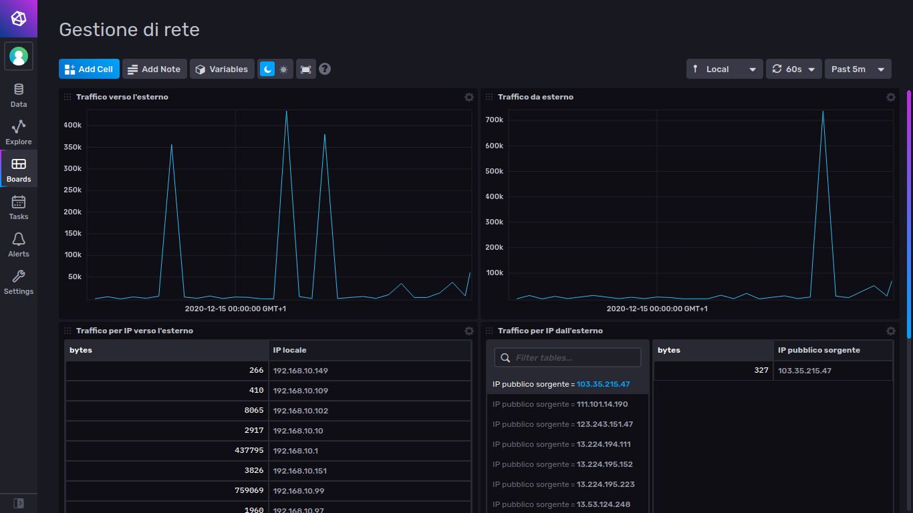

# Traffic Flow Collector - Ambrogini Alessandro

Traffic Flow Collector si occupa di collezionare i flussi netflow generati da router Mikrotik. 

Il software, oltre a collezionare i flussi in una struttura dati interna, li rende disponibili, attraverso una specifica Web API, sulla porta 8000 in formato JSON;

Utilizzando poi un DB InfluxDB sarà possibile raccogliere e visualizzare i dati in una dashboard.

Per elaborare i dati JSON resi disponibili dalla Web API, creare le metriche ed inviarle a InfluxDB si è scelto di utilizzare il software Telegraf.

In questo progetto si potranno trovare i files di configurazione di Telegraf e di InfluxDB nella cartella conf.

## Prerequisiti:

Traffic Flow Collector richiede l'installazione di python3 e dei seguenti moduli:
- python netflow library (https://pypi.org/project/netflow/)
- python netaddr library (https://pypi.org/project/netaddr/)
- python flask library   (https://flask.palletsprojects.com/en/1.1.x/)

Su Ubuntu è possibile installare i requisiti sopra elencati tramite i seguenti comandi da terminale:

        sudo apt install python3-pip
        
        pip3 install netflow

        pip3 install netaddr

        pip3 install Flask

Si richiede poi l'installazione di un DB InfluxDB e del software di collezione ed esportazione dati Telefraf

### InfluxDB https://portal.influxdata.com/downloads/

È necessario scaricare ed installare la versione 2 di InfluxDB, le istruzioni sulla pagina spiegano come procedere

### Telegraf https://docs.influxdata.com/telegraf/v1.16/introduction/installation/

Sulla pagina web vengono riportate le istruzioni per scaricare ed installare l'applicativo.

## Configurazione InfluxDB

Una volta installato il tutto, si potrà configurare InfluxDB.

Sarà necessario assicurarsi che il demone installato sia correttamente in esecuzione.
        
Sarà quindi possibile accedere all'interfaccia web disponibile sulla porta 8086 della macchina ove è stato installato.

Inserite le credenziali di accesso si dovrà creare un bucket di nome data ed organizzazione gr, dopodichè sarà possibile configurare la propria dashboard importando il file di configurazione (si trova nella cartella conf/InfluxDB/dashboard) e creare un token (se non già disponibile) da utilizzare con Telegraf.

## Configurazione Telegraf

Per configurare il software si dovrà copiare il file di configurazione di esempio(telegraf.conf) nel percorso specifico di Telegraf (su Ubuntu è /etc/telegraf/telegraf.conf), e modificare le seguenti sezioni: 

- sezione "outputs.influxdb_v2": si deve inserire il token prima generato.
- sezione "inputs.http": inserire l'indirizzo IP sulla quale sarà in esecuzione il collettore, questo per leggere i dati in formato JSON esposti della Web API per poi generare ed inviare le metriche ad InfluxDB.
- (opzionale) sezione "outputs.influxdb_v2": è possibile modificare l'indirizzo IP e porta della macchina ove risiede InfluxDB.

Per testare la configurazione è possibile usare il comando:

        telegraf -config /etc/telegraf/telegraf.conf -test

## Configurazione del router Mikrotik

Affinchè i dati netflow vengano inviati al collettore è necessario configurare il router Mikrotik come segue.

Attraverso l'utilizzo di WinBox o dell'interfaccia web è necessario:
- Attivare SNMP aprendo la specifica sezione sotto la voce del menu IP
- Attivare Traffic Flow aprendo la specifica sezione sotto la voce IP e quindi specificare:
    - l'indirizzo IP della macchina del collettore cliccando su Targets, avendo cura di selezionare la versione 9
    - le interfacce di riferimento adeguate nel target
    - selezionare tutti i campi nel tab IPFIX

## Configurazione del Traffic Flow Collector

Prima di eseguire il collettore si devono specificare la network locale (utile per identificare gli indirizzi IP della LAN) e l'indirizzo IP pubblico (utile per tracciare le richieste che provengono dall'esterno).

Per fare ciò è necessario modificare le variabili nel file modules/config.py:
- localNet
- myPublicIP

## Esecuzione
Una volta configurato il sistema sarà possibile eseguire il collector spostandosi nella cartella del progetto ed eseguendo (una volta dato i permessi di esecuzione al file):

        ./trafficflow_collector.py

Se non è stato impostato come demone in avvio automatico, sarà necessario poi eseguire il client Telegraf per esportare i dati esposti dal collezionatore.

        telegraf

In output dal collettore troveremo alcune informazioni utili per comprendere:
1. Se i pacchetti netflow provenienti dal router non risultano decodificabili (mancanza di template della v9)
2. Le richieste effettuate alla Web API da parte di Telegraf

Telegraf infatti, ogni minuto, attingerà ai dati sulla Web API e li invierà al DB; sarà quindi possibile visualizzare la dashboard su InfluxDB attraverso l'apposita sezione presente nell'interfaccio web

