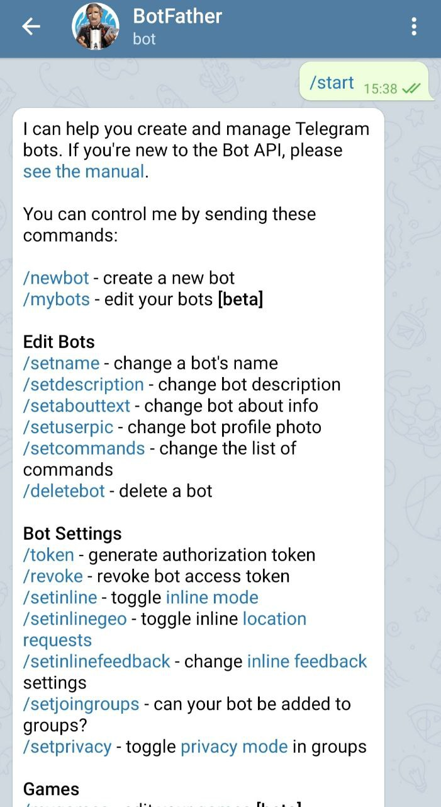
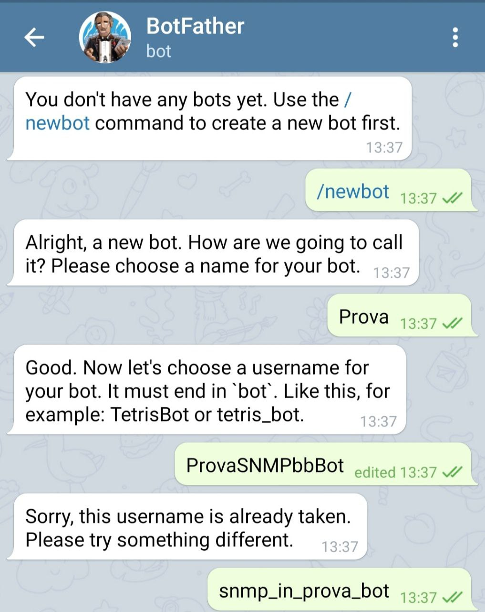

# GRProject
University project for Gestione di Reti

## What is it
A Telegram bot from which we can monitor an snmp agent in remote.
It's possibile to get CPU, RAM, Disk, Download and Upload stats, change hostname, community and version, to be able to get info of whichever agent we want.
Moreover it can store data of the agent into local files and it's possible to get graphs from it.

## Prerequisite
For the program to run correctly, it requires:
- python3: obtainable in linux version with command `sudo apt-get install python3`
- telepot: obtainable in linux version with command `pip3 install telepot`
- emoji: obtainable in linux version with command `pip3 install emoji`
- easysnmp: obtainable in linux version with command `pip3 install easysnmp`
- psutil: obtainable in linux version with command `pip3 install psutil`
- rrdtool: obtainable in linux version with command `pip3 install rrdtool`

## Installing
- On Telegram: 
    start a conversation with `@BotFather` to create a new bot. Take the token and save it on your pc, it's very important. After that, start a new conversation on telegram using the tag choosen for your new bot, or use it to add the bot to a telegram group. Before starting to send message to your bot you need to follow the guide on your server.
    Example:
    - write /start command to `@BotFather` chat:
    
    - write /newbot command to `@BotFather` chat to create a new bot and choose the name for the bot.
    
    - take to token and save it on your pc.
    
    
- On your Server:
    download the github repository, and go into `/bot` directory and insert the token of your bot inside the file `bot_main.py` (line 30, from `token = '11111111'`, to `token = 'new_token'`). After that, if you want to change the password (highly recommended), run the script `./change_password.py old_password new_password` to change the password of the bot (the default password is: gestionedireti). Now run the script `./bot_main.py` and the bot will start.   Now you have to invite the bot into a chat in Telegram and call for him with `/start` and you are done!  
    The default info to find the snmp agent are:
    - hostname: localhost
    - community: public
    - version: 1 

- Search on telegram the bot to start the conversation after running the bot_main script on your server.

    
### Notes 
You can change the password whenever you want, but when you do it, you have to reboot the actual `./bot_main.py` in execution  for the changes to take place.

To change the default snmp agent info you can use the options of the bot from Telegram:
- `/sethost <new_host>`
- `/setcommunity <new_community>`
- `/setversion <new_version>` (only version 1 and 2 are supported)

For more info abount the code you can check the documentation under `bot/docs/_build/html/index.html`

### Examples
- Login:

- Command list:

- Settings:

- Start Monitoring:

- Stop Monitoring:

- Graph:

### Authors:
- Nicolò Maio
- Matteo Biscosi
