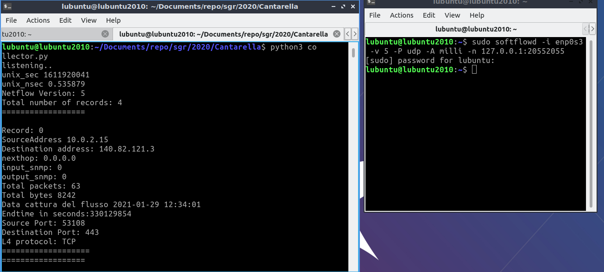

# netflow

GRPROJECT

University project for Gestion Reti

---------------------------------------------------------------------------------------------------------------------------------
WHAT IS IT

Questo progetto si occupa di catturare flussi netflow in versione 5 sulla propria rete tramite softflowd ed esportarli presso un collector scritto in python, successivamente i flussi vengono ispezionati e caricati su un'istanza di clickhouse-server avviata sulla propria macchina ed infine si possono 
eseguire delle queries per andare a verificare che tipo di traffico abbiamo generato.

---------------------------------------------------------------------------------------------------------------------------------
PREREQUISITE

CLICKHOUSE:

scaricare e installare clickhouse sulla propria macchina eseguendo questi passi:

From DEB Packages

It is recommended to use official pre-compiled deb packages for Debian or Ubuntu. Run these commands to install packages:

sudo apt-get install apt-transport-https ca-certificates dirmngr sudo apt-key adv --keyserver hkp://keyserver.ubuntu.com:80 --recv E0C56BD4

echo "deb https://repo.clickhouse.tech/deb/stable/ main/" | sudo tee
/etc/apt/sources.list.d/clickhouse.list sudo apt-get update

sudo apt-get install -y clickhouse-server clickhouse-client

sudo service clickhouse-server start clickhouse-client

SOFTFLOWD:

sudo apt-get install -y softflowd

--------------------------------------------------------------------------------------------------------------------------------
USAGE

Prima di lanciare il collector eseguire il file create_table.py per creare la tabella su cui verranno salvati i flussi.

Per Lanciare lo script python collector.py e' necessario scaricare il folder unpacker in quanto contiene un modulo necessario per il funzionamento del collector.

lanciare softflowd da terminale con i seguenti parametri:

softflowd -i [inserire una interfaccia di rete dalla quale 'sniffare i flussi'] -v 5 -P udp -A milli -n 127.0.0.1:2055

Successivamente si possono eseguire delle queries come quelle di esempio nel file Queries.txt direttamente da linea di comando.

Di seguito si possono osservare delle immagini a scopo dimostrativo di come lanciare e come dovrebbe apparire il tutto una volta eseguiti i precedenti passi:

