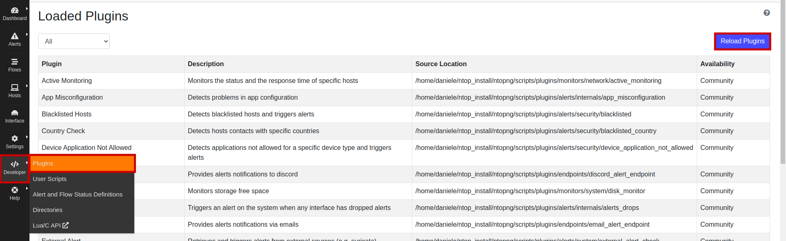
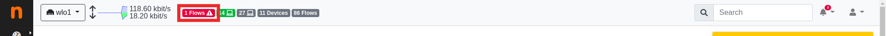
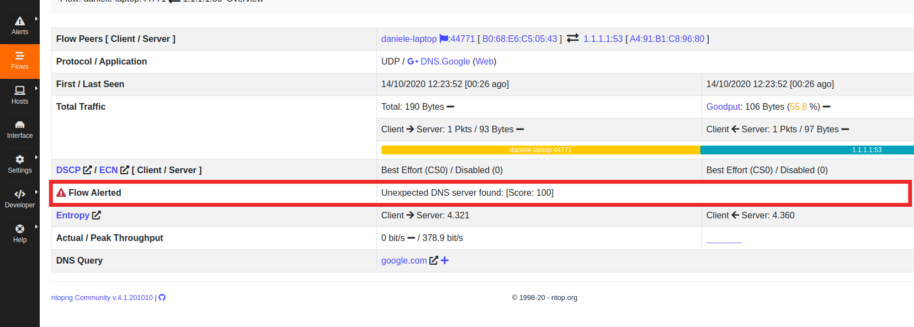
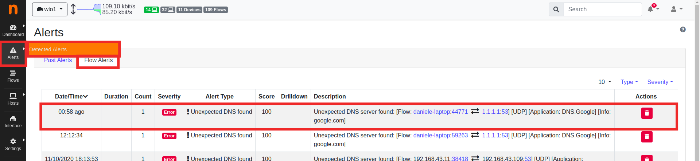

# Write a ntopng Plugin: Detect not Allowed DNS Servers (Ubuntu)

In ntopng you can write plugins to exend it with custom features. Suppose we want to create a plugin that throws an alert when a flow to an unexpected DNS server is found.

These are the steps to implement the plugin:

## Step 1: Create the plugin folder

ntopng stores plugins under ```<installation dir>/scripts/plugins```, the plugins are grouped in [categories](https://github.com/ntop/ntopng/blob/dev/scripts/plugins/README.md), in this case ```alerts/security``` is the correct one. So let's create our folder ```unexpected_dns```, this folder contains all the plugin's sources and configurations.

```sh
$ cd <installation dir>/scripts/plugins/alerts/security
$ mkdir unexpected_dns
```

## Step 2: Create the manifest.lua

```manifest.lua``` contains basic plugin information such as name, description and version. It must return these information with a Lua table:

``` lua
return {
    title = "Unexpected DNS",
    description = "Trigger an alert when an unexpected DNS server is detected",
    author = "Daniele Zulberti, Luca Argentieri",
    dependencies = {},
}
```

Table keys are:

- ```title```: The title of the plugin. This is used within the ntopng web GUI to identify and configure the plugin.
- ```description```: The description of the plugin. This is used within the ntopng web GUI to provide a plugin description to the user.
- ```author```: A string indicating the name of the author of the plugin.
- ```dependencies```: A Lua array of strings indicating which other plugins this - plugin depends on. The array can be empty when the plugin has no dependencies.

Now, in the web GUI, under ```Developer/Plugins``` click on ```Reload Plugins``` button. If it's all ok you should see ```Unexpected DNS``` in the plugin list.

Plugins page:



Unexpected DNS plugin raw:


## Step 3: Plugin logic

The main part of the plugin it's under ```user_scripts```. Every plugins can run scripts for [differt traffic elements](https://www.ntop.org/guides/ntopng/plugins/user_scripts.html#other-user-scripts). This script need to analyze flows, so you must tell to ntopng that by creating ```user_script/flow``` folder:

``` sh
$ mkdir -p user_scripts/flow
```

Now we can start to write some code.

Move in ```user_script/flow``` and create ```unexpected_dns.lua```, the file name **must be** the same as the plugin root directory.

``` lua 
local script = {
   -- Script category
   category = , 

   -- Priority
   prio = ,

   -- NOTE: hooks defined below
   hooks = {},

   -- use this plugin only with this protocol
   l7_proto_id = ,

   -- Specify the default value whe clicking on the "Reset Default" button
   default_value = {
      items = {},
   },

   gui = {
     
   }
}

return script
```

The ```script``` variable contains the configuration of the script. It's a Lua table where ```category```, ```priority```, ```hooks```, ```l7_proto_id```, ```default_value``` and ```gui```, are some of the [script table keys](https://www.ntop.org/guides/ntopng/plugins/user_scripts.html#structure).

- ```category```: specify the category of the scripts, our is under ```security```, so you shuold set the value to ```user_scripts.script_categories.security``` (note that the root directory of the plugin is under ```alerts/security```).

- ```priority```: Is a number rappresenting the script execution priority, the default priority is 0, lower number have less priority.

- ```hooks```: a Lua table with hook names as key and callbacks as values. [User Script Hooks](https://www.ntop.org/guides/ntopng/plugins/user_script_hooks.html#user-script-hooks) are events or points in time. ntopng uses hooks to know when to call a user script. A user script defining a hook will get the hook callaback called by ntopng. User scripts must register to at least one hook. For our purpose ```protocolDetected``` it's enough, the script runs only when the DNS protocol is detected in a flow. The hooks are defined below the ```script``` table definition: 
``` lua
local script = { ... }

-- #################################################

function script.hooks.protocolDetected(now, conf)
   io.write("DNS Protocol Detected\n")
end
```

- ```l7_proto_id```: only execute the script for flows matching the L7 application protocol. Set it to ```5```, the DNS ID.

- ```default_value```: the default value for the script configuration. See [User Scripts GUI](https://www.ntop.org/guides/ntopng/plugins/user_script_gui.html#web-gui). There is no default configuration for DNS servers, you can set it later in the web GUI configuration page of the script.

- ```gui```: a Lua table specifying user script name, description and configuration. Data is used by ntopng to show the user script configurable from the [User Scripts GUI](https://www.ntop.org/guides/ntopng/plugins/user_script_gui.html#web-gui). Set it as follow: 
``` lua
gui = {
      i18n_title        = "unexpected_dns.unexpected_dns_title",
      i18n_description  = "unexpected_dns.unexpected_dns_description",

      input_builder     = "items_list",
      item_list_type    = "string",
      input_title       = i18n("unexpected_dns.title"),
      input_description = i18n("unexpected_dns.description"),
   }
```

```unexpected_dns.unexpected_dns_title```, ```unexpected_dns.unexpected_dns_description```, ```unexpected_dns.title```, ```unexpected_dns.description``` are localization keys. if the variable name have i18n suffix like ```i18n_title``` ntopng automatically converts that localization keys to the current user language otherwise you can force it using the ```i18n()``` function. The localization keys are stored under ```<plugin root directory>/locales```, and every language have the own file, for example the english language have the ```en.lua``` file. See [Localization](https://www.ntop.org/guides/ntopng/plugins/localization.html).

Create the ```locales``` directory:

``` sh
$ cd ../..
$ mkdir locales
```

and the ```en.lua```:
``` lua
return {
   unexpected_dns_description = "Trigger an alert when not allowed DNS server is detected",
   unexpected_dns_title = "Unexpected DNS",
   title = "Allowed DNS",
   description = "Comma separated values of allowed DNS IPs. Example: 8.8.8.8,8.8.4.4,1.1.1.1",
   status_unexpected_dns_description = "Unexpected DNS server found:",
   alert_unexpected_dns_title = "Unexpected DNS found"
}
```
Now you can test it reloading the plugin, and exuecuting ```dig google.com @1.1.1.1``` in the shell, ```dig``` is a usefull tool for interrogating DNS name servers. 

``` sh
$ dig google.com @1.1.1.1

; <<>> DiG 9.16.1-Ubuntu <<>> google.com @1.1.1.1
;; global options: +cmd
;; Got answer:
;; ->>HEADER<<- opcode: QUERY, status: NOERROR, id: 33360
;; flags: qr rd ra; QUERY: 1, ANSWER: 1, AUTHORITY: 0, ADDITIONAL: 1

;; OPT PSEUDOSECTION:
; EDNS: version: 0, flags:; udp: 1232
;; QUESTION SECTION:
;google.com.			IN	A

;; ANSWER SECTION:
google.com.		168	IN	A	216.58.209.46

;; Query time: 23 msec
;; SERVER: 1.1.1.1#53(1.1.1.1)
;; WHEN: mer ott 14 12:23:52 CEST 2020
;; MSG SIZE  rcvd: 55
```

Then take a look to the shell where you've launched ntopng, you should see a line saying ```DNS Protocol Detected```.

Obviously write a line in the shell is not our goal. We want the script to trigger an alert when a not allowed DNS request is detected, to do so we need to add alert and status definitions, and then change the hook code.

## Step 4: Define alert definition

A plugin enables alerts to be generated. All the alerts a plugin is willing to generate require a file in plugin subdirectory ```<plugin root directory>/alert_definitions/```. The file contains all the necessary information which is required to properly show, localize and format an alert. The name of the file has this format: ```alert_plugin_name.lua```, in our case: ```alert_unexpected_dns.lua```

The file must return a Lua table with the following keys:

- ```alert_key```: A constant uniquely identifying this alert.
- ```i18n_title```: A string indicating the title of the alert.
- ```i18n_description``` (optional): Either a string with the alert description or a function returning an alert description string.
- ```icon```: A Font Awesome 5 icon shown next to the i18n_title.
- ```creator``` (optional): this function creates the alert and prepares a JSON.

The ```alert_key``` is a constant uniquely identifying the alert. Constants are available in file ```<installation dir>/scripts/lua/modules/alert_keys.lua```. The file contains a table ```alert_keys``` with two sub-tables:

- ```ntopng```
- ```user```

Plugins distributed with ntopng must have their ```alert_key```s defined in sub-table ```ntopng```. User plugins must have their ```alert_key```s defined in sub-table ```user```.

Sub-tables can be extended adding new alert_key s to either the ```ntopng``` or the ```user``` table. Each ```alert_key``` has an integer number assigned which must be unique.

Alert description ```i18n_description``` can be either a string with the alert description or a function returning an alert description string. See [Alert Definitions](https://www.ntop.org/guides/ntopng/plugins/alert_definitions.html#alert-description).

```alert_unexpected_dns.lua```:
``` lua
local alert_keys = require ("alert_keys")

-- #################################################

local function createUnexpectedDNS(alert_severity, dns_info)
    local built = {
        alert_severity = alert_severity,
        alert_type_params = dns_info 
    }

    return built
end

-- #################################################

return {
    alert_key = alert_keys.ntopng.alert_unexpected_dns_server,
    i18n_title = "unexpected_dns.alert_unexpected_dns_title",
    icon = "fas fa-exclamation",
    creator = createUnexpectedDNS,
}
```

The ```createUnexpectedDNS``` function has many parameters as you need. Our are:
- ```alert_severity```: tells ntopng the severtity of the alert, one of {info, warning, error}. We set it in the status definition.
- ```alert_type_params```: the value will go in the JSON file.

## Step 5: Define status definition

A plugin enables one or more statuses to be set on certain flows. A flow can have multiple statuses set and statuses can be associated to alerts. Flow statuses must be defined in plugin sub-directory ```<plugin root directory>/status_definitions/``` and they are set calling ```flow.triggerStatus```. In the next step you can see the final code for ```unexpected_dns.lua```. Definition is done using a Lua files, one file per status. The name of the file has this format: ```status_plugin_name.lua```, in our case: ```status_unexpected_dns.lua```

A flow status definition file must return a Lua table with the following keys:

- ```status_key```: A constant uniquely identifying this status.
- ```i18n_title```: A string indicating the title of the status.
- ```i18n_description (optional)```: Either a string with the flow status description or a function returning a flow status description string.
- ```alert_type (optional)```: When an alert is associated to the flow status, this key must be present. Key has the structure ```alert_consts.alert_types.<an alert key>```, where ```<an alert key>``` is the name of a file created in Alert Definitions, without the ```.lua``` suffix.
- ```alert_severity (optional)```: When an alert is associated to the flow status, this key indicates the severity of the alert. Key has the structure ```alert_consts.alert_severities.<alert severity>```, where ```<alert severity>``` is one among the available alert severities.

```status_unexpected_dns.lua```:
``` lua
local alert_consts = require("alert_consts")
local status_keys = require ("flow_keys")

return {
    status_key = status_keys.ntopng.status_unexpected_dns_server,
    alert_severity = alert_consts.alert_severities.error,
    alert_type = alert_consts.alert_types.alert_unexpected_dns,
    i18n_title = "unexpected_dns.unexpected_dns_title",
    i18n_description = "unexpected_dns.status_unexpected_dns_description",
}
```

At the end this should be the plugin directory tree :
``` sh 
unexpected_dns/
├── alert_definitions
│   └── alert_unexpected_dns.lua
├── locales
│   └── en.lua
├── status_definitions
│   └── status_unexpected_dns.lua
├── user_scripts
│   └── flow
│       └── unexpected_dns.lua
└── manifest.lua
```

## Step 6: Change and finish the script file

Now we can modify the hook in ```unexpected_dns.lua``` to detect the not allowed DNS servers.

```lua
function script.hooks.protocolDetected(now, conf)
   if(table.len(conf.items) > 0) then
      local ok = 0
      local flow_info = flow.getInfo()
      local server_ip = flow_info["srv.ip"]
      
      for _, dns_ip in pairs(conf.items) do
         if server_ip == dns_ip then
            ok = 1
            break
         end
      end
      
      if ok == 0 then
         flow.triggerStatus(
            flow_consts.status_types.status_unexpected_dns.create(
               flow_consts.status_types.status_unexpected_dns.alert_severity,
               server_ip
            ),
            100, -- flow_score
            0, -- cli_score
            100 --srv_score
         )
      end
   end
end
```

The parameters of the hook are:
- ```now```: An integer indicating the current epoch.
- ```conf```: A table containing the user script configuration submitted by the user from the [User Scripts GUI](https://www.ntop.org/guides/ntopng/plugins/user_script_gui.html#web-gui). Table can be empty if the script doesn not require user-submitted configuration.

The ```if``` statement checks if there are allowed DNS server setted by the user in the GUI. With ```flow.getInfo()``` we can retrieve the server ip by accessing the Lua table that the function returns. 

We can simply scan the table and compare the value with the server ip. We can break as soon as a match is found. If there aren't any match we call ```flow.triggerStatus``` with this parameters:
- ```flow_consts.status_types.status_unexpected_dns.create```: this is the ```createUnexpectedDNS``` function defined in the alert definition, so we pass the alert severity and the server ip.
- ```flow_score```, ```cli_score```, ```srv_score```: score goes from 0 to 100 and represent the relevance of the flow, the client and the server.


## Test the final script

Now the plugin is ready to run. Reload the plugins and configure a list of DNS to test it:
- go under ```Settings/User Scripts/```
- click on the ```Flows``` tab
- click on the ```edit``` button.


- search the plugin in ```All``` tab by using the search box in the upper right corner.
- click on edit


- Insert the IP list in CSV format in the input box.
- click ```Apply```


Now launch the ```dig``` command as done before. You shold see a flow alert in the top bar near the local devices icon.



In the info of the alerted flow you can find the ```Flow Alerted``` raw saying: 	```Unexpected DNS server found: [Score: 100]```.



To check if an alert was triggered follow this setps:
- go under ```Alerts/Detected Alerts/```
- click the ```Flow Alerts``` tab



you should see a line with the unexpected DNS alert description.

## Conclusions

The plugin is complete and working. See the [Documentation](https://www.ntop.org/guides/ntopng/) for further information about ntopng and the plugins development.
