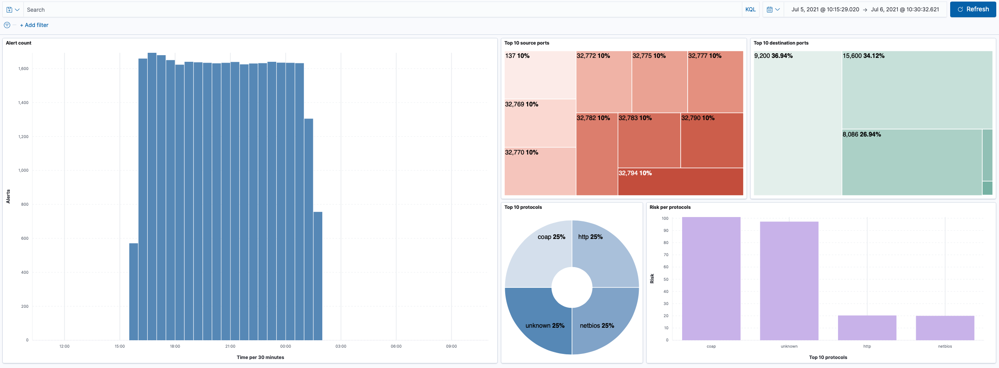

# Kibana dashboard and Elasticsearch for Ntopng alerts
## Introduction
Using Kibana dashboard help users to easely visualize alerts statistics generated by Ntopng like: the number of alerts generated, the risk score per protocol and other metrics.
## Installation
You need the following softwares:
1. Ntopng
2. Elasticsearch
3. Kibana
<br/>
You can install them as follows:

#### On MacOs:
Using homebrew<br/>
```bash
brew install ntopng
```
you can check if Ntopng is running clicking on this [link](http://localhost:3000) or typing in browser localhost:3000, if it's not running then type the command:
```bash
brew services start ntopng
```

So you can access to Ntopng dashboard as in the run check.

Then using docker via CLI, you have to create an Elasticsearch instance:
```bash
docker network create elastic
docker pull docker.elastic.co/elasticsearch/elasticsearch:7.13.3
docker run --name elasticsearch --net elastic -p 9200:9200 -p 9300:9300 -e "discovery.type=single-node" docker.elastic.co/elasticsearch/elasticsearch:7.13.3
```
Now the Elasticsearch instance is created and running, now create a Kibana instance and bind it to Elasticsearch

```bash
    docker pull docker.elastic.co/kibana/kibana:7.13.3
    docker run --name kibana --net elastic -p 5601:5601 -e "ELASTICSEARCH_HOSTS=http://elasticsearch:9200" docker.elastic.co/kibana/kibana:7.13.3
```
You can access to Kibana dashboard on  this [link](http://localhost:5601) or typing in browser localhost:3000.

Now all the required softwares are installed and running.

## How to forward alerts
To forward alerts from Ntopng to Elasticsearch you need to create a dedicated endpoint, selecting as interface "System" and then going to Notification/Endpoint and click on "+" button, you have to specify the type of endpoint and other information depending on which type you choose, i.e. for Elasticsearch you have to insert the url of the Elasticsearch server and eventually a username and password. Then you have to bind it creating a recipient, you can do that going to Notification/Recipient and click on "+" button, then you need to type the name for the recipient, select the endpoint, type a name for index and the level of serverity of alerts you want to forward to that recipient. After that you can test if forwarding works correctly hitting the test button in the recipient configuration page, if all works great then you can save and go ahead.
After configuring Ntopng you have to create the dashboard in Kibana. First you should go from the side menu in Stack Management/Index Patterns and select one of the index specified during the recipient configuration, then keep going creating a new dashboard in Kibana/Dashboard and click on "Create dashboard", select now the index pattern you want to use and create all "lens" in your dashboard with all information stored in the selected index.
## Dashboard example
