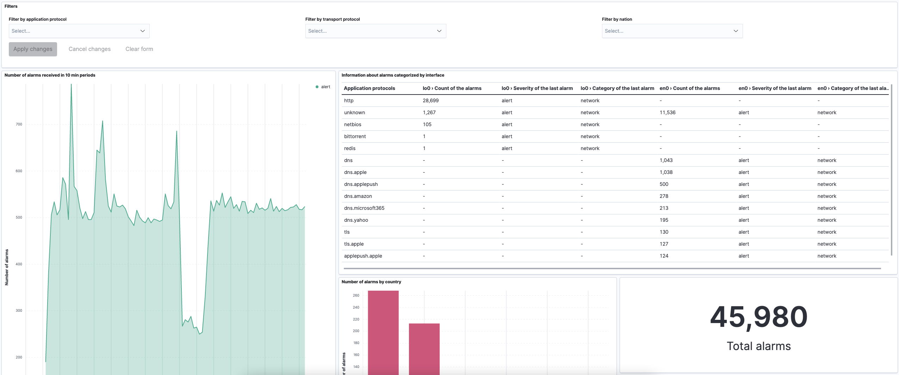

# Kibana dashboard and Elasticsearch for Ntopng alerts
## Introduction
Using the Kibana dashboard helps users to easily visualize alerts statistics generated by Ntopng as the number of alerts generated, the risk score, and other metrics.
## Installation
You need to install the following software:
1. Ntopng
2. Elasticsearch
3. Kibana
<br/>
You can install them as follows:

#### On MacOs:
Using homebrew<br/>
```bash
brew install ntopng
```
you can check if Ntopng is running by clicking on this [link](http://localhost:3000) or by typing in browser localhost:3000, if it's not running then type the command:
```bash
brew services start ntopng
```

So you can access the Ntopng dashboard as in the run check.

Then using docker via CLI, you have to create an Elasticsearch instance:
```bash
docker network create elastic
docker pull docker.elastic.co/elasticsearch/elasticsearch:7.13.3
docker run --name elasticsearch --net elastic -p 9200:9200 -p 9300:9300 -e "discovery.type=single-node" docker.elastic.co/elasticsearch/elasticsearch:7.13.3
```
The Elasticsearch instance is created and running, let's create a Kibana instance and bind it to Elasticsearch

```bash
 docker pull docker.elastic.co/kibana/kibana:7.13.3
 docker run --name kibana --net elastic -p 5601:5601 -e "ELASTICSEARCH_HOSTS=http://elasticsearch:9200" docker.elastic.co/kibana/kibana:7.13.3
```
You can access to Kibana dashboard on this [link](http://localhost:5601) or by typing in browser localhost:3000.

 Now all the required software are installed and running.

## How to forward alerts
To forward alerts from Ntopng to Elasticsearch you need to create a dedicated endpoint, selecting as interface "System" and then going to Notification/Endpoint and click on the "+" button, so you have to specify the type of endpoint and other information depending on which type you choose (e.g. for Elasticsearch you have to insert the URL of the Elasticsearch server and eventually a username and password). Then you have to bind it creating a recipient, you can do that by going to Notification/Recipient and click on the "+" button, then you need to type the name for the recipient, select the endpoint, type a name for index, and the level of severity of alerts you want to forward to that recipient. After that, you can test if forwarding works correctly by hitting the test button on the recipient configuration page, if all works, then you can save and go ahead.
After configuring Ntopng you have to create the dashboard in Kibana. First, you should go, from the side menu, in Stack Management/Index Patterns and select one of the indexes specified during the recipient configuration, then keep going creating a new dashboard in Kibana/Dashboard and click on "Create dashboard", pick now the index pattern you want to use and create all "lens" in your dashboard with all information stored in the selected index.
## Index variables example

## Dashboard example


On top of the dashboard, I created a filter "lens" that enables the user to easily filter the event's statistics by application/transport protocol or by nation. 