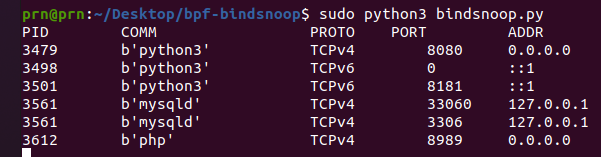

# bindsnoop

Trace bind() syscall

### Description

Trace IPv4 and IPv6 (both TCP and UDP) bind attempts. Performs dynamic tracing of the kernel syscalls **inet_bind()** and **inet6_bind()** using eBPF.
\
Output is as follows:



Returns pid, task name, protocol, port and address of the bound socket.

Tested on Ubuntu 20.04.3 LTS Server

### Requirements

Need a modern eBPF-enabled Linux distribution.  
Prerequisites can be installed as follows:
```sh
sudo apt-get install python3 python3-bpfcc build-essential autoconf automake autogen libjson-c-dev pkg-config libzmq3-dev libcurl4-openssl-dev libbpfcc-dev
```
### Run

Run the tool (as superuser):
```sh
sudo python3 bindsnoop.py
```
