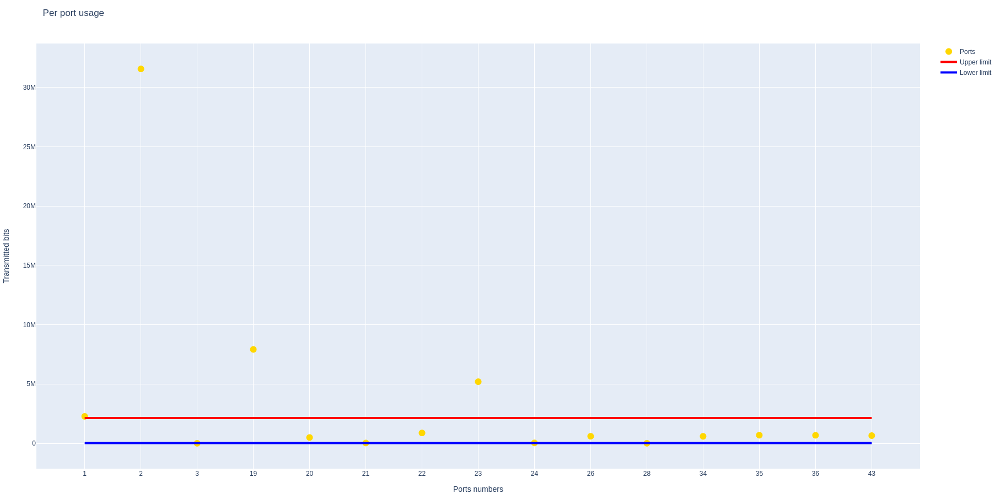
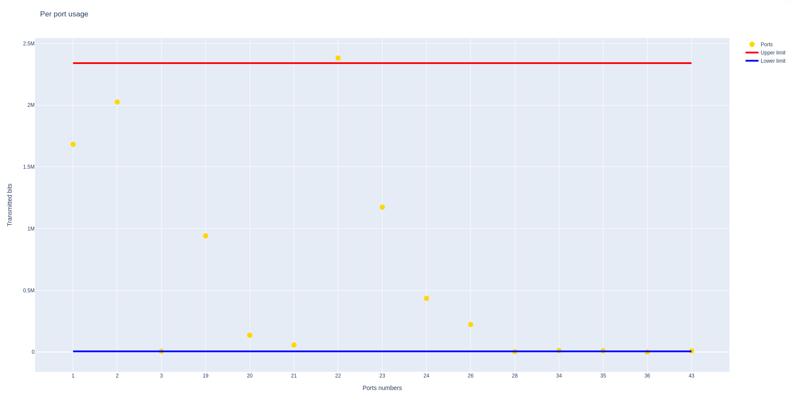

# FindOutlier
Progetto finale di Gestione di Reti a.a. 2020/2021

* Its aim is to find the outlier ports for a given switch, by using the transimitted amount of bits in a certain period of time.

### Pyhton Dependencies
* [easysnmp](https://pypi.org/project/easysnmp/)
* [plotly](https://plotly.com/python/getting-started/)

(The libraries below are used but are part of the Python Standard Libraries, so there is no need to install them)
* time
* sys
* ipaddress
* math

### Requirements
* Python 3.x
* [SNMP](https://martinsblog.dk/linux-how-do-i-enable-snmp-on-ubuntu/) -> NOTE: this link helps you install snmp on Ubuntu, for any other OS you must look for the correct guide.

### Run the program
Before starting the program you must type
```bash
export MIBS=ALL
```
to set the MIB environment variables. If you don't do this, the program will return an error.

To run the program you must be in the correct path (the one where the file .py has been saved) and then use:
```bash
python3 outlier.py host_ip community version time_ [threshold]
```
The parameter 'threshold' can be omitted: in this case the program sets it to +inf.

Note that host_ip, community and version are used for SNMP, whereas time and threshold are two constants the program uses and whose role is been explained at the end of the README.

If you want to stop the execution you must type:
```bash
ctrl + C
```

## How it works
The program uses the host's ip the user provide to poll its active interfaces with a snmp walk. In order to do that, the snmp walk explore the ifOperStatus MIB for each interface and the program saves the ports' number of the active ports. 

Subsequently, the program proceed to evaluate the usage of each port by performing two snmp get (for each port) at a distance of a certain amount of seconds from each other (this is the parameter 'time', whose value is decided by the user). Both snmp gets return the ifOutOctets MIB, which gives the number of transmitted octets (groups of eight bits) from a certain interface; the mean usage of a port is calculated with this formula:
```bash 
(outOctets(2) - outOctets(1)) / time_ 
```

During this evaluation, to avoid any type of error, the sysUpTime is checked: this check ensures the data used by the program are reliable and no switch's reinitialisation has occured.

After these preliminary steps, the function find_outliers is the one doing the most of the job. To set up the lower and the upper limit to detect the oulier ports, the program calculates Q1 and Q3, the percentiles involved in the calculation of the interquartile range (IQR). This IQR is a measure of variability, based on dividing the data set into quartiles; these quartiles divide the data set into four equal parts and are denoted by Q1, Q2 and Q3 (Q1 and Q3 are the only ones the program uses for its purpose).
To evaluate the lower and upper limit I had to change a little the standard rule to find outliers with IQR: an interface can't transmit a negative amount of octets, but the lower limit will result negative if calculated with the standard rule
```bash
Q1 - 1.5 * IQR
```
To avoid this and to find ports that are actually transmitting few octets, the program calculates the lower limit with this formula:
```bash 
Q1 / 1.5
```

The choice to divide has been made to obtain a reasonable low value, which wasn't exactly the percentile Q1.

The standard rule is used to calculate the upper limit:
```bash
Q3 + 1.5*IQR
```

Lastly, the program calls a function that creates a graph to show the results of the analysis.


Note that the graphs could be very different from each other: this is caused by the difference in number of transimetted octets between each monitoring (especially if two different monitoring are made in two different days). Here's another example:


### Implementation choices
First of all here's an explanion on how to use the parameters 'time' and 'threshold':
* time: the amount of time (in seconds) between each snmp get to know the number of transimetted octets;
* threshold: the number of active ports the program must use

Note that consider all the switch's active ports (threshold = +inf) and a high time value could slow down the program. I suggest to use values that let you make a reasonable analysis without wasting too much time (for my analysis I used time = 4 and threshold = 15).

Clearly, the main limitation of this program is the elaboration time: too many ports and a high time slow down the elaboration.
