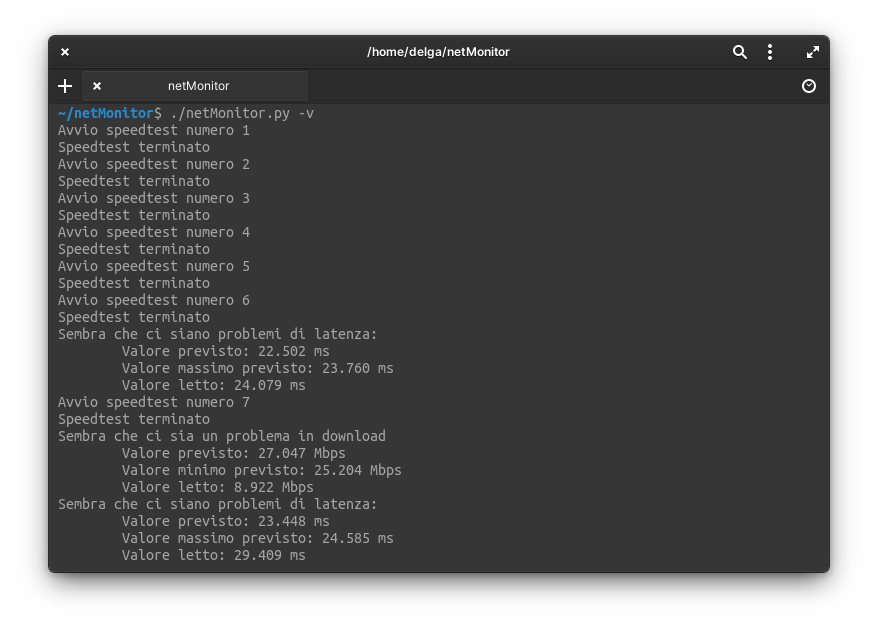

# netMonitor

## Introduzione

**netMonitor** è uno script in python che periodicamente esegue uno speedtest e ne usa i risultati per generare delle previsioni.
Al termine del ciclo di test viene creato un grafico dei dati raccolti e viene fatta una previsione sullo stato futuro usando il *Simple Exponential Smoothing*.


## Implementazione

Gli speedtest sono stati eseguiti con [speedtest.net](https://www.speedtest.net/) usando la libreria python [speedtest-cli](https://pypi.org/project/speedtest-cli/) e si lascia la possibilità all'utente di poter scegliere il numero di test da eseguire e la loro frequenza; tuttavia, per non stressare troppo la rete durante i test e quindi evitare di influenzare i risultati stessi, è stato scelto di impostare una frequenza minima di test (che è anche quella di default) di 3 minuti.
Nel caso in cui l'utente specifichi un numero negativo di ripetizioni, lo script viene eseguito fintanto che `<C-c>` non viene premuto.

Ogni volta che un test termina, i suoi risultati vengono inseriti in una lista che, tramite la libreria `pandas`, viene trasformata in un dataframe con indice temporale al fine di poter utilizzare l'algoritmo `SimpleExpSmoothing` di previsione della libreria `statsmodels`.
Di seguito, un esempio di un dataframe:

|                  | download  | upload    | ping   |
|:----------------:|:---------:|:---------:|:------:|
| 2021-09-20 20:20 | 24.188498 | 16.172388 | 23.559 |
| 2021-09-20 20:23 | 25.180179 |  9.463795 | 22.413 |
| 2021-09-20 20:26 | 25.028360 |  9.500230 | 24.712 |
| 2021-09-20 20:29 | 26.737299 | 12.579672 | 22.338 |
| 2021-09-20 20:32 | 25.897392 | 16.123149 | 22.175 |
| 2021-09-20 20:35 | 27.782916 | 15.866923 | 24.079 |
| 2021-09-20 20:38 |  8.921754 | 12.113325 | 29.409 |

Inoltre, l'insieme di previsioni viene usato per definire delle **thresholds**: nel caso in cui uno dei valori ottenuti con la misura successiva non rispetti la propria *threshold*, viene stampato un messaggio che avverte l'utente di tale anomalia.

**Attenzione**:

- poiché gli algoritmi di previsione necessitano di una serie temporale di almeno due elementi, le previsioni vengono generate a partire dal secondo test;
- per definire le soglie viene usata l'ultima previsione eseguita e la deviazione standard di tutte le previsioni eseguite fino a quel momento;
- la funzione `stdev` della libreria `statistics` necessita almeno due valori per calcolare la deviazione standard, quindi le *thresholds* vengono definite a partire dalla terza iterazione.

Se l'utente usa il flag `--export`, allora durante l'esecuzione viene creata (se non esiste) la directory `data`, all'interno della quale è possibile trovare le directory contenenti i grafici dei dati e delle previsioni in formato `.png` e i dati esportati in formato `.csv`.

### Struttura del progetto

Esempio di come si presenta la directory al termine di alcune esecuzioni in cui sono stati esportati i dati:

```bash
.
├── README.md
├── requirements.txt
├── netMonitor.py*
└── data/
    ├── 2021-09-19_19.26/
    │   ├── data.csv
    │   └── graphics/
    │       ├── download.png
    │       ├── ping.png
    │       └── upload.png
    ├── 2021-09-19_17.32/
    │   ├── data.csv
    │   └── graphics/
    │       ├── download.png
    │       ├── ping.png
    │       └── upload.png
    └── 2021-09-19_14.21/
        ├── data.csv
        └── graphics/
            ├── download.png
            ├── ping.png
            └── upload.png
```

## Installazione

### Requisiti

- `matplotlib`, versione 3.4.3
- `pandas`, versione 1.3.3
- `speedtest-cli`, versione 2.1.3
- `statsmodels`, versione 0.12.2

È possibile installare i pacchetti richiesti tramite

```bash
pip install -r requirements.txt
```

## Esecuzione

```bash
netMonitor.py [-h] [-t times] [-p period] [-f alpha] [-v] [-e]
```
### Flags

| Flag                            | Descrizione                                                |
|---------------------------------|------------------------------------------------------------|
| -h, --help                      | show this help message and exit                            |
| -t times,<br/> --times times    | esegue uno speedtest `<times>` volte                       |
| -p period,<br/> --period period | indica il periodo in minuti con cui eseguire gli speedtest |
| -f alpha,<br/> --forecast alpha | esegue una previsione usando `<alpha>`                     |
| -v, --verbose                   | stampa i risultati al termine dello script                 |
| -e, --export                    | esporta i grafici e i dati raccolti                        |
