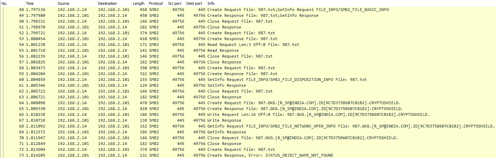
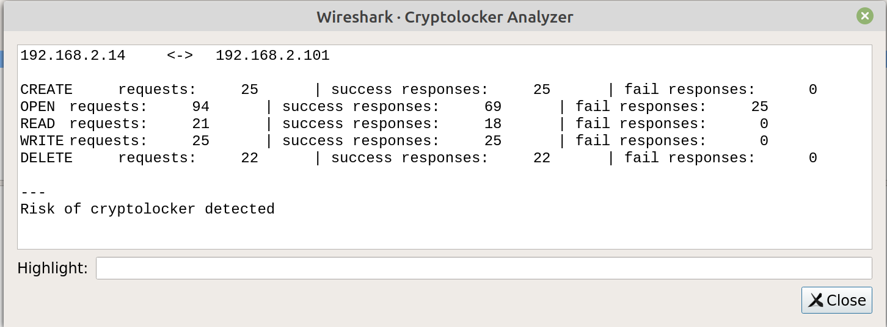
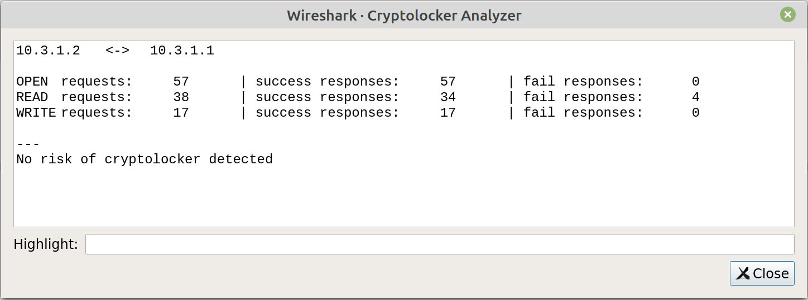

# Plugin Wireshark per la rilevazione del cryptolocker Cryptoshield

## Introduzione

Il progetto consiste nello sviluppo di un plugin per Wireshark scritto utilizzando
il linguaggio Lua. Questo script si occupa di rilevare la presenza del cryptolocker

Cryptoshield, andando ad analizzare i pacchetti di un pcap in cui ci sono host che utilizzano
il protocollo SMB per la gestione dei file.
Scansionado pacchetto per pacchetto, si occupa di raccogliere per ogni host,
le seguenti informazioni ritenute utili per l'identificazione del cryptolocker:

* numero richieste creazione file;
* numero richieste apertura file;
* numero richieste di operazioni di supersede;
* numero richieste di overwrite di file esistenti;
* numero richieste di letture su file;
* numero richieste di scritture su file;
* numero richieste di cancellazione file;
* numero richieste di ridenominazione.

per ciascuno dei dati sopra riportati vengono salvati il numero di risposte
positive (successi) e negative (fallimenti).

## Analisi di un file pcap in cui è presente un host sospetto

Per l'analisi è stato usato [questo pcap]( http://www.protectus.com/download/files/cryptoshield.pcapng)

Il pcap indicato presenta il traffico di un solo host infetto da Cryptoshield.
Durante la fase di analisi del pcap è stato riscontrato un pattern di comandi SMB
compiuti per ogni singolo file che il ransomware ha alla fine cifrato.
Da Wireshark è stato inserito il filtro "smb2" per poter visualizzare solamente i pacchetti di SMB (versione 2).

Come si può vedere dall'immagine vengono eseguite numerose aperture e chiusure del file. Il comando create non serve infatti solo per creare un file, ma anche per aprire, sovrascrivere o sostituire. Per sapere il tipo di operazione richiesta dal pacchetto create è possibile controllare il campo "CreateDisposition" che può assumere diversi valori [(consultabili a questa pagina)](https://docs.microsoft.com/en-us/openspecs/windows_protocols/ms-smb2/e8fb45c1-a03d-44ca-b7ae-47385cfd7997).

Il pattern eseguito su un file da cryptare è il seguente:

1. Prima create usata per aprire il file vittima, il campo Disposition del pacchetto di richiesta contiene il valore OPEN, con il quale se il file non esiste
l'operazione termina con fallimento. Il comando successivo è setInfo che presenta nel campo infolevel il valore SMB2_FILE_BASIC_INFO. Il tutto seguito dalla close;

    > NB: nel caso dell'immagine la setInfo e la prima create sono nello stesso pacchetto anche se poi vengono eseguiti in maniera sequenziale

1. Viene riaperto il file e subito viene eseguito il comando di read al fine di poter leggere l'intero file (e quindi poterselo copiare). Il tutto è seguito da una chiusura.

1. Si riapre il file, questa volta per poter eseguire il comando di setInfo che presenta un infolevel differente: SMB2_FILE_DISPOSITION_INFO. Con essa l'host sta richiedendo l'eliminazione del file una volta che verrà eseguita la chiusura. Segue la consueta chiusura (che questa volta porta anche all'eliminazione del file originale sul server).

1. Viene eseguita una quarta create request, questa volta con disposition uguale a OVERWRITE_IF, che consente di sovrascrivere un file o di crearne uno nuovo
se il file non era presente. Questo file è la versione cifrata creata dal cryptolocker. Quindi viene eseguita una write per poter scrivere il file cifrato. Dopo l'operazione si ha la consueta chiusura.

1. Dopo aver riaperto il file cifrato, viene richiesta un'operazione di getinfo con valore SMB2_FILE_BASIC_INFO nel campo infolevel, infine il file viene chiuso.

1. Come ultima operazione abbiamo un'ultima create, con valore sul campo Disposition OPEN, con la quale l'host controlla che il file originale non esista più. Infatti essa viene seguita da una risposta che riporta un errore.

## Come lanciare il plugin

Per poter lanciare il plugin, bisogna aggiungere il file cryptoAnalyzer.lua [nella cartella dei plugin di Wireshark](https://www.wireshark.org/docs/wsug_html_chunked/ChPluginFolders.html)

Una volta aggiunto il plugin a Wireshark non resta che avviare Wireshark, aprire un pcap o avviare una cattura e poi andare su "Strumenti > Project > Analyzer"

## Comportamento del plugin

Lo script mostra su schermo, per ogni host client, i contatori delle operazioni descritte all'inizio, considerando anche il numero di successi e fallimenti,
e viene stampato un messaggio in base all'entità del rischio identificato. I possibili messaggi sono:

* Risk of cryptolocker detected (nel caso in cui è stata rilevata una presenza concreta del cryptolocker)
* Potential risk of cryptolocker detected (nel caso in cui è stata rilevata una presenza potenziale del cryptolocker)
* No risk of cryptolocker detected (nel caso in cui non è stata rilevata una presenza del cryptolocker)

(**Nota**: per ogni rilevazione viene mostrata sullo schermo una coppia di indirizzi separati di "<->", l'indirizzo a sinistra corrisponde al client SMB, cioè il potenziale attaccante, mentre quello a destra al server)

### Come funziona l'algoritmo per identificare Cryptoshield

L'algoritmo nello script che rileva la presenza del Cryptolocker è anomaly_checker().
Per rilevare il rischio della presenza del malware sono stati considerati principalmente due parametri.
Uno è controllare se il numero di operazioni di lettura, scrittura e cancellazione sia simile. Per valutare se i valori siano simili, si calcola la proporzione tra numero di operazioni di READ e WRITE, e numero di operazioni di READ e DELETE, quindi si controlla se le percentuali calcolate superino delle soglie:

* RISK_THRESHOLD: una soglia del 70% per identificare il rischio di presenza del cryptolocker
* POTENTIAL_RISK_THRESHOLD: una soglia del 35% per identificare il rischio potenziale di presenza del cryptolocker

Un altro parametro utilizzato per l'identificazione è il rapporto tra numero di operazioni di aperture di file fallite e numero di operazioni di creazione di file,
che è risultato essere molto vicino nei test eseguiti. Questo perché le open fallite corrispondono ad un controllo che fa l'attaccante per verificare che il file originale sia stato
cancellato, il file originale viene sostiuito con quello cifrato, di conseguenza questi due contatori devono assumere valori vicini.
Anche in questo caso, come prima, viene usata una soglia, ma questa volta del 95% (PERC_CREATE_OPEN_RISK_THRESHOLD).

### Esempi di output
Un esempio di output del plugin, applicato al pcap infetto indicato sopra, è il seguente:

Si può notare come il numero di operazioni di READ, WRITE e DELETE sia vicino e che il numero di aperture fallite sia uguale al numero di operazioni di CREATE.

Questo è un esempio in cui è stato utilizzato un [pcap](https://wiki.wireshark.org/SMB2?action=AttachFile&do=view&target=smb2-peter.pcap) in cui non c'è nessun cryptolocker:

In questo caso non sono presenti le similitudini ottenute al caso precedente.