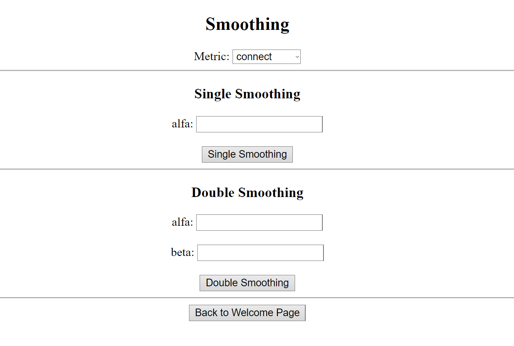
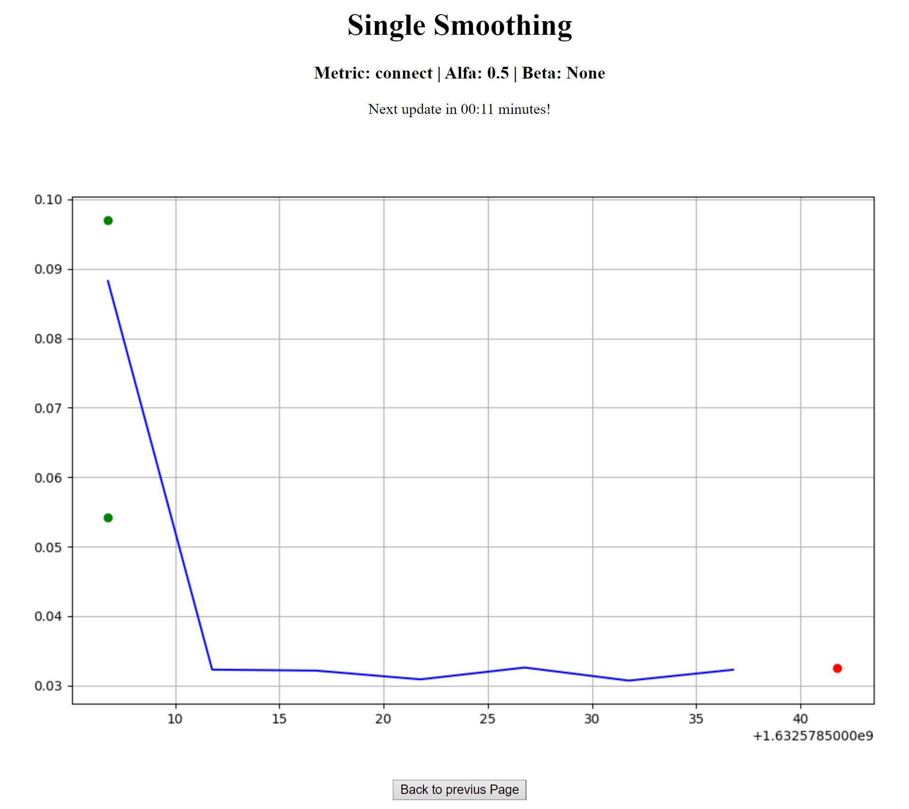
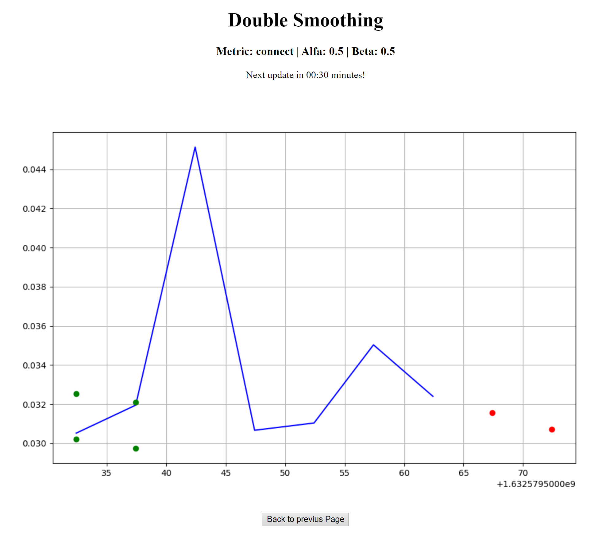
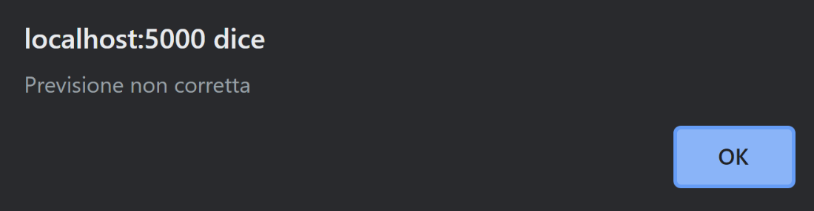

# Forecasting the server status using single/double exponential smoothing
## Introduzione
Il progetto ha come obiettivo la creazione di uno script in python in grado di prevedere lo stato di un server attraverso l'utlizzo di single & double exponential smoothing e l'analisi di risposte http: tramite prometheus si invia la query ***probe_http_duration_seconds*** al server, catturando la risposta di quest'ultimo è possibile analizzare la duranta della richiesta http per ogni sua fase (connect, processing, resolve, tls, transfer). **IMPORTANTE: per l'utilizzo della query *probe_http_duration_seconds* è necessaria la configurazione e l'utilizzo di una [Blackbox](https://github.com/prometheus/blackbox_exporter)**
## Prerequisiti e Esecuzione
Per poter utilizzare il programma è necessario eseguire i comandi

`pip3 install requests` 

`pip3 install matplotlib`

`pip3 install flask`

Per poi eseguire il programma con il comando

`python3 app.py`

L'applicazione permette di fare analisi su dati prelevati direttamente da Prometheus o da file JSON. Per la cattura dei dati con Prometheus è necessario utilizzare in aggiunta a quest'ultimo una BlackBox. Entrambi sono scaricabili direttamente dal [sito ufficiale di Prometheus](https://prometheus.io/download/).
Dopo aver scaricato la versione adeguata al proprio sistema, devono essere copiati i file di configurazione *.yaml* contenuti nella cartella *prometheus* della repository direttamente nelle cartelle *blackbox* e *prometheus* scaricate. A questo punto possiamo lanciare la blackbox e successivamente prometheus, quest'ultimo permetterà di effettuare query diverse al seguente link: http://localhost:9090/. Una volta mandato in esecuzione il programma sarà possibile utilizzare l'interfaccia web al link http://localhost:5000/ per interagire con l'applicazione.
## Descrizione
* **app.py:** contiene il main del programma oltre allo scheletro dell'interfaccia web 
* **smoothing.py:** contiene gli algoritmi di forecasting (single & double exponential smoothing)
* **utilities.py:** contiene alcune funzioni utili per la letture dei dati da un file .json o direttamente da prometheus
* **templates** è la cartella che contiene i vari file .html che realizzarano l'interfaccia web

## Esempio di esecuzione
Pagina Iniziale dopo aver selezionato la cattura da Prometheus:

Single Exponential Smoothing:

Double Exponential Smoothing:

Nel caso in cui i dati catturati fuoriescano dai bound previsti al passo precedente (segnalati in verde all'interno dei grafici) il programma genererà un **alert** di questo tipo:

