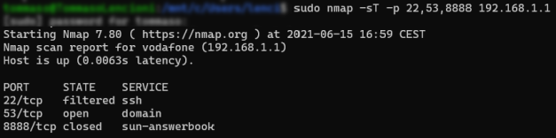
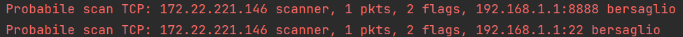

# PortScanDetector
## Introduction to problem

Port scanning is a technic through which a machine can discover various informations about the status of a port (or a range of them) of a specific host or subnet.<br/>
This practice can be used for both management and malicious activities.<br/>
Executing a port scan leaves traces and follows behaviours that can be observed and identified.<br/>
This tool aims to discover scans by analyzing the pace and structure of the traffic measured by a probe.<br/>
In order to do that NetFlow data is collected and analyzed in real time.<br/>
Notice that results got by this tool are just a suggestion, not a certainty.

## Requirements

### nProbes

PortScanDetector needs to receive NetFlow data in JSON format.<br/>
To do so I used [nProbe](https://www.ntop.org/products/netflow/nprobe/) from ntop:
* [Download nProbe](https://packages.ntop.org).
* Run it according to your configuration but make sure to specifying the following options in order to make it work with *PortScanDetector*:
	 ```bash
	 #Send TCP packets containing flows in JSON format
	 --tcp (application_address):(port)
	 ```
	
	 ```bash
  	 #Use a NetFlow template containing at least the following fields
	 -T "%IPV4_SRC_ADDR %IPV4_DST_ADDR %PROTOCOL %L4_SRC_PORT %L4_DST_PORT %TCP_FLAGS %IN_PKTS"
	 ```
  	e.g.: 
  
  	```bash
    ./nprobes -i eth0 -b 2 -V 10 --tcp 127.0.0.1:2055 -T "%IPV4_SRC_ADDR %IPV4_DST_ADDR %PROTOCOL %L4_SRC_PORT %L4_DST_PORT %TCP_FLAGS %IN_PKTS"
   	```
	
### PortScanDetector

This tool is a Python script that binds on a port and listen to NetFlow data from one probe at a time.<br/>

The code has the following major dependencies that are specified in [requirements.txt](https://github.com/TommasoLencioni/PortScanDetector/blob/main/requirements.txt): 
* [HyperLogLog](https://github.com/svpcom/hyperloglog), a probabilistic data structure, to store efficiently and without repetition host/port couples as string.
  This leads to efficiency in term of memory (trading off accuracy in element counting).
* [Statsmodels](https://github.com/statsmodels/statsmodels) to handle UDP average contacted host/port and producing a prediction through double exponential smoothing

In order to execute *PortScannerDetector*:
* clone the repo
	```bash
	git clone https://github.com/TommasoLencioni/PortScanDetector.git port_scan_detector && cd port_scan_detector
	```
* [optional] enter a virtual environment
* check if the required packages are installed
	```bash
	pip3 install -r requirements.txt
	```
 
## Usage

Please note that the address on which the application creates the TCP socket must be reachable by the probe.
```bash
python3 port_scan_detector.py [-h] [-a address] [-p port] [-d seconds] [-e seconds] [--version] 
```

**Optional Arguments:**

| Flag | Description |
| --- | :--- |
| -h, --help | Show help message and exit. |
| -a address,<br/> --address address | Address on which to open the TCP socket (default 0.0.0.0). |
| -p port,<br/> --port port | Port on which to receive JSON-formatted flows as TCP stream (deafult 2055). |
| -d seconds,<br/> --des seconds | Seconds between two double exponential smoothing prevision on UDP host/port couples (default 10). |
| -e seconds,<br/> --erase seconds | Seconds bewteen two resets of UDP host/port couples (default 180). |
| --version | Show program's version number and exit.|
| --verbose<b/> | Run the program showing all the information regarding flows received and UDP prevision.|

## How it works

*PortScanDetector* analyzes the flows and decide whether the traffic could be due to port scanning or not.

* First the program parses th flow sent in JSON format.
* Then excludes traffic directed or originated from multicast addresses (this is done because a scanner won't target such addresses and they are likely source of unresponded packets)
* After that the flow is analyzed according to its transport level  protocol. 

*PortScanDetector* uses 2 different metric for either TCP and UDP:

### TCP
The flows are analyzed looking at the TCP_FLAGS field and classified based on the following criterias (*nmap* flags inside parentheses):
* 0 -> NULL Scan (-sN, No bits set)
* 1 -> FIN Scan (-sF, FIN bit set)
* 2 -> SYN Scan (-sS, SYN bit set)
* 41 -> Xmas Scan (-sX, FIN, PSH, and URG bits set)
	
If a flow matches one of those cases the user is notified through CLI.

#### Limitations
* ***False positive***<br/>
	There could be situations where a host tries to connect without succeeding (resulting in 2 as TCP_FLAGS) without malicious intentions.  
  	This scenario can't be taken into account due to a "zero knowledge" principle where all traffic is "guilty until proven innocent" (in this case by concluding the three-way handshake).
  

* ***False negative***<br/>
	In case of scans that completes the three-way handshake (e.g. TCP Connect() Scan done with -sT option in *nmap*) the attack is indistinguishable
  	from a normal communication therefore the flow is not highlighted.
  
	This is true only for open ports, filtered and closed ports will result in a TCP_FLAG of 2 due to the attempted connection.<br/>
  	
  	
	
	
* ***Idle Scan***<br/>
	Scans made using another host as disguise (e.g. -sI option of *nmap*) could reveal that the "zombie" host is the source of the attack.
	I couldn't do test about that due to safety features on TCP packet ID of my network devices.
  
### UDP
The flows are analyzed looking at the number of couples host/port contacted by each source host.<br/>
If it exceeds the double exponential smoothing prevision (made with the time serie of the last 10 averages of couples among all source hosts) * 1.75 the user is notified.

#### Limitations
* ***False positive***<br/>
	There could be situations where a host contacts through UDP more hosts than the prediction*1.75 with no malicious intentions. 
  	
	This behavior results in an unnecessary alert.
  

* ***False negative***<br/>
	A scanning host can contact through UDP less couples host/port than the prediction*1.75 and still not be spotted by the tool.<br/>
  	This problem could have been addressed making assumptions about the traffic characteristics (number of packets, flow lifespan, bytes transmitted).
	
  	Doing so could still have led to wrong evaluations.
