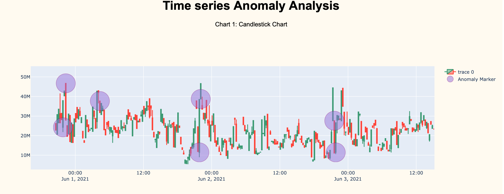
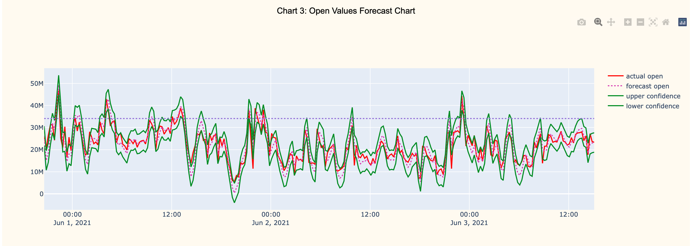

## Using candlestick charts to identify network anomalies in time series data

This simple script analyzes anomalies and outliers inside a time series, using candlestick charts.
Forecasting algorithm has been based on (double) exponential moving average.
Monitoring candlestick values (open, close, and volume) allows us to find anomalies even in
noisy datasets.

### How are candles created and what do open, close and volume values mean in network monitoring?

In order to create candles, data are fetched from a provided RRD archive; then the resulting time series is 
split into temporal windows, each one representing a candle (window size can be adjusted inside the config.json).
The bigger the window, the thicker the candle. For example, if RRD step is ```300s``` (5min) and candle thickness is set
to ```3```, each candle will represent 15 minutes of data; so, for each candle we obtain that:

- ```open``` value is the first point of the selected window;
- ```close``` value is window's last point;
- ```max (min)``` is the maximum (minimum) value registered inside the window.
- ```volume = abs(close-open)``` represents candle's body (or height)

Candles are built considering the first n elements of the list: 
n is the great integer such that ```n <= len(ds_rows)``` and ```n mod thickness = 0```; there are at most 
```thickness - 1``` discarded rows at every iteration of the algorithm. Candle list and last candle timestamp are returned from the function.
If there are not enough points to build a candle, starting timestamp and empty list is returned.

Using candlestick charts instead of _raw_ time series let us make better predictions in noisy data.

### How does the algorithm work?

To forecast anomalies, simple and double exponential smoothing functions have been implemented.
Each value of the candle is forecasted by an ewm function and confidence bands are created. Data are stored inside
a pandas dataframe. It is possible to tune algorithm "sensitivity" acting on ```config.json``` file. 
An anomaly is detected if more than or equal ```threshold``` params are out of forecasted confidence bands for a single candle; 
furthermore, anomaly is confirmed if one of the actual params is out of the 95th percentile.

At the end of the analysis, found anomalies details are printed to the terminal and plotted to a plotly web app in order
to be visualized by the user.

#### Update: Live-streaming feature:
After fetching old data, the script keeps querying RRD database at regular intervals (see config.json).

In particular, when the last-fetched candle is synchronized with current time, program begins a ```while True``` loop.
At every iteration, RRD file is asked for new data; if there are, candles are built and new data are analyzed; 
otherwise, if there are not enough points to build a candle, queried data are discarded. Since last candle timestamp 
is returned from ```build_candle``` function, it is possible to keep trace of the last read value from RRD. 

New data forecasting is based on previous fetched data: last ```DEPTH``` data are taken from the old DataFrame and
added to the new one, and analysis is performed.

Finally, it's possible to merge old DataFrame with the updated one, and plot data: charts will automatically update 
when new data are available.

### Screenshots
Candlestick chart with anomalies markers:



Data forecasting example chart:



### Installation instructions

This project requires python 3.9 installed on your local machine and the package virtualenv.
Once you have installed python, open a terminal (on Linux/MacOS) window and type the following commands
in order to install dependencies.

```bash
    $ virtualenv timeseries-anomaly-venv
    $ source timeseries-anomaly-venv/bin/activate
    $ pip3 install -r requirements.txt  
```

Now, you can edit the ```config.json``` with all the parameters you need for your dataset.

To run the script type:
```bash
    $ python3 main.py
```

