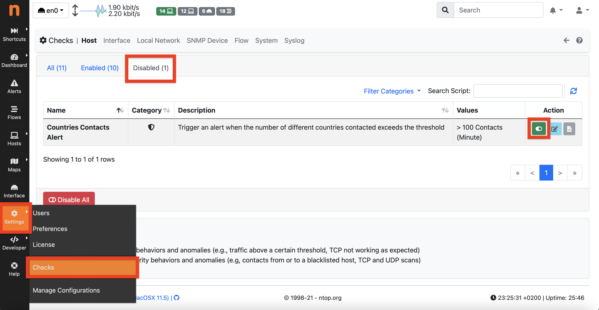
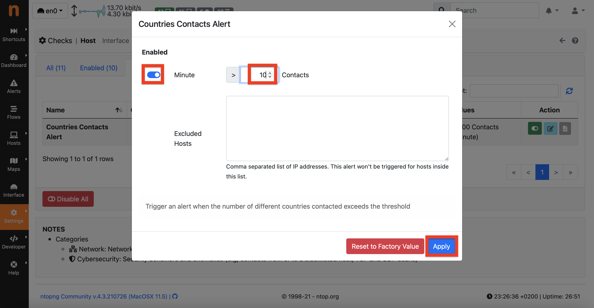
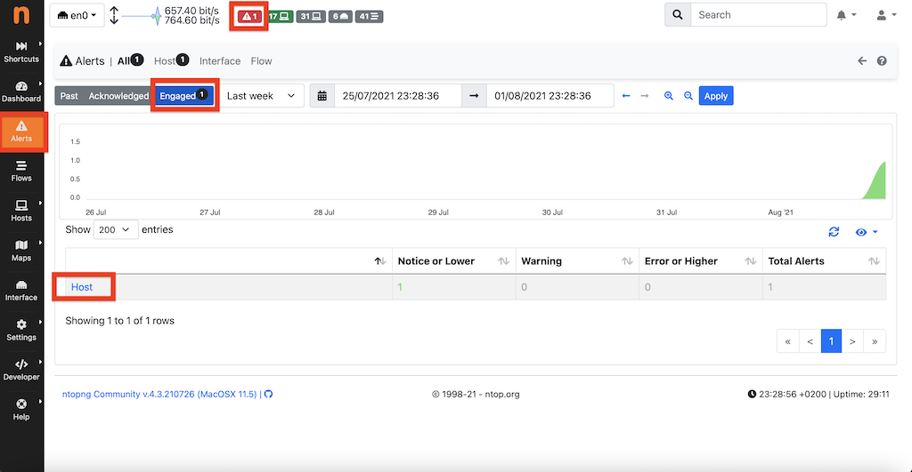
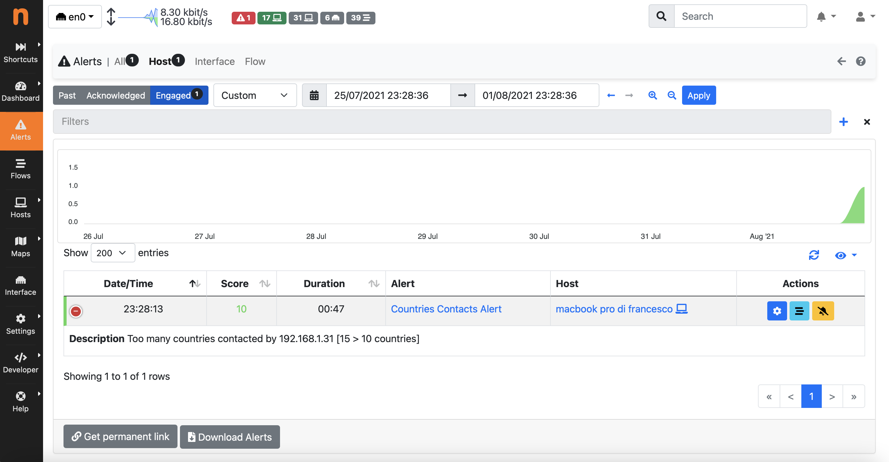

# Countries Contacts Host Check

## 1. Introduzione
[ntopng](https://github.com/ntop/ntopng) è uno strumento per il monitoraggio del traffico di rete. È la nuova incarnazione dell’originale ntop scritto nel 1998, adesso rinnovato in termini di performance, usabilità e funzionalità. 

ntopng genera degli allarmi, chiamati alert, per riportare il verificarsi di eventi e il superamento di soglie (configurabili dall’utente). La visualizzazione e la configurazione di quest’ultimi avviene attraverso l’interfaccia web, alla quale si può accedere dopo che ntopng è stato avviato.

Questi alert possono essere creati per flussi, host e altri elementi della rete. Gli alert per i flussi e gli host sono creati all’interno del core C++ di ntopng, all'interno dei check. I Check sono istanze di classi C++ che implementano l'interfaccia `Check.h`. Durante la sua esecuzione, un check può verificare una certa condizione (cioè un’anomalia) e pertanto decidere di creare un alert. Gli alert, similmente ai check, sono istanze di classi C++ che implementano l'interfaccia `Alert.h`.

L’obiettivo di questo progetto è quello di sviluppare un nuovo host check e il relativo alert per controllare quando un host contatta o viene contattato da un numero elevato di nazioni. 
Seguendo la documentazione ([Developing Alerts](https://www.ntop.org/guides/ntopng/developing_alerts/developing_alerts.html)) è stato sviluppato il check CountriesContacts. 

## 2. Creazione della classe CountriesContacts

In ntopng gli host check vengono dichiarati in dei file `.h` sotto `include/host_checks`. La definizione del check invece viene fatta all’interno di un file `.cpp` sotto `src/host_checks`. 

Un host check deve utilizzare come classe di base l’interfaccia `include/HostCheck.h`.
Una volta implementata quest’interfaccia, il check deve obbligatoriamente ridefinire il metodo `periodicUpdate` implementando il comportamento desiderato. Questo metodo viene chiamato da ntopng approssimativamente ogni 60 secondi e controlla se si sono verificate le condizioni per generare un alert.

Per permettere la corretta compilazione del nuovo check bisogna includere la direttiva `#include “host_checks/CountriesContacts.h”` in `include/host_checks_includes.h`.
Infine per permettere il corretto caricamento a tempo di esecuzione del check, si deve aggiungere il costruttore `new CountriesContacts()` all’interno di `registerChecks` in `HostCheckLoader.cpp`. 

## 3. Creazione della classe CountriesContactsAlert

Gli alert vengono dichiarati in dei file `.h` sotto `include/host_alerts` e definiti in dei file `.cpp` all'interno di `src/host_alerts`. 

Questa classe deve implementare l’interfaccia `include/HostAlert.h` e pertanto ridefinire il metodo `getAlertType`. Quest’ultimo utilizza il metodo `getClassType` che restituisce un oggetto di tipo `HostAlertType` composto dalla categoria dell'alert e dal tipo dell’alert, cioè una chiave definita nella `enum` `HostAlertTypeEnum` di `include/ntop_typedefs.h`.

Per fare in modo che l’alert venga correttamente compilato bisogna includere la direttiva `#include “host_alerts/CountriesContactsAlert.h”` in `include/host_alerts_includes.h`.

## 4. Configurazione del check

I check sono configurabili attraverso l’interfaccia web di ntopng. È possibile abilitare/disabilitare il check e impostare dei parametri. Questi parametri permettono di modificare la soglia a piacimento oppure di escludere determinati host dal controllo, indicando il relativo IP.

ntopng utilizza, per leggere e salvare i valori della configurazione, dei piccoli file `.lua` che si trovano sotto `scripts/lua/modules/check_definitions/host`. Al loro interno vengono definite le proprietà del check come chiave e categoria, valore di default per la threshold, e campi che riguardano la corretta visualizzazione del check sull'interfaccia, come nome e descrizione. 
Questi file sono obbligatori e permettono al check di essere correttamente eseguito e configurato. 

Di default, il check viene lasciato disabilitato e viene impostata una soglia statica a 100.

## 5. Linking configurazione con istanza del check

Per collegare la configurazione del check all’istanza della sua classe C++, il nome del file `.lua`, nel nostro caso `countries_contacts.lua`, deve essere uguale alla stringa restituita dal metodo `getName` di `CountriesContacts.h` : 
```cpp
std::string getName()   const { return(std::string("countries_contacts")); }
```

Inoltre deve essere aggiunta una chiave in `scripts/lua/modules/alert_keys/host_alert_keys.lua`, nel nostro caso `host_alert_countries_contacts`, in modo da identificare univocamente l'alert. 
Il valore di questa chiave deve essere lo stesso di quello utilizzato nella `enum` 
`HostAlertTypeEnum` in `ntop_typedefs.h`.

In `host_alert_keys.lua`:
```lua
local host_alert_keys = {
	...
	host_alert_countries_contacts = 7,
	...
}
```
In `ntop_typedefs.h`:
```cpp
typedef enum {
	...
	host_alert_countries_contacts = 7,
	...
} HostAlertTypeEnum;
```

## 6. Formattazione dell’alert

Gli alert sono mostrati graficamente attraverso la web UI di ntopng. Per capire come formattare l’alert, ntopng legge queste informazioni attraverso dei file `.lua` all’interno di 
`scripts/lua/modules/alert_definitions/host/`.
 Questi file sono obbligatori per far in modo che l’alert venga correttamente creato e visualizzato. 

Ogni file deve restituire una tabella contenente dei metadati, come la alert key univoca definita in precedenza, in `scripts/lua/modules/alert_keys/host_alert_keys.lua`. Restituiamo quindi la chiave `host_alert_countries_contacts`, l’icona da mostrare con l'alert e una localization key, ovvero una stringa usata come titolo dell’alert. 
```lua
host_alert_countries_contacts.meta = {
  alert_key = host_alert_keys.host_alert_countries_contacts,
  i18n_title = "alerts_dashboard.host_alert_countries_contacts",
  icon = "fas fa-fw fa-life-ring",
  has_victim = true,
}
```
Le localization key sono salvate in `/scripts/locales` e permettono a ntopng di mostrare il titolo dell’alert nella lingua configurata dall’utente. Ogni lingua ha il suo file `.lua` e per ognuna sono state aggiunte le stringhe relative ai nostri check e alert. Si può vedere di seguito, ad esempio, come è stata aggiunta una localization key al file `en.lua`:
```lua
["alerts_dashboard"] = {
    ["host_alert_countries_contacts"] = "Countries Contacts Alert",
    ["abort_add_filter"] = "Abort add filter?",
    ["active_flows_anomaly"] = "Active Flows Anomaly",
    ["add_filter"] = "Add Filter",
    ...
    ...
}
```

## 7. Logica del check

Per implementare la logica desiderata si è partiti dal momento in cui viene creato un flusso. All'interno del costruttore della classe `src/Flow.cpp`, quando vengono definiti il client e il server del flusso, viene incrementata la nazione contattata, aggiungendola ad entrambi. In questo modo, per ogni host, viene incrementato il numero di nazioni contattato sia quando ha il ruolo di client, sia quando ha quello di server. Inoltre l'aggiunta viene fatta solo se l'host è locale seguendo i principi dettati dalla documentazione ([LocalHosts](https://www.ntop.org/guides/ntopng/basic_concepts/hosts.html#local-hosts)). 
```cpp
char country[64];
if(cli_host) {
	...
	if (cli_host->isLocalHost() && srv_host) {
		srv_host->get_country(country, sizeof(country));
		cli_host->incCountriesContacts(country);
	}
}

if(srv_host) {
	...
	if (srv_host->isLocalHost() && cli_host) {
		cli_host->get_country(country, sizeof(country));
		srv_host->incCountriesContacts(country);
	}
}  
```
L'incremento delle nazioni contattate viene ottenuto attraverso il metodo `incCountriesContacts`. Quest'ultimo viene dichiarato nella classe `Host.h` e definito in `LocalHost.h`. Al suo interno viene chiamato un omonimo metodo che però è dichiarato nella classe `HostStats.h` e definito similmente in `LocalHostStats.h`. Questa è la classe dove avvengono effettivamente le operazioni di aggiunta e stima delle nazioni contattate. 

Per lo scopo è stato dichiarato un contatore HLL chiamato `hll_countries_contacts` che incrementa il numero ogni volta che viene chiamata la `incCountriesContacts`, stima la cardinalità dell'insieme delle nazioni contattate in `getCountriesContactsCardinality` ed infine azzera il conteggio in `resetCountriesContacts`. 

La stima restituita da questo contatore viene utilizzata sia per controllare che non venga superata la threshold statica, sia per aggiungere nuove osservazioni ad una struttura DES che utilizza il Double Exponential Smoothing per avere anche una threshold dinamica. 

Di seguito i membri usati all'interno della classe `LocalHostStats` per il conteggio delle nazioni:
```cpp
/* Estimate the number of contacted countries using HyperLogLog */
  struct ndpi_hll hll_countries_contacts;
  u_int8_t old_hll_countries_value, new_hll_countries_value, hll_delta_countries_value;
  DESCounter countries_contacts;
``` 
### 7.1 Impatto sulla memoria

È stato stimato che le variabili utilizzate per il conteggio delle nazioni per ogni localhost, hanno un impatto complessivo sulla memoria utilizzata di ~150 byte. In particolare nella scelta e nell'inizializzazione del contatore HLL è stato preso come metro di paragone una bitmap di 256 bit, dato che le nazioni al mondo sono < 256. Il contatore HLL viene inizializzato in `LocalHostStats.cpp` utilizzando 5 bit e come vediamo dalla seguente tabella viene occupata la stessa quantità di memoria della bitmap:
 
|bits|size (bytes) | standard error  |
|----|---------|--------|
|  4 |      16 | 26.00% |
|  5 |      32 | 18.38% |
|  6 |      64 | 13.00% |
|  7 |     128 |  9.19% |
|  8 |     256 |  6.50% |
|  9 |     512 |  4.60% |
| ...|	...	   | ...	  |
 
Il conteggio delle nazioni contattate viene mantenuto per 5 minuti e dopodichè viene resettato. 

### 7.2 Controllo threshold statica

Ogni minuto, all'interno della classe del check (`CountriesContacts.cpp`), nella `periodicUpdate` viene confrontata la stima ottenuta dal contatore `hll_countries_contacts`, con la soglia statica. Tale stima viene restituita dal metodo `getCountriesContactsCardinality` e viene controllato che non superi la threshold statica (definita di default a 100 nel file `countries_contacts.lua`, oppure configurata dall'utente). Se la soglia è stata superata, allora viene allocato l'alert attraverso la `allocAlert` che chiama il costruttore della classe `CountriesContactsAlert`. 

Dopo aver creato l'istanza dell'alert è il momento di chiamare la `triggerAlert` che avvisa ntopng di creare un alert identificato da `CountriesContactsAlert::getClassType()` sull'istanza dell'host che in quel momento eseguiva la `periodicUpdate`.

### 7.3 Controllo threshold dinamica

Per quanto riguarda la threshold dinamica, essa viene gestita all'interno di `LocalHostStats.cpp`, grazie alla struttura `DESCounter countries_contacts`. Al suo interno è implementata, attraverso il Double Exponential Smoothing, la gestione dinamica dei lower e upper bound e viene verificato se il valore delle osservazioni ha superato tali soglie, generando quindi un'anomalia. 

L'implementazione della threshold dinamica per le nazioni contattate, segue quella già presente per il controllo sul numero di host contattati. In particolare l'`updateStats` effettua un aggiornamento ogni 5 minuti, chiamando il metodo `updateCountriesContactsBehaviour`, il quale recupera dal contatore `hll_countries_contacts`, la stima delle nazioni contattate, calcola la differenza tra l'osservazione appena fatta e quella fatta durante l'ultimo aggiornamento e chiama il metodo `addObservation` sul `DESCounter`, passando come parametro il delta calcolato. Dopo aver aggiunto l'osservazione, viene resettato il contatore `hll_countries_contacts` (ogni 5 minuti).


All'interno di `addObservation` è dove avviene l'aggiornamento del lower e dell'upper bound e se c'è stata un'anomalia viene settata a `true` una variabile `boolean`. Questo valore viene recuperato successivamente, attraverso il metodo `anomalyFound` e viene usato, insieme a quelli del lower e dell'upper bound (restituiti dai metodi `getLastLowerBound` e `getLastUpperBound`), all'interno del metodo `luaCountriesBehaviour` che a sua volta viene chiamato dal metodo `LocalHostStats::lua` ed infine chiamato da ntopng per la visualizzazione delle statistiche su un determinato host.

## 8. Testing del check

Per provare il corretto funzionamento del check bisogna compilare ntopng con le nuove classi aggiunte e le modifiche fatte. Le istruzioni per la compilazione si possono trovare qui: [README.compilation](https://github.com/ntop/ntopng/blob/dev/doc/README.compilation).
Si ricorda che questo check necessita che i database per la geolocalizzazione degli host siano correttamente caricati all'avvio di ntopng. Per ulteriori dettagli sull'integrazione della geolocalizzazione in ntopng, si consiglia di consultare [README.geolocation](https://github.com/ntop/ntopng/blob/dev/doc/README.geolocation.md). 

Dopo aver completato la compilazione si può eseguire un'istanza di ntopng, posizionandosi nella cartella d'installazione ed eseguendo il comando:
```
$ sudo ./ntopng
``` 
Una volta avviato ntopng, esso è attivo sulla porta locale 3000 e si può accedere all'interfaccia web digitando sulla barra degli indirizzi di un browser:
```
http://127.0.0.1:3000
``` 
Per altri dettagli e opzioni per l'avvio di ntopng si può vedere la documentazione: [How to Start ntopng](https://www.ntop.org/guides/ntopng/how_to_start/index.html).

Dopo aver effettuato il login, bisogna attivare e configurare il check, che di default è disabilitato: 
- click su `Settings -> Checks`
- click sulla tab `Disabled`
- click sullo switch toggle di `Countries Contacts Alert`



- click sullo switch toggle sotto `Enabled` nella finestra che si apre
- impostare una soglia di contatti a piacimento (ad esempio 10 come test)
- escludere eventuali host dal controllo scrivendoli nel riquadro `Excluded Hosts`
- click su `Apply`



Per simulare la situazione in cui dovrebbe essere generato l'alert è stato implementato lo script [test/pingall.sh](./test/pingall.sh):
```sh
#!/bin/bash
# Program name: pingall.sh
date
cat list.txt |  while read output
do
    ping -c 1 "$output" > /dev/null
    if [ $? -eq 0 ]; then
    echo "node $output is up" 
    else
    echo "node $output is down"
    fi
done
```
Lo script permette di eseguire il comando `ping` su host multipli. Prende in input il file [test/list.txt](./test/list.txt) che contiene una lista di IP di name servers appartenenti a più di 100 nazioni diverse. 
Pertanto dopo aver avviato ntopng e abilitato il check dall'interfaccia web si può avviare lo script eseguendo il comando:
```
$ sh pingall.sh 
```
Dopo qualche minuto di esecuzione dello script, si potrà vedere che sull'interfaccia web di ntopng è stato generato l'alert.
Per avere maggiori dettagli si può fare click sull'icona rossa in alto oppure andare su `Alerts`:



Se il test è stato fatto da poco tempo, l'alert dovrebbe essere ancora nella tab `Engaged`, altrimenti si potrà ritrovare nella tab `Past`.

A questo punto, cliccando su `Host` si possono vedere tutti gli host alert generati tra cui il nostro, con cui vengono indicati l'host che ha generato l'alert, la durata, lo score e la descrizione. Se non si vede la descrizione, si può fare click sul `+` a sinistra per leggerla.  Nella descrizione viene indicato il numero di nazioni diverse contattate rispetto alla soglia precedentemente configurata. 


