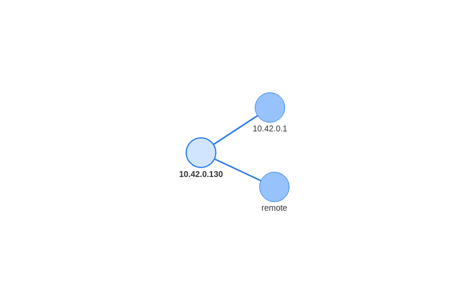
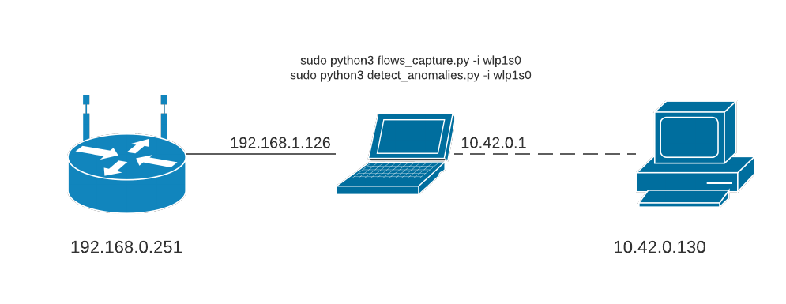

# Introduzione
Questo progetto ha come obiettivo la creazione di uno script in grado di rilevare anomalie basandosi su *una mappa dei servizi.* 

L'idea è di: 
1. esaminare il comportamento della rete andando a catturare il traffico e generando, tramite la libreria *nfstream*, i flussi relativi ai pacchetti.

2. creare una mappa dei servizi in base ai flussi e utilizzarla come filtro per individuare eventuali anomalie (protocollo mai osservato all'interno della rete, ip sorgente sconosciuto....)

## Prerequisiti
Per poter eseguire correttamente gli script è necessario installare *nfstream* con il seguente comando:

`sudo pip3 install nfstream`

**IMPORTANTE:** bisogna eseguire il comando con i permessi di superutente.

# Metodologia e risultati
Lo scopo del programma è individuare delle anomalie sulla rete, relative a uno o più dispositivi. Per fare ciò viene utilizzata una mappa dei servizi cioè una struttura dati che descrive quali host hanno comunicato tra di loro e quali protocolli sono stati utilizzati, nel nostro caso ad esempio *10.42.0.130* ha inviato solo richieste DNS a *10.42.0.1* mentre *remote* ha comunicato con *10.42.0.130* solo tramite TLS.

## Mappa dei servizi 
La mappa dei servizi è un file json (services_map.json), quindi un dizionario chiave-valore, che ha come chiavi l'ip sorgente, per ogni ip sorgente ci sono n chiavi che rappresentano gli ip destinazione contattati dall'host e come valore di queste chiavi è presente un array contenente il numero di byte che i due host si sono scambiati e una lista dei protocolli utilizzati.

Partendo dal presupposto di sapere quali sono le attività principali svolte dai dispositivi analizzati, ad esempio nel caso di una smart tv, streaming e navigazione web, possiamo creare una mappa dei servizi, che descriva il "comportamento" dei dispositivi, esaminando il traffico di rete in entrata e in uscita da questi.

Per questo progetto ho avuto la possibilità di analizzare un solo dispositivo, destinato principalmente ad attività di streaming online (YouTube, Netflix....). Questa è una possibile rappresentazione della mappa dei servizi (gli archi sono contrassegnati da una lista di protocolli):



## Anomalia
Innanzitutto, per anomalia intendo un traffico di rete che si discosta da quello descritto nella mappa dei servizi, ad esempio può venir generato del traffico con un protocollo mai utilizzato da quel dispositivo (verso quel determinato host) o possono venir inviati/ricevuti dati a/da un host sconosciuto.

Per individuare le anomalie si confrontano le informazioni dei flussi, generati in tempo reale dai pacchetti, con le informazioni della mappa:
- se l'host sorgente del flusso non è presente all'interno della mappa, allora lo script restituirà "UNKNOWN_SOURCE_IP"
- viceversa per l'host destinatario restituirà "UNKNOWN_DESTINATION_IP"
- infine, se gli host sorgente e destinatario si trovano già all'interno della mappa dei servizi, ma viene utilizzato un protocollo diverso da quelli registrati per questa coppia di host, il programma restituirà "PROTOCOL_NEVER_USED"
  - se il protocollo principale è DNS o TLS allora restituisce "DNS/TLS APPLICATION"
  - se il protocollo è sconosciuto ("Unknown") allora restituisce "UNKNOWN PROTOCOL"

Gli ultimi due casi sono delle anomalie di minore importanza, poiché sì, individuano un comportamento atipico della rete ma nella maggior parte dei casi non rappresentano un pericolo come le altre anomalie; ad esempio, se la macchina mi inizia a generare traffico TLS di Ebay, mentre l'unico traffico TLS osservato su quel dispositivo è relativo ad Amazon, è importante notificarlo all'utente ma difficilmente rappresenterà una minaccia.

Per come è stato implementato il codice, ho deciso di non notificare moltiplici anomalie relative a un singolo flusso ma di fornire una priorità a ognuna di queste; ad esempio se il mio dispositivo contatta un host locale sconosciuto con un protocollo sconosciuto, l'unica anomalia che notificherà sarà quella di "UNKNOWN_DESTINATION_IP", senza aggiungere anche quella di "UNKNOWN PROTOCOL".

## Test e risultati

### Setup della rete
*Nota:* Durante i test, gli script sono stati eseguiti su una macchina differente dal dispositivo da analizzare. Grazie alla possibilità di trasformare l'interfaccia wifi in un hotspot, è stato inoltre possibile eseguire i test su una sottorete locale (10.0.0.0/8) in cui la macchina aveva il ruolo di router:



Questa impostazione è solo una delle tante; invece che eseguire gli script sul "router" è anche possibile analizzare i pacchetti della rete inoltrando il traffico su una certa porta del router su cui sarà connesso il dispositivo che eseguirà gli script (molto più vicino ad uno scenario reale in cui difficilmente un router esegue numerose operazioni vista la scarsa capacità computazionale).

Infine, anche se non è mai stato testato, è possibile, dopo aver generato la mappa dei servizi, individuare le anomalie di un file .pcap, passando come argomento al flag `-i` il percorso assoluto o relativo del file.

### Test eseguiti
Per testare il programma ho inizialmente catturato per circa 60 minuti i flussi generati dal dispositivo dedicato allo streaming, utilizzando tutte le funzionalità disponibili. Successivamente eseguendo `detect_anomalies.py` è stata generata la mappa dei servizi (dai flussi) e poi ho iniziato ad utilizzare il dispositivo, cosicché lo script potesse iniziare ad analizzare i flussi in tempo reale.

Per testare la rilevazione di anomalie, ho generato traffico torrent e ho aperto varie sessioni SSH verso host remoti (PROTOCOL_NEVER_USED). Inoltre, come previsto, facendo comunicare il dispositivo con una macchina locale mai osservata prima, lo script ha generato un'anomalia di tipo *ip sorgente/destinatario sconosciuto*.

I risultati ottenuti vengono riassunti nel report ottenibile eseguendo `detect_anomalies.py` con il flag `-a`.

*Nota:* nel report vengono rappresentati insieme alla lista dei protocolli utilizzati da un certo host, anche i byte del flusso bidirezionale. 

# Esecuzione
*Nota: Il file `config.json` contiene dei parametri utilizzati dagli script come ad esempio il nome dei file di output.*

Inizialmente eseguire `sudo flows_capture.py -i eth0` per catturare il traffico dall'interfaccia `eth0` e ottenere in output un file contenente i flussi generati. I permessi di superutente sono necessari per attivare la cattura sull'interfaccia di rete.

A questo punto si può eseguire `sudo detect_anomalies.py -i eth0` per generare la mappa dei servizi e per iniziare a catturare i pacchetti attraverso l'interfaccia `eth0`; lo script in tempo reale analizza le informazioni dei flussi e controlla la presenza di anomalie. Per ogni flusso analizzato verrà mostrato un risultato:

```
 1.  10.42.0.130     --> 10.42.0.1       , DNS                  | NONE
 2.  10.42.0.130     --> 10.42.0.1       , DNS                  | NONE
 3.  10.42.0.130     --> 10.42.0.1       , DNS.AmazonVideo      | NONE
 4.  10.42.0.130     --> remote          , TLS.Amazon           | NONE
 5.  10.42.0.130     --> 10.42.0.1       , DNS.AmazonVideo      | NONE
...
 65. 10.42.0.130     --> remote          , BitTorrent           | PROTOCOL NEVER USED
 66. 10.42.0.130     --> remote          , BitTorrent           | PROTOCOL NEVER USED
 67. 10.42.0.130     --> remote          , BitTorrent.Amazon    | PROTOCOL NEVER USED
 68. 10.42.0.130     --> remote          , BitTorrent           | PROTOCOL NEVER USED
 69. 10.42.0.130     --> remote          , BitTorrent           | PROTOCOL NEVER USED
 70. 10.42.0.130     --> remote          , BitTorrent           | PROTOCOL NEVER USED
 71. 10.42.0.130     --> remote          , BitTorrent           | PROTOCOL NEVER USED
 72. 10.42.0.130     --> remote          , BitTorrent           | PROTOCOL NEVER USED
 73. 10.42.0.130     --> remote          , BitTorrent           | PROTOCOL NEVER USED
 74. 10.42.0.130     --> remote          , BitTorrent           | PROTOCOL NEVER USED
 75. 10.42.0.130     --> remote          , BitTorrent           | PROTOCOL NEVER USED
 76. 10.42.0.130     --> remote          , BitTorrent           | PROTOCOL NEVER USED
...
319. 10.42.0.130     --> remote          , TLS                  | NONE
320. 10.42.0.130     --> remote          , TLS.Wikipedia        | DNS/TLS APPLICATION
321. 10.42.0.130     --> remote          , TLS.Wikipedia        | DNS/TLS APPLICATION
322. remote          --> 10.42.0.130     , ICMP                 | PROTOCOL NEVER USED
323. 10.42.0.130     --> remote          , QUIC.Google          | NONE
324. 10.42.0.130     --> remote          , BitTorrent           | PROTOCOL NEVER USED
325. 10.42.0.130     --> remote          , QUIC.Google          | NONE
326. 10.42.0.130     --> remote          , TLS.YouTube          | NONE
327. 10.42.0.130     --> remote          , BitTorrent           | PROTOCOL NEVER USED
...
364. 10.42.0.130     --> 10.42.0.1       , DNS.UbuntuONE        | DNS/TLS APPLICATION
365. 10.42.0.130     --> 10.42.0.96      , Unknown              | UNKNOWN DESTINATION IP
366. 10.42.0.130     --> remote          , SSH                  | PROTOCOL NEVER USED
367. remote          --> 10.42.0.130     , Unknown              | UNKNOWN PROTOCOL
368. 10.42.0.130     --> 10.42.0.96      , Unknown              | UNKNOWN DESTINATION IP
369. 10.42.0.130     --> 10.42.0.1       , DNS                  | NONE
370. 10.42.0.130     --> 10.42.0.1       , DNS                  | NONE
371. 10.42.0.130     --> 10.42.0.96      , Unknown              | UNKNOWN DESTINATION IP
372. 10.42.0.130     --> 10.42.0.96      , TLS                  | UNKNOWN DESTINATION IP
373. 10.42.0.130     --> 10.42.0.96      , Unknown              | UNKNOWN DESTINATION IP
374. 10.42.0.130     --> 10.42.0.1       , DHCP                 | PROTOCOL NEVER USED
375. 10.42.0.130     --> remote          , NTP.UbuntuONE        | NONE
376. remote          --> 10.42.0.130     , Unknown              | UNKNOWN PROTOCOL
```

Periodicamente un report delle anomalie viene salvato in locale. Una volta terminata la cattura, è possibile visualizzarlo eseguendo `detect_anomalies.py` con il flag `-a` (*sudo* non necessario):

```
+++++++ NONE anomaly flows +++++++
+ 10.42.0.130     exchange  71595235 bytes with: 
         - 10.42.0.1      ,     51994 bytes (0.07%) using ['DNS', 'DNS.AmazonVideo', 'DNS.Amazon', 'DNS.Google', 'DNS.GoogleServices', 'DNS.Microsoft', 'DNS.NetFlix', 'DNS.YouTube']
         - remote         ,  71543241 bytes (99.93%) using ['TLS', 'TLS.Amazon', 'HTTP', 'TLS.AmazonVideo', 'TLS.Google', 'QUIC.Google', 'TLS.YouTube', 'HTTP.Google', 'NTP.UbuntuONE', 'TLS.Cloudflare', 'QUIC.YouTube', 'TLS.GoogleServices']

+++++++ DNS/TLS APPLICATION anomaly flows +++++++
+ 10.42.0.130     exchange   1680371 bytes with: 
         - 10.42.0.1      ,      2417 bytes (0.14%) using ['DNS.Wikipedia', 'DNS.UbuntuONE']
         - remote         ,   1677954 bytes (99.86%) using ['TLS.Wikipedia']

+++++++ PROTOCOL NEVER USED anomaly flows +++++++
+ 10.42.0.130     exchange     67578 bytes with: 
         - remote         ,     66886 bytes (98.98%) using ['BitTorrent', 'BitTorrent.Amazon', 'ICMP', 'IGMP', 'SSDP', 'SSH']
         - 10.42.0.1      ,       692 bytes (1.02%) using ['DHCP']
+ remote          exchange      1399 bytes with: 
         - 10.42.0.130    ,      1399 bytes (100.00%) using ['ICMP', 'ICMP.Amazon']

+++++++ UNKNOWN DESTINATION IP anomaly flows +++++++
+ 10.42.0.130     exchange   5154607 bytes with: 
         - 10.42.0.96     ,   5154607 bytes (100.00%) using ['Unknown', 'TLS']

+++++++ UNKNOWN SOURCE IP anomaly flows +++++++
+ 10.42.0.1       exchange      2600 bytes with: 
         - 10.42.0.130    ,      2600 bytes (100.00%) using ['ICMP']

+++++++ UNKNOWN PROTOCOL anomaly flows +++++++
+ 10.42.0.130     exchange      2040 bytes with: 
         - 10.42.0.1      ,      2040 bytes (100.00%) using ['Unknown']
+ remote          exchange      2198 bytes with: 
         - 10.42.0.130    ,      2198 bytes (100.00%) using ['Unknown']

+++++++ On 561 flows, 159 anomalies +++++++
```