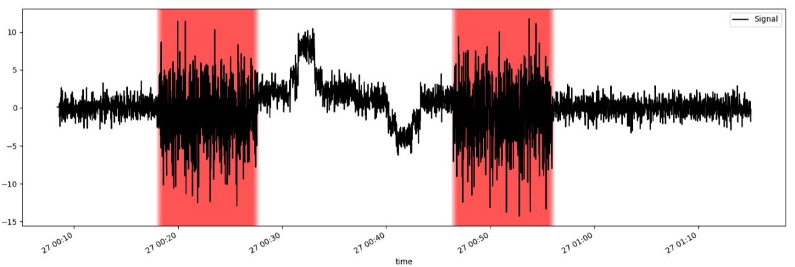
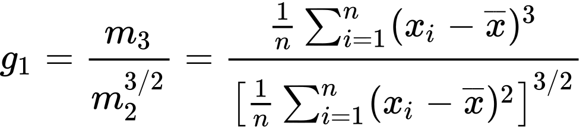

# Analisi della skewness di una serie temporale

## Introduzione

Il progetto consiste, dato un file rrd, nel determinare i punti in cui la serie temporale assume dei valori che ne aumentano la skewness. Come definizione di _skewness_ ho considerato quella riportata alla pagina [Skewness](https://en.wikipedia.org/wiki/Skewness). La formula usata è quella proposta al seguente [link](https://en.wikipedia.org/wiki/Skewness#Sample_skewness), cioè:

La formula viene applicata ad un intervallo di valori di ampiezza `size` punti e l'intervallo viene traslato di `transl` punti dopo ogni computazione del valore di skewness.

Il progetto si compone di uno script bash e di un programma in C. Lo script si occupa di creare un file rrd e di riempirlo di punti. I punti vengono aggiunti in modo da creare delle situazioni in cui la serie temporale è skew. Il programma C, dato il path al file rrd da analizzare, si occupa di riportare i punti in cui la skewness della serie temporale supera una certa soglia. In particolare i parametri presi in input dal programma C sono:
- il tempo di inizio e di fine di analisi del file rrd
- l'ampiezza `size` dell'intervallo
- il numero di punti `transl` di cui traslare l'intervallo
- la soglia oltre cui riportare i valori di skewness calcolati
- il path al file rrd da analizzare

## Compilazione ed esecuzione

Per l'esecuzione è necessaria la libreria [librrd](https://github.com/oetiker/rrdtool-1.x) per interagire con i file rrd.
`gcc -L /usr/lib/ -lrrd -lm skewness.c -o skewness`

