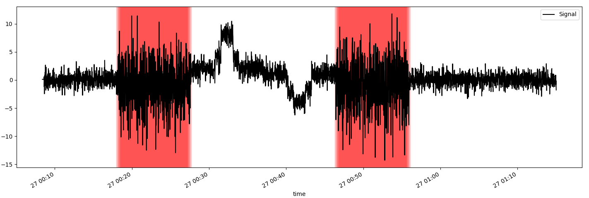

# Autore

Alessio Matricardi (a.matricardi@studenti.unipi.it)

# Obiettivo

L'obiettivo del progetto è l'implementazione di un sistema di individuazione di picchi all'interno di serie temporali.
Viene analizzato un arco che comprende gli ultimi S secondi della serie temporale.

Il sistema deve essere calibrato dall'utente con i primi N valori non nulli all'interno della serie temporale, ragion per cui è opportuno che la serie presenti, almeno inizialmente, un comportamento che riteniamo standard. Il processo di calibrazione calcola la deviazione standard degli N valori.
Da questo momento in poi, il programma cerca i picchi all'interno della serie procedendo con la tecnica della finestra mobile: il sistema procede calcolando la deviazione standard sui W valori presenti all'interno della finestra mobile.
Un picco viene individuato se la deviazione standard calcolata è 3 volte maggiore di quella di calibrazione.
La finestra si sposta ad ogni iterazione di 1/10 della sua grandezza (e.g. se W = 20 -> finestra mobile di 2 elementi per iterazione)



# Dipendenze

Le dipendenze sono all'interno del file `requirements.txt`.

Per installarle, se non presenti sulla propria macchina, eseguire da linea di comando:
```
pip3 install requirements.txt
```
Per evitare l'installazione di dipendenze non volute, è possibile installare ed eseguire il programma all'interno di un ambiente virtuale.

# Come eseguire

Parametri obbligatori:

- `-n` numero di elementi con cui calibrare il sistema
- `-w` numero di elementi presenti nella finestra mobile

Parametri obbligatori e alternativi tra loro:
- `--rrd <rrd file>` analizza file rrd
- `--json <json file>` analizza file json

Parametri opzionali:

- `-s` arco temporale da prendere in considerazione, espresso in secondi (default è 86400 = 1 giorno)
- `-v` verbose mode (mostra log di debug come ad esempio quando non viene rilevata un anomalia)
- `-p` plotta in nero il segnale ed in rosso dove il segnale è stato riconosciuto come nervoso
- `--rrd-metric` metrica RRD da prendere a scelta tra AVERAGE, MAX, MIN, LAST (default è AVERAGE)
- `--rrd-ds-index` DS index da prendere (default è 0)

# Come testare

## NTOPNG

È possibile testare le metriche offerte da ntopng lanciando da linea di comando:
```
sh test.sh
```
È un semplice script bash che prende tutti i file RRD presenti in `/var/lib/ntopng/0` e li analizza in successione.

È possibile lanciare lo script con un parametro indicante la cartella dove è presente una lista di file RRD:
```
sh test.sh /path/containing/rrds
```

## Test di singoli file RRD

Un esempio tipico di esecuzione è
```
python3 peaks.py -n 50 -w 40 -p --rrd test/signal.rrd
```

Il programma è stato testato con tutti i file di test forniti.

Esempio di output:

```
python3 peaks.py -w 40 -n 50 -p --rrd test/signal.rrd
2022-06-27 10:53:39,266 - INFO : Anomaly detected inside window between 2022-06-27 00:17:59 and 2022-06-27 00:18:39
2022-06-27 10:53:39,267 - INFO : Anomaly detected inside window between 2022-06-27 00:18:03 and 2022-06-27 00:18:43
2022-06-27 10:53:39,267 - INFO : Anomaly detected inside window between 2022-06-27 00:18:07 and 2022-06-27 00:18:47
2022-06-27 10:53:39,268 - INFO : Anomaly detected inside window between 2022-06-27 00:18:11 and 2022-06-27 00:18:51
2022-06-27 10:53:39,269 - INFO : Anomaly detected inside window between 2022-06-27 00:18:15 and 2022-06-27 00:18:55
2022-06-27 10:53:39,270 - INFO : Anomaly detected inside window between 2022-06-27 00:18:19 and 2022-06-27 00:18:59
2022-06-27 10:53:39,271 - INFO : Anomaly detected inside window between 2022-06-27 00:18:23 and 2022-06-27 00:19:03
2022-06-27 10:53:39,272 - INFO : Anomaly detected inside window between 2022-06-27 00:18:27 and 2022-06-27 00:19:07
2022-06-27 10:53:39,272 - INFO : Anomaly detected inside window between 2022-06-27 00:18:31 and 2022-06-27 00:19:11
[...]
2022-06-27 10:53:39,910 - INFO : Anomaly detected inside window between 2022-06-27 00:54:47 and 2022-06-27 00:55:27
2022-06-27 10:53:39,911 - INFO : Anomaly detected inside window between 2022-06-27 00:54:51 and 2022-06-27 00:55:31
2022-06-27 10:53:39,913 - INFO : Anomaly detected inside window between 2022-06-27 00:54:55 and 2022-06-27 00:55:35
2022-06-27 10:53:39,914 - INFO : Anomaly detected inside window between 2022-06-27 00:54:59 and 2022-06-27 00:55:39
2022-06-27 10:53:39,915 - INFO : Anomaly detected inside window between 2022-06-27 00:55:03 and 2022-06-27 00:55:43
2022-06-27 10:53:39,917 - INFO : Anomaly detected inside window between 2022-06-27 00:55:07 and 2022-06-27 00:55:47
2022-06-27 10:53:39,921 - INFO : Anomaly detected inside window between 2022-06-27 00:55:11 and 2022-06-27 00:55:51
2022-06-27 10:53:39,923 - INFO : Anomaly detected inside window between 2022-06-27 00:55:15 and 2022-06-27 00:55:55
2022-06-27 10:53:39,925 - INFO : Anomaly detected inside window between 2022-06-27 00:55:19 and 2022-06-27 00:55:59
2022-06-27 10:53:39,930 - INFO : Anomaly detected inside window between 2022-06-27 00:55:23 and 2022-06-27 00:56:03
2022-06-27 10:53:39,933 - INFO : Anomaly detected inside window between 2022-06-27 00:55:27 and 2022-06-27 00:56:07
2022-06-27 10:53:39,935 - INFO : Anomaly detected inside window between 2022-06-27 00:55:31 and 2022-06-27 00:56:11
```