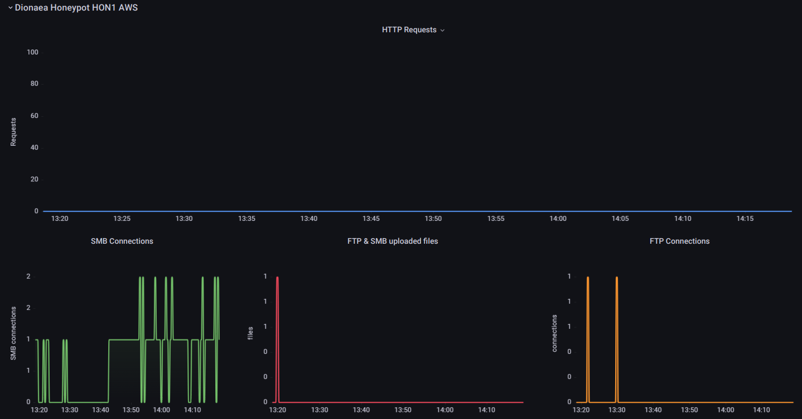
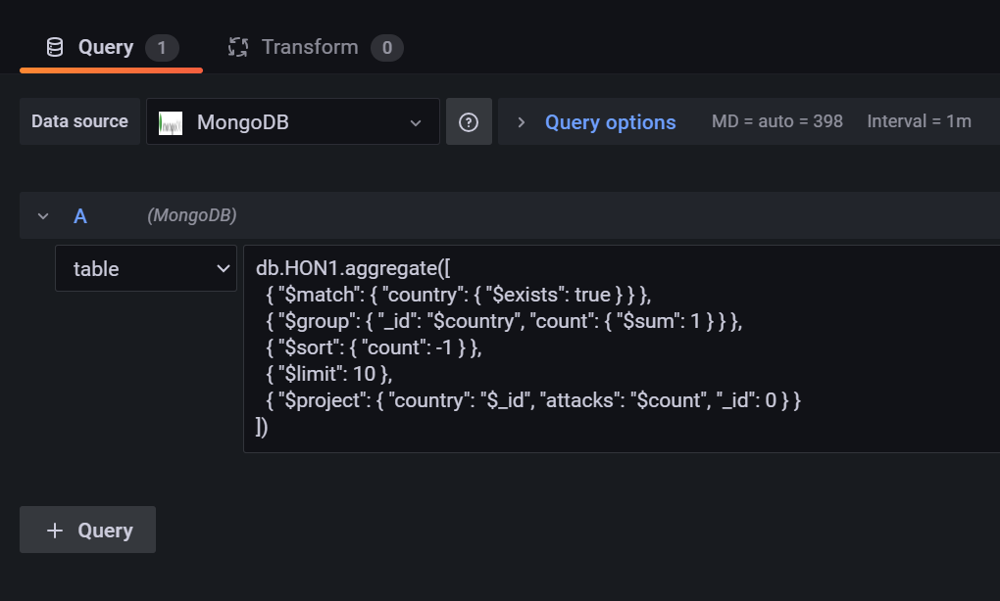

| Name        | Email                   |
|-------------|-------------------------|
 Boni  Filippo | f.boni7@studenti.unipi.it  |
 Braccini  Giovanni   | g.braccini8@studenti.unipi.it   |


 
 # Virtualized & Containerized Honeypot Management with Prometheus, MongoDB, and Grafana
## Concept
This project aims to visualize logs generated by [Cowrie](https://github.com/cowrie/cowrie) and [Dionaea](https://github.com/DinoTools/dionaea) honeypot and to monitor the environment where these run. The project addresses the challenges associated with deploying, securing  and monitoring these honeypots. By leveraging Grafana and Prometheus, this repository aims to provide a comprehensive solution for efficient and straightforward honeypot management.

## What is **Grafana?**
Grafana is a powerful visualization platform, offers intuitive and interactive dashboards that allow to gain valuable insights from collected honeypot data. Through Grafana, patterns, anomalies, and potential threats can be identified, enabling proactive defense measures.
## What is **Prometheus?**
Prometheus is a useful tool that allows you to create timeseries based on honeypots' collected data.

## Leveraging MongoDB for Efficient Data Storage and Retrieval

Prometheus is an excellent tool for storing and visualizing timeseries, gauges, and similar data. However, to accommodate more complex queries, we have integrated MongoDB, a flexible NoSQL database.

By incorporating **MongoDB** into the system, we can store a wider range of data types and leverage its powerful querying capabilities. This allows for more advanced analysis and retrieval of honeypot data.

   

## Grafana Dashboards

The repository provides two types of Grafana dashboards:

* Time series dashboard
Which includes:
   
   * Connections to Cowrie
   * Accepted SSH Connections
   * Cowrie Malware/files Downloads
   * SSH Commands executed
   * Dionaea HTTP Requests
   * Dionaea SMB Connections
   * Dionaea SMB & FTP files upload
   * Dionaea FTP Connections
   * Virtualbox VM TX network stats
   * Virtualbox VM RX network stats
   * Virtualbox VM / Docker containers CPU usage
   * Virtualbox VM / Docker containers  RAM usage


 * Attacks dashboard
   Which includes:
   
    * Live attack map
   * Top 10 attackers
   * Number of unique IPs and Files collected
   * Total SSH connections
   * Top 10 countries ( based on number of attacks)
   * Top 10 run commands
   * Daytime/Night-time attack time comparison ( from the honeypot prospective)
   * Daytime/Night-time attack time comparison ( from the attacker's prospective)
   * Number  of attacks detected as Tor nodes
   * Latest file captures with Virustotal results
   * Latest run commands
   * Top 10 passwords and usernames
   * Most common malware sources (from where attackers download malware onto the honeypot)

### Time series and VM statisics
In this dashboard, Prometheus is utilized to graph timeseries of various statistics from both honeypots. Additionally, we monitor the current state of the virtual machine (VM) by leveraging VirtualBox's API.


<div style="text-align: center;">
  
</div>


### Attacks Dashboard: More comprehensive statistics 
On the other hand, this other dasboard provides a more complete summary of the collected data. e.g top run commands and  most common attackers by ip & country. It also provides a live view of the latest uploded files and commands that were run on the honeypot. 


## Installation using Docker (fast)
This type of installation will run the honeypots in Docker containers, whereas the data collectors will run on the host machine.

<div style="text-align: center;">
  
</div>


# Quick Testing


To test the script without setting up the honeypots, the files in the *test* folder can be used. 

### Requirements
* Prometheus
* [Grafana](https://grafana.com/grafana/download/8.2.4?edition=oss)


## Setup Prometheus 
1. In the Prometheus.yml configuration file add the two clients:
```
  - job_name: 'Dionaea Honeypot'
    scrape_interval: 30s
    static_configs:
      - targets: ['127.0.0.1:8002']
  - job_name: 'Cowrie Honeypot'
    scrape_interval: 30s
    static_configs:
      - targets: ['127.0.0.1:8001']
```


## Setup Grafana 
1. Setup Prometheus as a data source in Grafana
2. Import in Grafana the   *Timeseries_Dashboard_Test* provided  in this repository.

## Testing Cowrie's Collector

1. Create folder called *ctrl1* in your root directory
2. Extract the contents of the *test* inside the folder you just created 
3. Install dependencies:
```
pip install prometheus_client
``` 
4. Run:
```
./testCowrie.sh
```
5. The script emulates cowrie's logs in order to showcase the log parsing function. 
A Promethous server istance will be started and can be added in grafana by following the steps described  in [Setup the Collectors and Prometheus](#setup-the-collectors-and-prometheus)

The test will emulate a day of attacks in 1 hour. 
Here it is a similar expected output when testing 

<div style="text-align: center;">
  
</div>


## Testing Dionaea's Collector

1. Create folder called *ctrl1* in your root directory
2. Extract the contents of the *test* inside the folder you just created 
3. Install dependencies:
```
pip install prometheus_client
``` 
4. Run:
```
./testDionaea.sh
```
3. The script  emulates Dionaea's logs in order to showcase the parsing function. A Promethous server istance will be started and can be added in grafana by following the steps described  in [Setup the Collectors and Prometheus](#setup-the-collectors-and-prometheus)

The test will emulate a day of attacks in 1 hour. 
Here it is a similar expected output when testing 




# Time Series  Dashboard Setup
The time series dashboard powered by prometheus and grafana **can be deployed in two ways**:
* **Docker Installation** : The honeypots will run in docker containers, and the collectors will be in the host machine, this is the **fastest deployment**
* **VM Installation** : if security is of primary importance, you can opt for this type of installation, which deploys the honeypots inside a virtualbox VM, the collectors script will be executed on the host machine. 


---


## Installation using Docker (fast)
This type of installation will run the honeypots in Docker containers, whereas the data collectors will run on the host machine.

<div style="text-align: center;">
  
</div>


### Requirements
* Debian >= 10 or Ubuntu >= 18.04 LTS
* [Grafana OSS 8.2.4](https://grafana.com/grafana/download/8.2.4?edition=oss)
* MongoDB >= 6.0.6 
* Prometheus >= 2.37.8
* Docker >= 23.0
* Docker Compose
* Open Port 20, 21, 22, 80, 443, 445

### Deploy and prepare the containers 
Cowrie will use port 22 to simulate an SSH server, so you will have to change the SSH port on the host machine to another port of your choice.
You will also need to create this directories  `/ctrl1/dionaea` and `/ctrl1/cowrie` in your root (`/`) folder and recursively set the permission to 777 (`chomod -R 777 /ctrl1`)
### Deploy Dionaea 

1. Download the provided dionaeaDocker folder, inside you will find a custom version of [T-Pot](https://github.com/telekom-security/tpotce/tree/master) Dionaea's docker compose file 
2. Run the docker compose file
 `docker-compose -f docker-compose.yml up -d
 `
4. On the Host machine, to convert the log files to a json format compatible with the collectors we will use the script [dionaeaToJSON](https://github.com/eval2A/dionaeaToJSON). You can find an adapted version in the dionaeaDocker directory previusly downloaded
6. To run the dionaeaToJson script add it to a crontab that executes it every 30 seconds

### Deploy Cowrie 
1. Pull and run Cowrie container:
```
docker run -p 22:2222/tcp -d cowrie/cowrie
```
2. Rename the Container to cowrie : 
```
docker rename CONTAINER_old_name cowrie
```
3. Find the shared volume of the container, which should be located in /var/lib/docker/volumes/. In the file path there should be cowrie logs /var/lib/docker/volumes/YOUR_VOLUME/_data/cowrie/log.
So write down the Volume Name (YOUR_VOLUME)

### Setup the Collectors and Prometheus
After the deployment of the docker containers:

1. Copy to /usr/local/sbin and run *chmod 700* on both `cowrieDockerPrometheus.py` and `dionaeaDockerPrometheus.py` 
2. Install the Prometheus library required (on Python 2.7)
    `pip install prometheus-client`
3. Edit `cowrieDockerPrometheus.py` 's LOGFILE variabile changing `YOUR_VOLUME` to the one annotated previusly
    
4. Create two empty files in the same directory as the collector called *lastlinepromDion.txt* and *lastlineprom.txt*
5. Execute the python script: 
```
nohup python cowriePrometheus.py &
nohup python dionaeaPrometheus.py &
```
6. In the Prometheus.yml configuration file add the two clients:
```
  - job_name: 'Dionaea Honeypot'
    scrape_interval: 15s
    static_configs:
      - targets: ['127.0.0.1:8002']
  - job_name: 'Cowrie Honeypot'
    scrape_interval: 15s
    static_configs:
      - targets: ['127.0.0.1:8001']
```
The Prometheus collectors expose an HTTP server on ports 8001 and 8002, both of which can be adjusted to run on a different port. Additionally, the default metrics update interval is set to 15 seconds, and it can be modified by changing the value of the variable SCRAPE_INTERVAL in the main function of both scripts.

### Setup Grafana

1. Setup Prometheus as a data source
2.  Import in Grafana the  *Docker Timseries  dashboard* provided  in this repository.

**Now you can configure the Attacks Dasboard**


---


## Time Series  Installation using VMs (Long)
This type of installation requires a Virtual Machine where the honeypots will be executed and using rsync and VirtualBox shared folder the collectors scripts provided will read the logs and obtain the metrics.

<div style="text-align: center;">
  
</div>


### Requirements 
* Debian >= 10 Or Ubuntu >= 18.04 LTS
* [Grafana OSS 8.2.4](https://grafana.com/grafana/download/8.2.4?edition=oss)
* MongoDB >= 6.0.6 
* Prometheus >= 2.37.8
* Docker >= 23.0
* VirtualBox >= 6.1

### Install and prepare the VM
After the installation of Virtualbox  on the host machine, proceed to crerate a VM with a fresh copy of ubuntu 18.04 LTS (Suggested specs are >= 2vCPUs >= 4GB ram >= 128Gb ssd), after that we are ready to setup the shared folders:
1. On the VM settings of Virtualbox : System > Enable Enable I/O APIC
2. On the host : sudo mkdir /ctrl1
3. On the VM settings of Virtualbox : Shared Folders > Add New > Folder path /ctrl1, folder name: ctrl1, flag Auto-mount > ok
4. In the VM install the additional tools of virtualbox from the virtual CD ([Guide](https://www.techrepublic.com/article/how-to-install-virtualbox-guest-additions-on-a-gui-less-ubuntu-server-host/)) and restart the VM
5. Verify that the shared directory system is working ( sudo touch /media/sf_ctrl1/test)

Now we can configure the virtual NIC:
On the  virtualbox home GUI:

1. Change the host SSH Port to one of your choice.
2. "YOUR_VM_NAME" > Settings > Network > Adapter 1 NAT > advanced : Port forwarding set desired forwarding rules (22,80,445,21) (from local ip of host) to Guest ip 10.0.2.15
3. In order to allow source IP of packets to be maintained even after NAT translation, run the command from the host terminal: 
`VBoxManage modifyvm "YOUR_VM_NAME" --nataliasmode1 proxyonly` 
4. Configure the virtualbox network adapter in the VM by assigning IP 10.0.2.15

### Setup Dionaea
1. Install Dionaea as described by the documentation
2. By default Dionaea is installed on `/opt/dionaea` and emulates  serveral services, these services can be changed and configured in the directory : `/opt/dionaea/etc/dionaea/services-enabled`. 
3. Check that in /opt/Dionaea/etc/dionaea/ihandlers-enabled there is the log_sqlite.yaml file,  alternatively set the corrisponding sqlite ihandler.
4. To convert the log files in JSON download [dionaeaToJSON](https://github.com/eval2A/dionaeaToJSON): 
`wget https://raw.githubusercontent.com/eval2A/dionaeaToJSON/master/dionaeaSqliteToJson.py `
`$ sudo mv dionaeaSqliteToJson.py /opt/`
5. In the downloaded file configure the variables:
`dionaeaSQLite = '/opt/dionaea/var/lib/dionaea/dionaea.sqlite'`
`dionaeaLogPath = '/opt/dionaea/var/log/dionaea/json`
`dionaeaBinariesPath = '/opt/dionaea/var/dionaea/binaries'`
6. Add a crontab  that runs it every 30 seconds 
6. Restart the VM

#### Setup the shared log file
In order to read the log file from host machine we will use [rSync](https://linux.die.net/man/1/rsync) to sync the log file to the sharedfolder located in /media/sf_ctrl1:
1. Copy the Script `logSyncDion.sh` to the VM
2. Add the script to a crontab at reboot using *@reboot*
3. Check if the file `syncedLogDion.json` exists on the host in the `/ctrl1` directory

### Setup Cowrie (Docker)
In the Virtual Machine:
1. Install the latest version of Docker
2. Pull and run the Cowrie container:
```
docker run -p 22:2222/tcp cowrie/cowrie
```
3. Find the shared volume of the container in /var/lib/docker/volumes/ and write down the full path.
#### Setup the shared log file
The log file will be read by the prometheus client and the MongoDB collector from the host machine, for doing so we will use [rSync](https://linux.die.net/man/1/rsync) so setup the share from the Dionaea json file to the shared folder /media/sf_ctrl1 :
1. Copy the Script `logSyncCowrie.sh` to the VM
2. Edit the source path volume in the script to the one you wrote down in the previous step
3. Add the script to a crontab at reboot using *@reboot*
4. Check if the file exists on the host in the `/ctrl1` directory

### Setup the Collectors and Prometheus
On the host machine the collectors should be able to read the files from the shared folder /ctrl1 with the VM after checking that:

1. Prapare the VirtualBox machine for collecting the performace metrics, so execute this command on the host terminal as root:
```
VBoxManage metrics setup "YOUR_VM_NAME" Guest/CPU/Load,Guest/RAM/Usage,Net/Rate
```
2. Copy to /usr/local/sbin and chomod 700 both `cowriePrometheus.py` and `dionaeaPrometheus.py` 
3. Install the promethus library required (on Python 2.7)
    `pip install prometheus-client`
4. Create in the same directory as the collectors the empty files last_line_prom.txt and last_line_promDion.txt
4. Execute the python script: 
```
nohup python cowriePrometheus.py &
nohup python dionaeaPrometheus.py &
```
5. In the promethues.yml configuration file add the two clients:
```
  - job_name: 'Dionaea Honeypot'
    scrape_interval: 15s
    static_configs:
      - targets: ['127.0.0.1:8002']
  - job_name: 'Cowrie Honeypot'
    scrape_interval: 15s
    static_configs:
      - targets: ['127.0.0.1:8001']
```
The Prometheus collectors expose an HTTP server on port 8001 and 8002, both can be adjusted. In addition, the default metrics update interval is 15 seconds, it can be set from the variable SCRAPE_INTERVAL in the main function of both scripts.

### Setup Grafana
1. Setup prometheus as a data source
2. Import in Grafana the  *Timseries dashboard* provided  in this repository


# Attacks Dashboard setup 
The attack dashboard setup is the same for both type of installation (Docker and VM)


## Storing Cowrie's logs in MongoDB

Since Cowrie logs are in a one-line JSON format (each line represents a JSON entity), we have defined a MongoDB document model that aligns with the structure of Cowrie logs. In addition to the existing fields, we have incorporated additional fields in our MongoDB collection. For example, each log line in MongoDB includes a "country" field, which is derived from MaxMind's geoip lite database. Furthermore, for entries containing file hashes, we have included a "virustotal" field that provides a direct link to the VirusTotal results page for the respective hash. To automate the process of inserting new log lines, we have implemented two scripts, MongoTailAgent.py for Cowrie, and MongoTailAgentD.py for Dionaea. These script run every minute, identifying new log lines and utilizing the MongoDB API to insert them into the database.


### Storing Cowrie’s logs in MongoDB
### Script setup
 1. install the following Python 3 libraries:

```
geoip2
pymongo
timezonefinder
```

2. Download [MaxMind's city DB](https://www.maxmind.com/en/geoip2-city)
3. Edit the following variables in  MongoTailAgent.py according to your installation
```

COWRIE_LOGS_PATH
MONGO_ISTANCE
LAST_LINE_FILE (has to be created manually)
CITY_DATABASE_FILE
DB_NAME 
MONGO_COLL
```


4. Finally run the script with:

```
nohup python3 MongoTailAgent.py &
```

### Storing Dionaea's logs in MongoDB
### Script setup
 1. install the following Python 3 libraries:

```
geoip2
pymongo
timezonefinder
```

2. Download [MaxMind's city DB](https://www.maxmind.com/en/geoip2-city)
3. Edit the following variables in  MongoTailAgentD.py according to your installation
```

DIONAEA_LOGS_PATH
MONGO_ISTANCE
LAST_LINE_FILE (has to be created manually)
CITY_DATABASE_FILE
DB_NAME 
MONGO_COLL
```


4. Finally run the script with:

```
nohup python3 MongoTailAgentD.py &
```


## Integrating MongoDB with Grafana

Now that all our logs are stored in MongoDB, we want to be able to access them from Grafana. Grafana offers an [official plugin](https://grafana.com/grafana/plugins/grafana-mongodb-datasource/) that allows adding a MongoDB database as a data source. However, the plugin requires a Grafana enterprise subscription. Therefore, for this project, we opted for a free alternative, which is a fork of [this](https://github.com/JamesOsgood/mongodb-grafana) repository, available [here](https://github.com/nescohen/mongodb-grafana).

 
## Installing the plugin 
* Clone the GitHub repsotory mentioned above
* Copy the whole mongodb-grafana dir into the Grafana plugins dir (/usr/local/var/lib/grafana/plugins )
* Restart the Grafana server:
```
systemctl restart grafana
```
* Open a command prompt in the mongodb-grafana directory
* Install the dependencies
```
npm install
```

* Start the REST API proxy to MongoDB:
 ```
npm run server
```
By default, the server listens on http://localhost:3333.


## Setting up the plugin
Once installed, the plugin will be available at as a datasouce within Grafana as shown below:


In the datasource settings, in the https section, set the URL of  the server we started in the previous step.


Then, in the MongoDb details section, set the MongoDB server details, specifying the database we want grafana to be able to access, as shown below:


Finally, test the config by clicking the *Save & Test* butto. You should see the following message:


The plugin has been succesfully set up, and can now be used as a datasource in any grafana dashboard. 

You can now Import in Grafana the *Attacks dashboards* provided in this repository

## Quick testing

Both MongoDB scripts can be tested in order to poupulate a MongoDB Database without installing the honeypots by using the demo files located in the *test* folder.

### Test Cowrie's agent

To test  *MongoTailAgent.py*:

1. extract the contents of the *test* folder in your working directory (Where *LASTLINEFILE* and *CITYDATABASEFILE* files are located)
2. Edit the *COWRIELOGSPATH* variable of *MongoTailAgent.py* to *"syncedLog.json"*
3. Run:
 ```
 nohup python demoFileCowrie.py &
 python3 MongoTailAgent.py 

```
### Test Dionaea's agent

To test  *MongoTailAgentD.py*:

1. extract the contents of the *test* folder in your working directory (Where *LASTLINEFILE* and *CITYDATABASEFILE* files are located)
2. Edit the *DIONAEA_LOGS_PATH* variable of *MongoTailAgentD.py* to *"syncedLogDion.json"*
3. Run:
 ```
 nohup python demoFileDionaea.py &
 python3 MongoTailAgentD.py 

```


## A simple usage example

Let's create a new empty panel in any dashboard and set MongoDB as the default datasource. In the query section, we can add a MongoDB query:




Note: The plugin only supports the *aggregate* method, but it's not a deal-breaker by any means since it does not limit the number of queries that can be performed. Additionally, the query has to be in JSON format. For example, use *"$match"* instead of $match.

At this point, we need to choose the appropriate type of panel based on the query and its results. For instance, a timeseries requires a query that returns a "time" field.

Here's an example of a *piechart* panel showing the top 10 countries from which a honeypot was attacked:


## MongoDB & Dionaea

Regarding Dionaea, by default, it does not provide logs in JSON format. To address this, we utilized the [dionaeaToJSON](https://github.com/eval2A/dionaeaToJSON) tool. This tool can be run as a cronjob to periodically convert logs into JSON format. Once the logs are in JSON format, we proceeded to develop MongoTailAgentD.py. This script is similar to the one used for Cowrie, with the exception of the document structure tailored to Dionaea. Additionally, the logs are saved in a separate MongoDB collection that can be used within Grafana for panel queries.


## A Useful Querying Tool

After manually creating several dashboards filled with a wide range of different kinds of queries, we realized that more often than not, we still couldn't find the specific data we were looking for. This led us to manually create new panels every time, which was time-consuming. To address this issue, we developed **HoneyLogSense**, a simple tool that allows you to query the honeypot logs using natural language. It automatically determines the appropriate type of query and generates the corresponding Grafana panel.

Below is a simple example showcasing the results of the query "top 10 attackers from the US":

<div style="text-align: center;">
  
</div>


