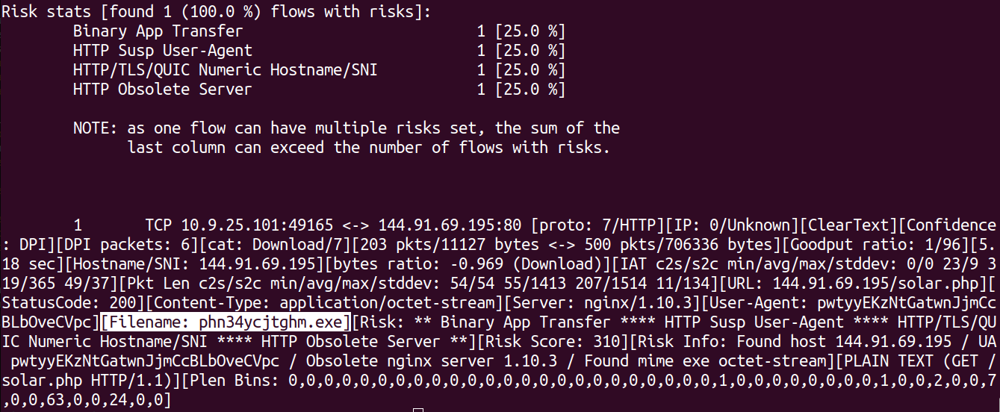

# Estensione nDPI con feature per estrarre filename da HTTP Content-Disposition
Chiara Maggi, <c.maggi2@studenti.unipi.it>

## Introduzione 
nDPI (https://www.ntop.org/products/deep-packet-inspection/ndpi/) è una libreria open-source utilizzata per la Deep Packet Inspection. Il progetto consiste nell'estrarre il filename (se presente) dal Content-Disposition presente nel response header di una risposta HTTP regolare. L'aggiunta del nome del file identificherà meglio i trasferimenti sospetti/dannosi.
<p align="center">
  
</p>

## Modifiche apportate alla libreria
Per andare a implementare questa feature sono servite piccole aggiunte in diversi file, che riporto di seguito:
- In `src/include/ndpi_typedefs.h` aggiunta della variabile `filename` nel campo `http` della struct `ndpi_flow_struct`.
- In `src/lib/protocols/http.c` modificato il codice esistente della funzione `ndpi_http_check_content` in maniera tale da processare nella risposta HTTP il campo "Content-Disposition" estraendo il filename, se esistente, e salvandolo dentro il campo `filename` del punto precedente. In particolare la strategia utilizzata è stata quella di andare ad analizzare la struttura della porzione di stringa che segue `"attachment; filename="` e controllare in quale forma si trovasse il filename da estrarre. In base a quello si va a inizializzare `filename` con la grandezza adeguata sfruttando la funzione della libreria `ndpi_malloc` (facendo i dovuti controlli sull'assenza di errori durante la malloc) e si va a inserire il nome del file al suo interno (compreso di estensione). Tre sono le forme possibili prese in considerazione:
    - `filename="nome_del_file`
    - `filename="nome_del_file"`
    - `filename=nome_del_file`
- Sempre in `src/lib/protocols/http.c` si va liberare la memoria del `filename` (se popolata) nella funzione `reset`.
- In `src/lib/ndpi_main.c` si va a liberare la memoria del `filename` (se popolata) nella funzione `ndpi_free_flow_data`.
- In `example/reader_util.h` aggiunta della variabile `filename` nel campo `http` della struct `ndpi_flow_info`
- In `example/reader_util.c` vado a salvare dentro `flow->http.filename` il campo popolato nei punti precedenti
- In `example/ndpiReader.c` aggiunta della stampa di `filename` se campo popolato
- In `src/include/ndpi_typedefs.h` modificata la grandezza massima della `ndpi_flow_struct` da 952 a 960.

Il risultato finale è la presenza del campo aggiuntivo `[Filename: ...]` all'interno delle informazioni relative ai flussi.

## Esempio output su file pcacp di test
Trovandosi all'interno della cartella `nDPI` un possibile comando da eseguire è il seguente:
```c
sudo ./example/ndpiReader -v 2 -i /path_file_pcacp
```
L'output conterrà, se presente, l'informazione relativa al filename:
<p align="center">
  
</p>


