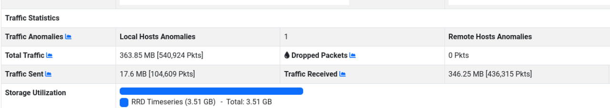
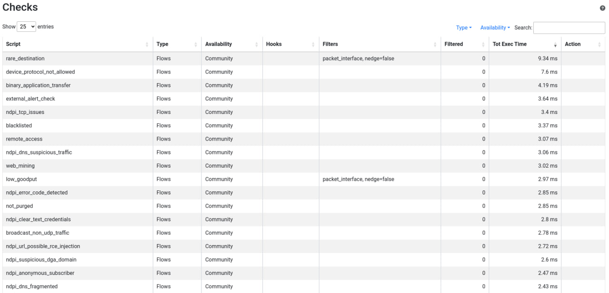

# Rare/Unusual Domain or Destination Flow Check
Yuriy Rymarchuk <y.rymarchuk@studenti.unipi.it>
Leonardo Brugnano <l.brugnano@studenti.unipi.it>
Giuseppe Zocco <g.zocco1@studenti.unipi.it>

## 1. Introduzione
[ntopng](https://github.com/ntop/ntopng) è uno strumento per il monitoraggio del traffico di rete.
Per analizzare il traffico che scorre in una o più reti, ntopng sfrutta [nDPI](https://github.com/ntop/nDPI): una libreria open source di *deep-packet inspection* caratterizzata da funzionalità come la classificazione e l'analisi del traffico, l’estrazione di metadati dai flussi, il rilevamento dei protocolli a livello di applicazione, etc...


ntopng genera degli allarmi, chiamati *alert*, per riportare il verificarsi di diversi tipi di eventi sulla rete monitorata. La visualizzazione e la configurazione di questi avviene attraverso l’apposita interfaccia web, accessibile una volta che ntopng è stato avviato. Gli alert in questione possono essere creati per flussi, host oppure altri elementi della rete. Gli alert riguardanti i flussi e gli host sono creati all’interno del core C++ di ntopng, all'interno dei check.

Il progetto preso in carico consiste nell’aggiungere una nuova feature a ntopng relativa alle issue n. [#6416](https://github.com/ntop/ntopng/issues/6416) e [#6417](https://github.com/ntop/ntopng/issues/6417)

La feature consiste nell’implementare il controllo delle comunicazioni verso destinazioni o domini considerati rari per ogni Interfaccia registrata in un'istanza di ntopng, e nel caso lanciare un alert. Per definire quando una destinazione o un dominio è raro abbiamo previsto una routine di apprendimento periodico delle abitudini del traffico di rete.

## 2. Scelta e implementazione delle strutture dati
Prima di implementare la logica del check e dell'apprendimento abbiamo dovuto scegliere le strutture dati necessarie per il nostro algoritmo. Sotto il consiglio del professore, abbiamo usato l'implementazione delle [Roaring Bitmaps](https://roaringbitmap.org/about/) all'interno della suite nDPI, una delle librerie di bitmap compresse più usata sul mercato, data la sua efficienza per quanto riguarda l'uso della memoria.

È stato scelto di effettuare l'apprendimento per interfaccia, che viene monitorata da ntopng, quindi la classe `NetworkInterface` è stata estesa con le bitmap `rare_dest_local`, `rare_dest_remote`, `rare_dest_local_bg` e `rare_dest_remote_bg`, e la struttura d'appoggio `rareDestTraining` utile a rilevare lo stato dell'apprendimento ( Se viene effettuato il `initialTraining` e il `checkPoint` dall'ultimo apprendimento effettuato)

```cpp
/* RareDestination data implementation*/
ndpi_bitmap *rare_dest_local;
ndpi_bitmap *rare_dest_remote;
ndpi_bitmap *rare_dest_local_bg;
ndpi_bitmap *rare_dest_remote_bg;

struct {
	bool initialTraining;
	time_t checkPoint;
} rareDestTraining;

```

Seguendo lo standard del codice di ntopng abbiamo inoltre esteso la classe con metodi utili ad astrarre l'accesso e la modifica di `rareDestTraining` e le relative bitmap. Ad esempio:
```cpp
inline void setLocalRareDestBitmap(u_int32_t hash) { if(rare_dest_local) ndpi_bitmap_set(rare_dest_local, hash); }
inline void setRemoteRareDestBitmap(u_int32_t hash) { if(rare_dest_remote) ndpi_bitmap_set(rare_dest_remote, hash); }

inline bool isSetLocalRareDestBitmap(u_int32_t hash) const { return ndpi_bitmap_isset(rare_dest_local, hash); }
inline bool isSetRemoteRareDestBitmap(u_int32_t hash) const { return ndpi_bitmap_isset(rare_dest_remote, hash); }
```

## 3. Memorizzazione dei dati
Per risparmiare la memoria, ntopng controlla periodicamente gli host istanziati, rimuovendo dalla memoria quelli inattivi. Per far fronte ad una possibile interruzione, dovuta alla rimozione dell’interfaccia dalla memoria, abbiamo deciso di usare Redis Database, il middleware a disposizione di ntopng. Abbiamo esteso la classe `LocalHost` con due metodi per permetterci il salvataggio e il ripristino dei dati, rispettivamente chiamati `saveRareDestToRedis()` e `loadRareDestFromRedis()`.

In particolare, sfruttiamo Redis Hashes, che memorizza dei record modellati come collezioni di coppie campo-valore. Ogni chiave, campo e valore sono rappresentati da stringhe, di conseguenza abbiamo dovuto trasformare ogni tipo di dato in una stringa per poterlo memorizzare. 
Ogni record è rappresentato da una chiave data una stringa comune `IFACE_RARE_DEST_SERIALIZED_KEY` così formata:
```cpp
#define IFACE_RARE_DEST_SERIALIZED_KEY "ntopng.iface_rare_dest_fields.ifid_%d"
```
a cui è concatenata l'id' dell’interfaccia, grazie all'uso del metodo `get_id()`, che rende ogni record univoco e specifico per quella interfaccia di rete.

Per poter memorizzare le bitmap su Redis Hashes, usando il metodo `redis->hashSet()`, prima è necessario serializzarle usando il metodo `ndpi_bitmap_serialize(rare_dest, &value)`, ma dato che il valore restituito rappresentato dal `value` è una sequenza arbitraria di bit ( i quali durante il salvataggio su Redis possono essere corrotti o rappresentati in formato sbagliato  ) codifichiamo i dati seguendo lo standard *base64*, utilizzando il metodo `Utils::base64_encode()`.

```cpp
void NetworkInterface::setRareDestBitmapRedisField(const char *key, const char *field, ndpi_bitmap **bitmap){
	char *value = NULL;
	size_t size;
	
	size = ndpi_bitmap_serialize((*bitmap), &value);
	
	if( value == NULL ) return;
	
	char *encoded_bmap = value ? Utils::base64_encode((unsigned char *)value, size) : NULL;

	if (encoded_bmap != NULL) {
		size = strlen(encoded_bmap);
		ntop->getRedis()->hashSet(key, field, encoded_bmap);
		
		char len_field[32];
		snprintf(len_field, sizeof(len_field), "%s_len", field);
		setRareDestStructRedisField(key, len_field, (u_int64_t)size);
		
		free(encoded_bmap);
		free(value);
	}
}
```

Quando un interfaccia viene inizializzata e caricata in memoria, la presenza di dati relativi a quest’ultima in Redis è verificata eseguendo lo stesso procedimento ma al contrario: usando `redis->hashGet()` per le stringhe effettuiamo il cast al tipo opportuno, mentre per le bitmap decodifichiamo da base64 la stringa ottenuta e deserializziamo il contenuto. 
```cpp
bool NetworkInterface::getRareDestBitmapRedisField(const char *key, const char *field, ndpi_bitmap **bitmap){
	char *bitmap_field_val = NULL;
	u_int64_t value;
	size_t size;
	
	char len_field[32];
	snprintf(len_field, sizeof(len_field), "%s_len", field);
	
	if (!getRareDestStructRedisField(key, len_field, &value)) return(false);
	size = (size_t)(value); 
	
	if((bitmap_field_val = (char *) malloc(size)) == NULL) {
		ntop->getTrace()->traceEvent(TRACE_ERROR, "Unable to allocate memory to deserialize %s", key);
		return(false);
	} 
	
	if(ntop->getRedis()->hashGet(key, field, bitmap_field_val, (size)) != 0) {
		free(bitmap_field_val);
		return(false);
	}
	  
	if( bitmap_field_val == NULL ) return(false);
	
	(*bitmap) = ndpi_bitmap_deserialize((char *)(Utils::base64_decode((std::string)bitmap_field_val).c_str()));
	free(bitmap_field_val);
	
	return(true);
}
```

Se durante l'inizializzazione di una Interfaccia uno dei valori non è presente (o non è stato possibile deserializzare una delle bitmap), oppure l'ultimo checkpoint registrato di fine apprendimento risulta vecchio di due o più settimane, tutte le strutture dati elencate vengono nuovamente inizializzate, dunque al primo flow utile viene avviato il training.
```cpp
if( id >= 0 && (!loadRareDestFromRedis() || 
				(( time(NULL) - rareDestTraining.checkPoint ) > (2 * RARE_DEST_BACKGROUND_TRAINING_DURATION))) ){
	rareDestTraining.checkPoint = 0;
	rareDestTraining.initialTraining = true;
	rare_dest_local = ndpi_bitmap_alloc();
	rare_dest_local_bg = ndpi_bitmap_alloc();
	rare_dest_remote = ndpi_bitmap_alloc();
	rare_dest_remote_bg = ndpi_bitmap_alloc();
}
```

## 4. Algoritmo di apprendimento e logica del Check
Il controllo delle destinazioni rare è implementato dalla funzione `void RareDestination::protocolDetected(Flow *f)` in `./src/flow_checks/RareDestination.cpp`. Formalmente, viene definita rara una destinazione di cui la funzione non ha memoria. In tal caso, tale destinazione viene memorizzata ed un alert è lanciato. 

### 4.1 Hashing delle destinazioni
Per garantire una memorizzazione efficiente delle destinazioni, viene fatto uso di bitmap compresse, implementate dalle `ndpi_bitmap`. L’indicizzazione di tali strutture avviene utilizzando il valore ottenuto dall’hashing delle destinazioni, funzionalità implementata all’interno del metodo
```cpp
u_int32_t RareDestination::getDestinationHash(Flow *f, u_int8_t *destType)
```

Le modalità di hashing cambiano a seconda del tipo di destinazione. In prima istanza, vengono distinte le destinazioni locali da quelle remote, dato che diverse tecniche di hashing vengono utilizzate per le due. Il tipo della destinazione viene ottenuto mediante i metodi `isLocalToLocal()` e `isLocalToRemote()` definiti nella classe `Flow`.
```cpp
if (f->isLocalToLocal()) {

	*destType = 0;  // local destination
	LocalHost *ldest = (LocalHost*)f->get_srv_host();

	if (ldest->isLocalUnicastHost() && ldest->isDHCPHost()) {
		Mac *mac = ldest->getMac();
		hash = mac ? mac->key() : 0;
	}
	else if (ldest->isIPv6() || ldest->isIPv4()) {
		hash =  ldest->get_ip()->key();
	}

}
else if (f->isLocalToRemote()) {
	*destType = 1;  // remote destination
	hash = Utils::hashString(f->getFlowServerInfo());
}
```

Come si può osservare, quando la destinazione è locale viene tenuto conto del fatto che essa sia DHCP o meno. Nel primo caso viene calcolato l’hashing dell’indirizzo MAC, mentre nel secondo è valutato l’indirizzo IP. Ciò è dovuto al fatto che in una rete locale DHCP gli indirizzi IP vengono distribuiti e reclamati dinamicamente tra gli host in essa presenti, quindi un certo host potrebbe possedere indirizzi IP diversi in istanti di tempo separati. L’identificazione di un host mediante il suo temporaneo indirizzo IP sarebbe dunque una scelta errata. In questo contesto, viene effettuato l’hashing dell’indirizzo MAC dell’host, in quanto valore costante. 
In una rete a configurazione manuale dell’indirizzo IP si suppone invece che le associazioni tra host ed indirizzi IP permangano sostanzialmente invariate nel tempo.
Nel caso in cui una destinazione sia remota, ne viene considerato il nome di dominio. L’indirizzo IP non è considerato in quanto ad uno stesso servizio online potrebbero essere associati molteplici indirizzi IP.

Infine, si può osservare come `getDestinationHash` non si limiti soltanto a calcolare e ritornare l’hashing di una destinazione, ma indica anche se questa è locale o remota settando un l’apposita variabile `destType`. Questa informazione è alla chiave del funzionamento del check.

### 4.2 Versione iniziale del check
Una problematica che emerge all’istante è la seguente: se la funzione memorizza e basta nuove destinazioni, si arriverà ad un punto in cui virtualmente ogni destinazione sarà già stata vista e considerata non rara. Questo è chiaramente un comportamento indesiderato, in quanto è naturale che se una destinazione non viene più vista per un intervallo di tempo sufficientemente lungo, è giusto considerarla nuovamente rara.

Per risolvere tale problema è stata inizialmente proposta una soluzione che, facendo uso di una bitmap ausiliaria, permettesse una gestione dinamica delle destinazioni. Essa si ispirava al second-chance (o clock) algorithm per il rimpiazzamento delle pagine in memoria fisica. Infatti, nonostante il campo applicativo sia completamente diverso, una logica analoga può essere applicata anche nel nostro caso.

La funzione proposta operava perciò nel seguente modo:
1. La funzione entra in una fase di training preliminare, in cui le nuove destinazioni vengono memorizzate nella bitmap principale senza lanciare un alert.  
2. Finita la fase di training, la funzione inizia ad operare normalmente, lanciando un alert ogni volta che una destinazione rara viene vista. Quando invece viene vista una destinazione non rara, il rispettivo bit all’interno della bitmap di supporto (indicizzata con lo stesso valore di hash) viene posto a 0.
3. Ad intervalli di tempo regolari, detti epoche, la funzione controlla quali destinazioni siano considerate non rare (bit a 1 nella bitmap principale). Per ognuna di queste, viene controllato il rispettivo bit nella bitmap di supporto: se questo è a 0, allora viene posto a 1; se è ad 1, allora viene posto a 0 insieme al bit nella bitmap principale, rendendo la destinazione nuovamente rara.
4. Siccome la funzione viene chiamata esclusivamente al presentarsi di un nuovo flow, può accadere in caso di mancanza di traffico che essa non venga eseguita per molto tempo. Per garantire che qualsiasi destinazione non rara venga considerata nuovamente rara se non vista per un’epoca, viene aggiunto un controllo ulteriore: prima di verificare se è passata un’epoca, si controlla se ne sono passate due. Infatti, questo secondo caso implica che ogni destinazione non rara non è stata vista per almeno l’intera durata di un’epoca, e quindi va considerata nuovamente rara. La funzione ritorna perciò al punto 1).  

Nonostante questa soluzione permettesse di svolgere il training solamente una volta (in condizioni regolari), è stata in ultima istanza scartata in quanto troppo complessa dal punto di vista computazionale.

### 4.3 Seconda versione del check
Una nuova soluzione è stata quindi implementata. Questa, a differenza dell’altra, si affida a training periodici, semplificando notevolmente la politica di gestione delle destinazioni. Sebbene sia anche qui sfruttata una bitmap ausiliaria (`rare_dest_last`), essa ha il solo scopo di memorizzare la configurazione della bitmap principale prima che questa venga azzerata per la nuova fase di training.
```cpp
/* RareDestination.cpp */
if ( elapsedFromLastTraining >= RARE_DEST_LAST_TRAINING_GAP ) {
	cli_lhost->updateRareDestBitmaps();
	cli_lhost->setStartRareDestTraining(0);
	
	return;
}

/* LocalHost.h */
inline void updateRareDestBitmaps() { 
	ndpi_bitmap_free(rare_dest_last); rare_dest_last = rare_dest; rare_dest = ndpi_bitmap_alloc(); 
}
```

La logica implementata è quindi la seguente: in corrispondenza di una destinazione non già vista dall’ultima fase di training, viene lanciato un alert solo se questa non fu vista neanche nella fase precedente.
```cpp
if (!cli_lhost->isSetRareDestBitmap(hash)){
	cli_lhost->setRareDestBitmap(hash);
	if (!cli_lhost->isSetRareDestLastBitmap(hash)) {
		is_rare_destination = true;
	}
}
```

In questo modo, una destinazione risulta effettivamente rara solo se non vista per due cicli di training consecutivi.

Similmente alla soluzione scartata, si controlla anche qui se per troppo tempo, cioè per almeno due cicli di training, la funzione non è stata eseguita. In tal caso, tutte le destinazioni in memoria sono considerate nuovamente rare ed una nuova fase di training viene iniziata.
```cpp
if (elapsedFromLastTraining >= 2*RARE_DEST_LAST_TRAINING_GAP ) {
	cli_lhost->clearRareDestBitmaps();
	cli_lhost->setStartRareDestTraining(0);
	
	return;
}
```

Questa nuova soluzione si è dimostrata essere computazionalmente molto più efficiente della precedente. Tuttavia, essa è stata in ultima istanza scartata in quanto imporre dei training periodici al sistema (tempo in cui esso deve operare in un ambiente controllato e protetto) non è in molti contesti ragionevole.

### 4.4 Versione finale del check
Arrivati a questo punto, possiamo analizzare pregi e difetti delle due soluzioni proposte e successivamente scartate:
* **Check con uso di epoche**
  * *Vantaggi:* in condizioni regolari, il sistema deve eseguire un solo training iniziale.
  * *Svantaggi:* soluzione computazionalmente costosa.
* **Check con uso di training periodici**
  * *Vantaggi:* soluzione con alte prestazione a livello computazionale.
  * *Svantaggi:* il sistema deve periodicamente fermare la propria attività regolare per entrare in una nuova fase di training.
Una terza e definitiva soluzione, che incorpori i vantaggi delle precedenti senza ereditarne gli svantaggi, è stata perciò implementata. Essa è strutturalmente molto semplice ed opera nel seguente modo:
1. La funzione entra in una fase di training iniziale, in cui ogni nuova destinazione viene memorizzata in `rare_dest_local` se locale od in `rare_dest_remote` se remota.
```cpp
/* RareDestination.cpp */
if (iface->getRareDestInitialTraining()) {
	destType == 0 ? iface->setLocalRareDestBitmap(hash) 
				  	: iface->setRemoteRareDestBitmap(hash);

	if (!iface->getRareDestTrainingCheckPoint())
		iface->setRareDestTrainingCheckPoint(t_now);
	else if (t_now - iface->getRareDestTrainingCheckPoint()
					>= RARE_DEST_INITIAL_TRAINING_DURATION)
		iface->endRareDestInitialTraining(t_now);
      
	return;
}

/* NetworkInterface.h */
inline void endRareDestInitialTraining(time_t t)              { rareDestTraining.initialTraining = false; rareDestTraining.checkPoint = t; }
```

2. Terminato il training iniziale, la funzione entra immediatamente in una nuova fase di training, questa volta in background mediante il supporto delle bitmap `rare_dest_local_bg` e `rare_dest_remote_bg`. Nel mentre, il check viene regolarmente svolto confrontando ogni nuova destinazione con quelle già presenti in `rare_dest_local` e `rare_dest_remote`.
```cpp
/* background training */
destType == 0 ? iface->setLocalRareDestBitmap_BG(hash) 
				: iface->setRemoteRareDestBitmap_BG(hash);

/* update bitmap */
if (destType == 0 && !iface->isSetLocalRareDestBitmap(hash)) {
	is_rare_destination = true;
	iface->setLocalRareDestBitmap(hash);
}

else if (destType == 1 && !iface->isSetRemoteRareDestBitmap(hash)) {
	is_rare_destination = true;
	iface->setRemoteRareDestBitmap(hash);
}
```

3. Passato sufficiente tempo dall’inizio dell’ultimo background training, si fa una scambio delle bitmap. In questo modo, le bitmap riempite fino ad ora in background (`rare_dest_local_bg` e `rare_dest_remote_bg`) diventano quelle utilizzate per il check, mentre quelle usate fino ad ora per il check (`rare_dest_local` e `rare_dest_remote`) vengono svuotate ed usate per la nuova fase di background training.
```cpp
/* RareDestination.cpp */
if (t_now - iface->getRareDestTrainingCheckPoint() 
			>= RARE_DEST_BACKGROUND_TRAINING_DURATION) {
	iface->setRareDestTrainingCheckPoint(t_now);
	iface->swapRareDestBitmaps();
}

/* NetworkInterface.h */
void swapRareDestBitmaps() {
	ndpi_bitmap_free(rare_dest_local);
	rare_dest_local = rare_dest_local_bg;
	rare_dest_local_bg = ndpi_bitmap_alloc();

	ndpi_bitmap_free(rare_dest_remote);
	rare_dest_remote = rare_dest_remote_bg;
	rare_dest_remote_bg = ndpi_bitmap_alloc();
}
```

L’elevata efficienza computazionale di questa soluzione è evidente, dato che l’unica operazione complessa è `swapRareDestBitmaps`, la quale è tuttavia eseguita allo scadere della fase di training che tipicamente dura ore se non giorni. Inoltre, questa soluzione risolve il problema dei training periodici implementati nella seconda, dato che il sistema deve eseguire un solo training esplicito iniziale.

## 5. Testing
Il check è stato testato su un volume di traffico regolare pari a 363MB.


Come si può facilmente osservare, questo check è uno tra i più impattanti in fatto di tempo. Esso è stato eseguito per un totale di 9.34 ms, quando la maggior parte dei check si è attenuta ad una media di 2-3 ms. 
Tuttavia, questo è un risultato prevedibile data la maggiore complessità della logica implementata da questo check. Infatti, si nota come molti altri flow check si limitino sostanzialmente al controllo del valore di poche variabili, senza dovervi applicare trasformazioni o manipolare strutture dati complesse. 