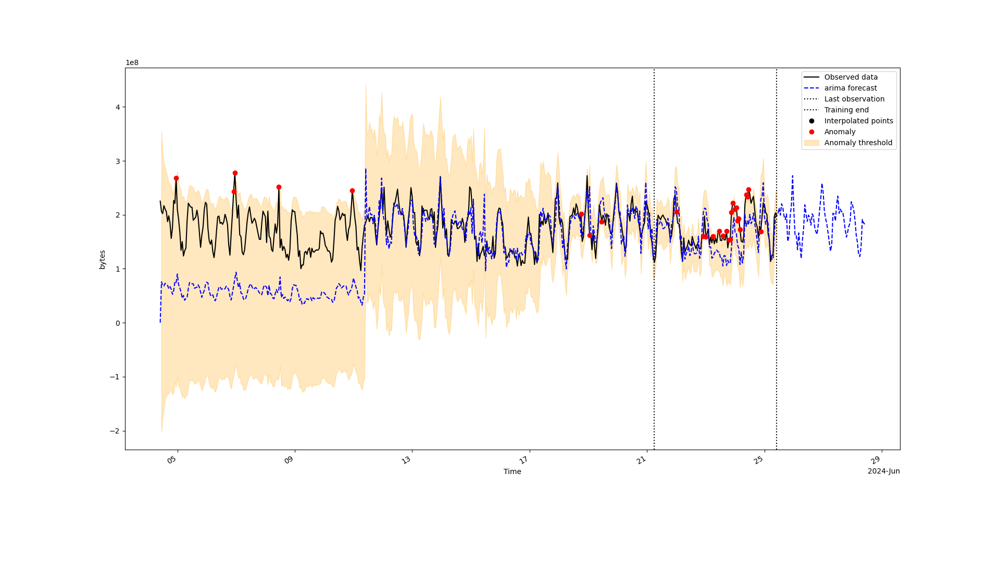
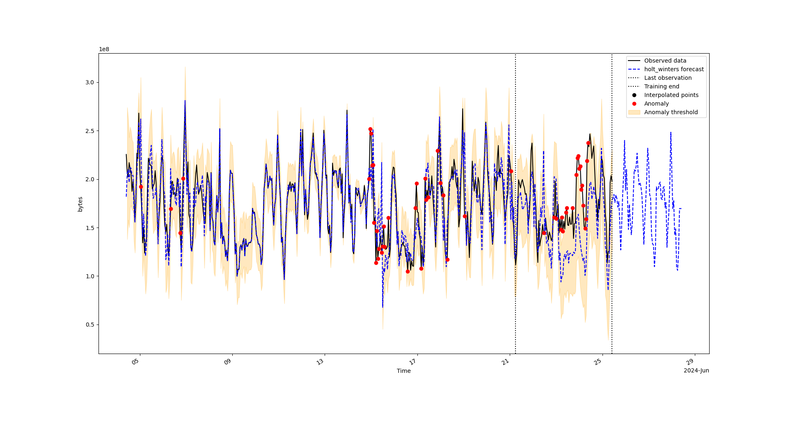
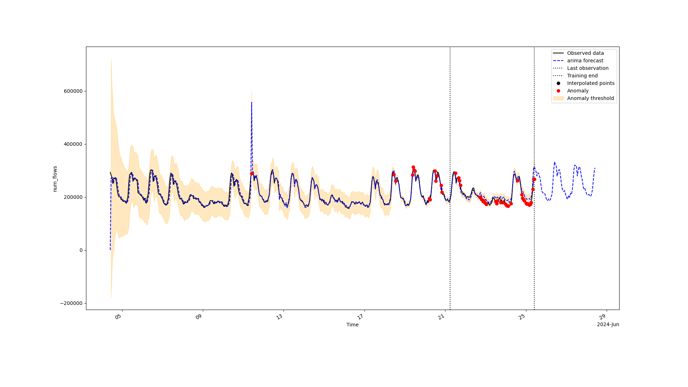
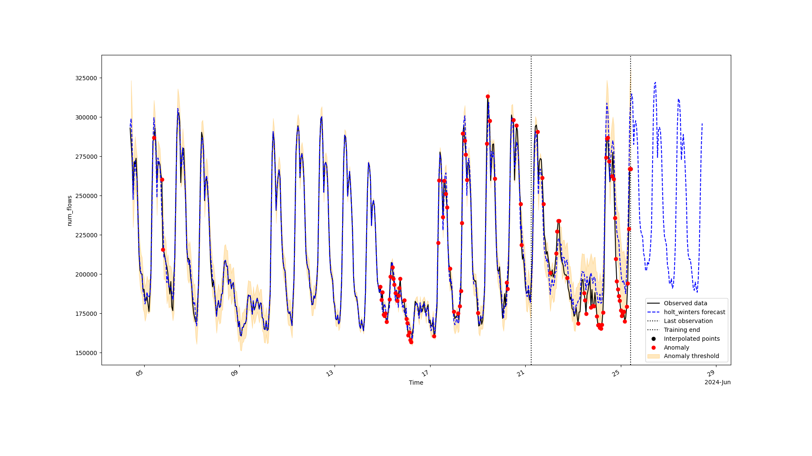
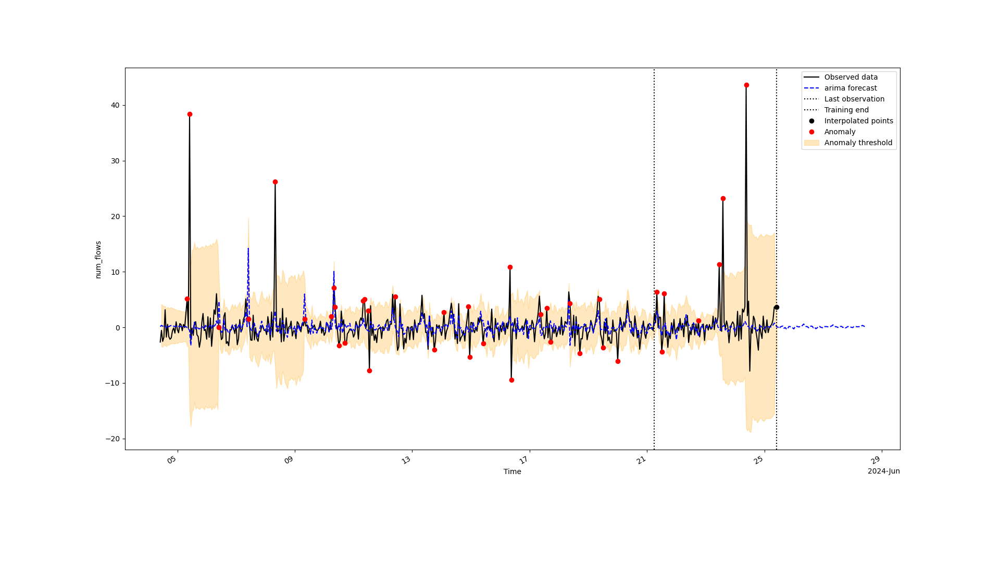
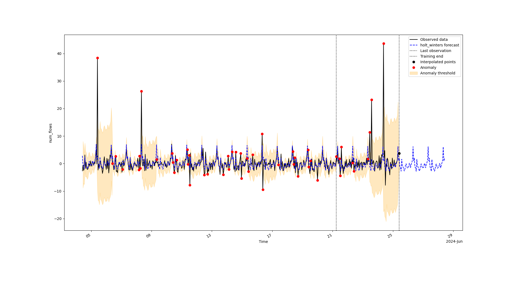

# Progetto Gestione di rete A.A. 23/24

- Francesco Borri
- 639079
- f.borri2@studenti.unipi.it

## Introduzione

Il progetto consiste nell'implementare due modelli statistici, *Holt-Winters* e ARIMA, per la proiezione di dati e rilevamento di anomalie sulla base di serie temporali memorizzate sotto forma di database RRD.

### Modello *Holt-Winters*

Il modello *Holt-Winters* è un modello statistico che smorza le oscillazioni di una serie temporale, permettendo di fare delle previsioni sui valori futuri, basandosi anche su *trend* e stagionalità dei dati, che possono essere sia additivi che moltiplicativi. Il modello teorico (con *trend* e stagionalità additivi) è il seguente: 

- Livello: $l_t = \alpha y_t + (1 - \alpha)(l_{t-1} + b_{t-1})$
- *Trend*: $b_t = \beta(l_t - l_{t-1}) + (1 - \beta)b_{t-1}$
- Stagionalità: $s_t = \gamma(y_t - l_{t-1} - b_{t-1}) + (1 - \gamma)s_{t-m}$
- Proiezioni: $f_{t+h} = l_t + hb_t + s_{t+h\mod m}$

### Modello ARIMA

Il modello ARIMA è un modello statistico che permette di fare previsioni su una serie temporale, che integra i modelli AR (*Auto-Regressive*), I (*Integrated*) e MA (*Moving Average*). E' definito dai parametri $(p,d,q)$, dove:

- $p$ è l'ordine del modello AR;
- $d$ è il grado di differenziazione;
- $q$ è l'ordine del modello MA.

Il funzionamento del modello si basa sul mettere in relazione il prossimo valore con una combinazione lineare dei valori precedenti (AR) e degli errori passati (MA), dopo aver differenziato (I) la serie temporale per renderla stazionaria.

## Struttura del progetto

Il progetto è strutturato come segue:

- `forecast.py`: *script* principale per effettuare previsioni e rilevare anomalie con i due modelli statistici implementati;
- `models/arima.py`: modulo che implementa il modello ARIMA;
- `models/holt_winters.py`: modulo che implementa il modello *Holt-Winters*;
- `utils/rrd.py`: modulo per la lettura dei dati da un database RRD;
- `utils/custom_types.py`: modulo contenente alcuni tipi ad-hoc utilizzati da `argparse`.

Per effettuare il *training* dei modelli correttamente è stato necessario riempire i dati mancanti con un metodo di interpolazione lineare.

E' possibile inoltre specificare una percentuale di dati da utilizzare per il *training*, così da lasciare il resto per valutare qualitativamente le predizioni di un modello, calcolando la radice dell'errore quadratico medio (RMSE).

Il rilevamento delle anomalie viene effettuato calcolando lo *z-score* degli errori di previsione su media e deviazione standard mobili (con una finestra lunga quanto una stagione), segnalando come anomale le osservazioni con un errore più grande di una certa soglia, con valori ragionevoli tra 1 e 3.

## Prerequisiti ed istruzioni per l'esecuzione

### Prerequisiti

Prima di eseguire il progetto è necessario creare l'ambiente virtuale ed installare le dipendenze.

> La libreria `rrdtool` richiede delle dipendenze di sistema aggiuntive che possono essere installate seguendo la [guida della pagina ufficiale](https://pythonhosted.org/rrdtool/install.html).

```bash
python3 -m venv venv
source venv/bin/activate
pip install -r requirements.txt
```

### Istruzioni per l'esecuzione

Il file `forecast.py` permette di effettuare le previsioni utilizzando i due modelli statistici implementati. Lanciando lo *script* con l'opzione `--help` è possibile visualizzare i parametri disponibili.

```
usage: forecast.py [-h] [-s START] [-e END] [-i STEP] [-m SEAS_PERIOD] [-f FC_PERIOD] [-t {add,mul,additive,multiplicative}] [-l {add,mul,additive,multiplicative}] [-d DELTA] [-p PERCENT] [-o DIR] [-q] [-v] filename {arima,holt_winters}

Forecast and anomaly detection with ARIMA or Holt-Winters models

positional arguments:
    filename                input RRD file
    {arima,holt_winters}    model to use

options:
    -h, --help
        show this help message and exit
    -s START, --start START
        start time from which fetch data (parsed by rrdtool using the AT-STYLE format, with the addition of the keyword "last", which means the timestamp of the last observation in the file), default is 30 days before the last observation in the file
    -e END, --end END
        end time until which fetch data (parsed the same way as the --start option), default is the last observation in the file
    -i STEP, --step STEP
        preferred interval between 2 data points (note: if specified the data may be downsampled)
    -m SEAS_PERIOD, --seasonal-period SEAS_PERIOD
        seasonal period (parsed by pandas.Timedelta, see https://pandas.pydata.org/pandas-docs/stable/reference/api/pandas.Timedelta.html for the available formats), default is 1 day
    -f FC_PERIOD, --forecast-period FC_PERIOD
        forecast period (parsed the same way as seasonal period), default is 7 day
    -t {add,mul,additive,multiplicative}, --trend-type {add,mul,additive,multiplicative}
        trend type for the Holt-Winters method, default is additive
    -l {add,mul,additive,multiplicative}, --seasonal-type {add,mul,additive,multiplicative}
        seasonal type for the Holt-Winters method, default is additive
    -d DELTA, --delta DELTA
        delta factor which defines the amplitude of the anomaly threshold, default is 1.5
    -p PERCENT, --training-percentage PERCENT
        percentage of data to use for training, default is 80% (the rest is used for computing RMSE)
    -o DIR, --save-dir DIR
        directory where to save the forecasted data and anomalies points as a CSV file and the plots as PNG files
    -q, --hide-plots
        do not show the graphs
    -v, --verbose
        print the summary of the model
```

Un esempio di esecuzione per effettuare previsioni con ARIMA utilizzando l'ultimo mese di dati disponibili con un intervallo di 12 ore tra un osservazione e l'altra e un periodo di previsione di 1 giorno è il seguente:

```bash
python3 forecast.py <filename.rrd> arima -s end-30d -i 12h -f 1d
```

Un altro possibile esempio che utilizza però *Holt-Winters* sui dati disponibili del penultimo mese con un intervallo di 30 minuti tra un osservazione e l'altra e un periodo di previsione di una settimana è il seguente:

```bash
python3 forecast.py <filename.rrd> holt_winters -s end-30d -e last-30d -i 30m -f 7d
```

Una volta lanciato il programma, verranno mostrati i dati osservati (ed eventualmente quelli interpolati), le previsioni effettuate, la soglia di anomalia definita dallo *z-score* e le anomalie rilevate.

## Test

I test sono stati condotti utilizzando alcuni RRD forniti dal professore, contenenti dati di traffico di rete e che esibiscono una stagionalità giornaliera o settimanale.

### `bytes`





### `num_flows`





### `alerted_flows`





### Risultati

Dai grafici si nota che ARIMA ha bisogno di almeno 2 stagioni di dati per effettuare previsioni accurate con intervalli di confidenza che riescano a identificare anomalie sui dati. *Holt-Winters* riesce ad adattarsi meglio ai dati, che però potrebbe diventare uno svantaggio nel caso di anomalie continue in quanto il modello si adatta alle anomalie.

Entrambi i modelli riescono a identificare le anomalie nel caso di picchi improvvisi (come nel caso di `alerted_flows`).