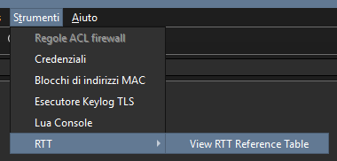
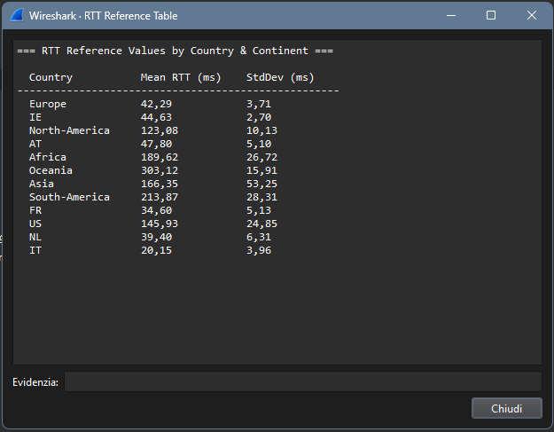
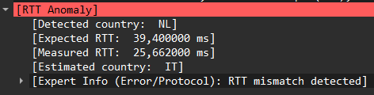

# RTT Geo-Location Anomaly Detector

### What is RTT Geo-Location Anomaly Detector ?

RTT Geo-Location Anomaly Detector ( ***RTT GAD*** ) is a <mark>***Wireshark plugin***</mark> written in Lua that **analyzes the Round-Trip Time** ( RTT ) of TCP and ICMP packets and **compares** it with an **expected average value for the country associated with the IP address**, **using** a **MaxMind geolocation database**. The goal is to determine whether the host is actually located in the region corresponding to its registered IP address ( *or if it is masking its true location using technologies such as VPNs, Tor, intermediate caches/CDNs, etc...* )


<a href="https://www.wireshark.org/"></a>

<a href="https://www.maxmind.com/en/geoip-databases"></a>
<a href="https://github.com/Nicofontanarosa"></a>

---

# 🤸 Quickstart

To get started with **RTT GAD**, follow these steps:

### 1️⃣ Install the MaxMind GeoIP2 Country Database

Download the **GeoLite2 Country** database ( *free with registration* ) or another GeoIP2 Country database from [MaxMind's official site](https://www.maxmind.com/en/geoip-databases)

You can also follow this helpful video tutorial for guidance by Chris Greer:   
🔗 [YouTube – How to Download GeoLite2](https://www.youtube.com/watch?v=IlVppluWTHw)

### 2️⃣ Install the Lua Plugin

Move the `rtt_check.lua` script to Wireshark’s plugin directory. Wireshark automatically loads Lua plugins placed in these directories depending on your OS:

- **Windows**:  
  `C:\Program Files\Wireshark\plugins\<version>\`
  
- **macOS**:  
  `/Applications/Wireshark.app/Contents/PlugIns/wireshark/<version>/`
  
- **Linux**:  
  `/usr/lib/wireshark/plugins/<version>/`

Copy your Lua script ( *rtt_check.lua* ) into Wireshark's plugin directory. If you're using the personal plugin directory, make sure it exists and create the plugins folder if necessary

#### GUI Method ( recommended ):

1. Open Wireshark
2. Click on `Help` → `About Wireshark`
3. Go to the `Folders` tab
4. Click the link next to `Personal Plugins`
5. Move the `rtt_check.lua` script into this folder

### 3️⃣ Add the RTT Statistics File

Move the `ntp_rtt_stats.txt` file into the **main Wireshark directory** ( *same path where the main Wireshark executable is installed or where your plugin folder is located* )

### 4️⃣ Restart Wireshark to load the plugin

### 5️⃣ Now you're ready to start analyzing RTT anomalies and detecting geo-location inconsistencies!

---

# ⚙️ How it works?

### 1️⃣ country.json

The `generator.py` file performs pings to servers from the [NTP Pool Project](https://www.ntppool.org/en/) ranging from server 0 to server 3. These servers are listed in the `country.json` file, where each country is associated with a corresponding NTP server domain. For example, the entry `"US": "us"` refers to the NTP `server us.pool.ntp.org`, and `"MX": "mx"` refers to the server `mx.pool.ntp.org`

You can modify the `country.json` file based on your preferences but:

- **Keys**: Must be valid country codes recognized by [MaxMind](https://www.maxmind.com/download/geoip/misc/region_codes.csv)
- **Values**: Must correspond to valid zones supported by the NTP Pool Project ( *used to construct domain names like 0.us.pool.ntp.org, 1.europe.pool.ntp.org, etc...* )

### 2️⃣ parameters.json

The `parameters.json` file contains configuration parameters for executing the pings:

**PING_COUNT**: Defines how many pings will be sent to each host

**PING_TIMEOUT**: Specifies the maximum wait time in seconds for each ping before considering it failed

**PING_INTERVAL**: Determines how quickly the pings are sent after receiving a result

**OUTLIER_FACTOR**: Used to exclude RTT values that are too far from the average, adjusting the tolerance for anomalous values ( *Recommended value between 1.1 and 1.5* )

### 3️⃣ generator.py

The `generator.py` script includes regular expressions to handle the output of the ping command across different operating systems:

Linux Regex:
```
rtt_regex_linux = re.compile(r'time=([\d.]+)', re.IGNORECASE)
```
This regex captures the RTT values in decimal numbers from the output of the ping command on Linux, where the format typically looks like `time=xx.xx ms`

Windows Regex:
```
rtt_regex_windows = re.compile(r'durata[=<]([\d]+)', re.IGNORECASE)
```
This regex captures the RTT in Windows, where the output may show `durata = xx ms` or `durata < xx ms` depending on the system configuration

macOS Regex:
```
rtt_regex_mac = re.compile(r'=\s*[\d.]+/([\d.]+)', re.IGNORECASE)
```
This regex captures the average RTT value from the output format typically seen on macOS, such as `... = nn.nn/xx.xx/...`

These regular expressions are used to extract RTT values from the ping output. <mark>**If your system is in a language other than English or Italian, you may need to adjust them accordingly**</mark>

### 4️⃣ ntp_rtt_stats.txt

The output of the `generator.py` script is a text file named `ntp_rtt_stats.txt`, which contains Round-Trip Time ( *RTT* ) statistics for the NTP servers. The file includes data for each country and the corresponding server. This file is generated in the current directory where the script is run and is used as a reference for comparison when analyzing RTT anomalies

**Currently**, the *ntp_rtt_stats.txt* file included in the repository **contains RTT statistics from Italy to various NTP servers**. If you're in a different country, it's recommended to re-run the `generator.py` script from your location to regenerate the file with more accurate local values

### 5️⃣ rtt_check.lua

The rtt_check.lua script integrates with Wireshark and displays a **dropdown menu** containing the **average RTT** from your current location to various countries and continents. These values are taken from the pre-generated `ntp_rtt_stats.txt` file.

<p align="center"></p>
<p align="center"></p>

The script adds a custom field to each packet in Wireshark named RTT Anomaly, which includes the following details:

- The **measured country** ( *based on the IP geolocation* ): **Detected country**
- The **measured RTT**:                                       **Mesured RTT**
- The **expected country** ( *estimated based on RTT* ):      **Estimated country**
- The **expected RTT** for the measured country:              **Expected RTT**

If an anomaly is detected ( *i.e., the measured RTT significantly differs from the expected value* ), the script flags the packet with a **protocol error**, which Wireshark highlights in red

<p align="center"></p>

---

# 📌 Requirements

To run the `generator.py` script, you need to have **Python** installed on your system ( *Tested on Python version >= 3.12* )
The script uses the following standard libraries, which are included in the Python Standard Library

- ✅ No external dependencies are required
- **This plugin requires Wireshark version 3.6 or later**

---

# 📄 License

This project is distributed under the terms of the MIT License. A complete copy of the license is available in the [LICENSE](LICENSE) file within this repository. Any contribution made to this project will be licensed under the same MIT License

- Academic project developed for educational and research purposes in the field of cybersecurity
- Author: Nicolò Fontanarosa
- Email: nickcompanyofficial@gmail.com
- University: University of Pisa
- Year: 2025

## 🙌 DISCLAIMER

While I do my best to detect location anomalies, I cannot guarantee that this software is error-free or 100% accurate. Please ensure that you respect users' privacy and have proper authorization to monitor, capture, and inspect network traffic


