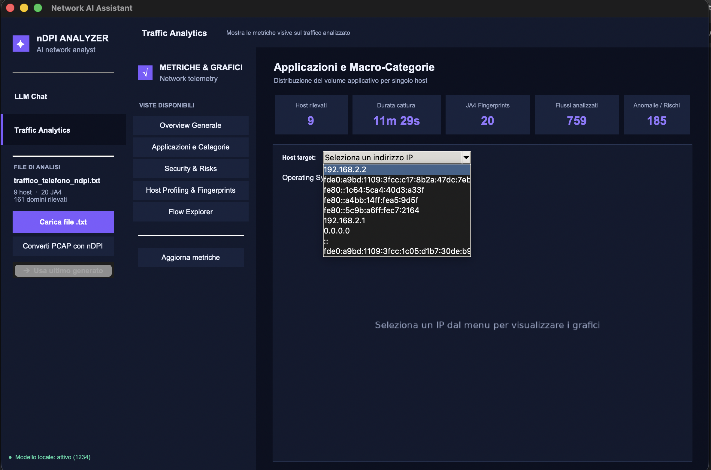
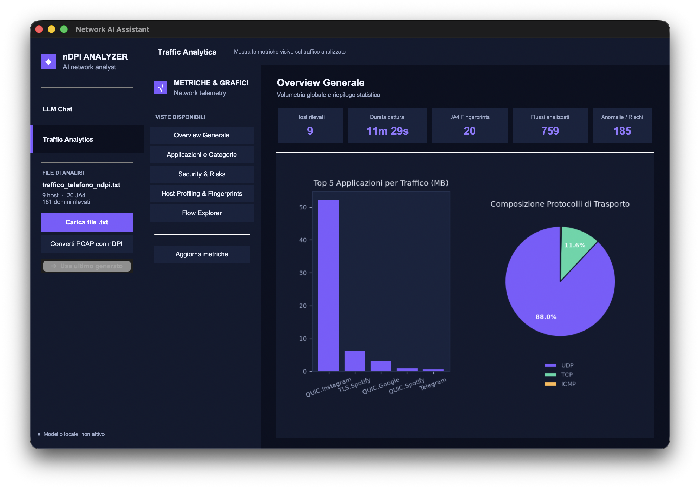
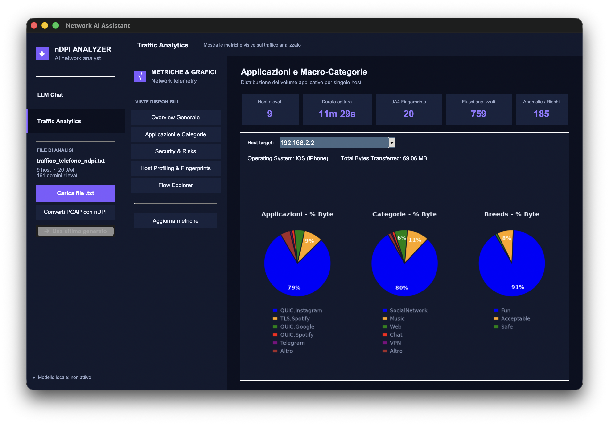
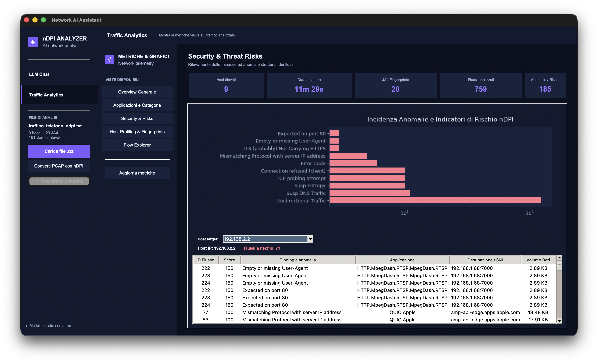
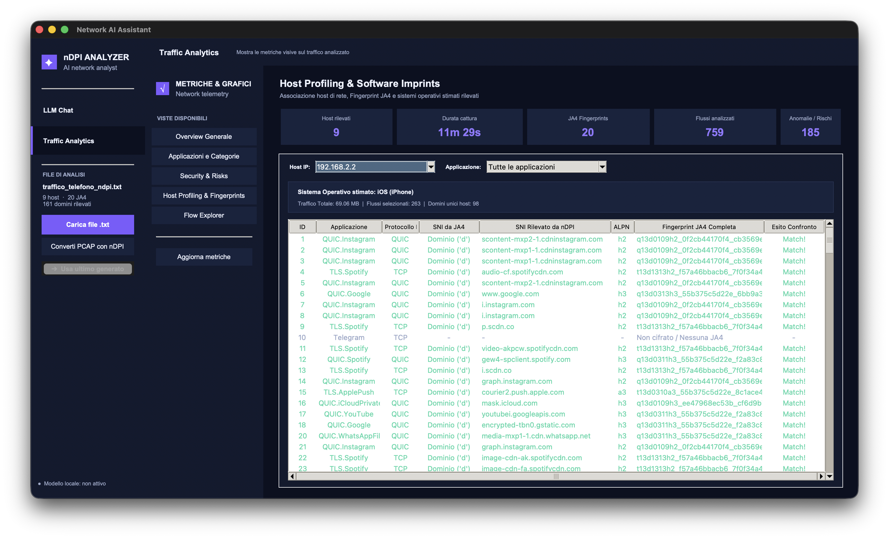
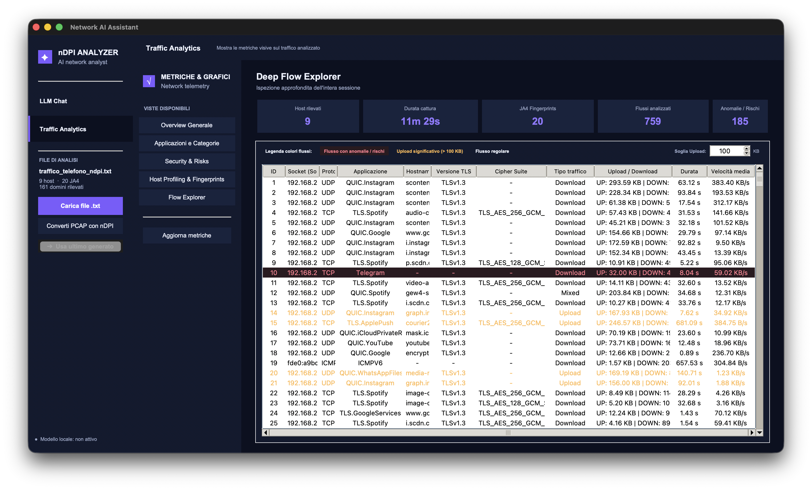

<h2 align="center">
  <strong>Analisi del Traffico di Rete, Fingerprinting Crittografico (JA4/nDPI) e Interrogazione della Baseline tramite AI Locale</strong>
</h2>

Relazione tecnica/sperimentale e documentazione del progetto per il corso di **Gestione di Reti**.

**Docente:** Prof. Luca Deri <br>
**Studente:** Andrea Bianucci <br>
**Data:** 11 Settembre 2026

---

### 1. Introduzione e Obiettivi
Agli albori di Internet, ogni protocollo era associato in maniera biunivoca ad una porta nota. Al giorno d’oggi, eccetto alcuni protocolli (es: HTTP via TCP porta 80) che per ragioni storiche questa relazione è rimasta valida, in molti altri casi, anche a causa della crescente varietà di applicazioni e della possibilità di utilizzare porte non standard, questa relazione non è più sempre valida. Per questo motivo non possiamo piu permetterci di effettuare congetture riguardo il protocollo utilizzato in flussi di traffico proveniente da porte note. Paradossalmente
non possiamo più essere certi che il traffico che sopraggiunge su porta 80 sia necessariamente traffico HTTP, infatti, è noto che alcuni sistemi possano prendere dati di un determinato protocollo, incapsularli in un altro ed inviarli su porte standard come la 80 per HTTP e 443 per HTTPS rendendo più difficile la loro identificazione da parte dei sistemi di controllo della rete (come firewall) (fenomeno del **tunneling**, ne sono un esempio le VPN che utilizzano protocolli come OpenVPN su porta 443), presentandosi (nei casi malevoli) come traffico legittimo ed innocuo.
In particolare si è osservato che HTTP costituisce una componente predominante del traffico Internet moderno. Si mostra comunemente come questo venga adottato anche per funzionalità extra a quella per cui è stato creato, ossia per lo scambio di dati client-server su Internet, ed è nota ad esempio la sua adozione per il trasferimento di grandi file, soppiantando il protocollo FTP.
Esaminare la sola 5-tupla (IP_src, porta_src, IP_dst, porta_dst, proto_L4) per determinarne in maniera affidabile il protocollo applicativo non è più sufficiente e pertanto è sorta la necessità di una tecnologia in grado di eseguire analisi piu aprofondite non più guardando solamente l'header dei pacchetti in transito (che risulta ormai poco informativo), ma che scendesse più a fondo leggendo entro certi limiti, nel rispetto della privacy e della confidenzialità della comunicazione, anche il payload.
Nasce per questo motivo la tecnologia Deep Packet Inspection (DPI).
Col passare del tempo però, l'adozione pervasiva di protocolli di cifratura hanno iniziato ad imporre delle forti limitazioni anche a quest’ultima; nasce da questa osservazione una nuova libreria open source **per l'analisi e la classificazione** del traffico di rete chiamata nDPI. Questa libreria, sviluppata da ntop, prende spunto da una precedente versione open source chiamata OpenDPI ormai deprecata, ed a partire da questa sono state aggiunte e raffinate molteplici funzionalità.

La libreria nDPI offre un sistema di analisi e classificazione del traffico di rete che analizza entro certi limiti il payload dei pacchetti appartenenti a flussi in chiaro (non cifrati); e i metadati dei pacchetti relativi alla fase di accordo iniziale (**Handshaking**) per i flussi cifrati. In particolare nDPI:
* Non si fida del numero di porta, ed è in grado di identificare il traffico di un certo protocollo che viaggia su una porta non standard;
* Supporta nativamente centinaia di protocolli ed applicazioni diverse, offrendo anche la possibilità di utilizzare un file di configurazione dedicato per estendere questo patrimonio;
* Poiché la maggior parte del traffico viaggia cifrato, nDPI include algoritmi in grado di analizzare i metadati dello scambio iniziale di chiavi per identificare l'applicazione o rilevare minacce senza dover decifrare i dati (es: certificati SSL, JA4 calcolate, Server Name Indication (SNI) e Server Common Name (CN), Application Layer Protocol Negotiation (ALPN), ...).
  * Talvolta è possibile trovare anche le fasi di handshaking criptate (vedi Encrypted Client Hello (ECH)); in questi casi nDPI utilizza euristiche per stimare la tipologia di applicazione.

In particolare nDPI si è ben affermato anche per la sua estrema efficienza nel lavoro che svolge, infatti, si stima che siano sufficienti i primi ≈ 8 / 10 pacchetti per riuscire ad intuire l'applicazione con precisione, etichettare definitivamente quel flusso e passare oltre (da quel momento in poi tutti i pacchetti che sopraggiungono appartenenti a quel flusso non verranno più controllati da nDPI). (NOTA: Naturalmente l'analisi DEVE inziare dal principio del flusso, altrimenti non si riesce più). 
Infine, quando nDPI analizza un flusso, non restituisce una semplice etichetta, ma generalmente ragiona su **due livelli di classificazione < major > . < minor > ,** (per risolvere il problema del tunneling accennato sopra):
* **Major Protocol (protocollo di livello 7 ISO/OSI)**: protocollo di trasporto reale (il "contenitore"), come ad esempio HTTP, QUIC, HTTPS/TLS;
* **Minor Protocol (applicazione)**: la vera applicazione che sta producendo traffico incapsulandolo in quel protocollo "contenitore", ad esempio: Whatsapp, Netflix, ecc... .
  * esempio: se un utente guarda un film su Netflix, nDPI classificherà il flusso dicendo: "Questo è traffico che viaggia su protocollo TLS (Master), ma l'applicazione reale all'interno è Netflix (App)".

Quest'ultima funzionalita in particolare è molto importante come innovazione dei precedenti sistemi di monitoraggio, in quanto tenta di risolvere il problema di "cecità" riguardo il tunneling e la profilazione di dati.
Nel traffico Internet moderno, protocolli e meccanismi come HTTP, TLS e QUIC sono estremamente diffusi e possono costituire il “contenitore” di una grande varietà di applicazioni, per tanto se il sistema di monitoraggio si fermasse al primo livello, non si riuscirebbe a distinguere il traffico di una rete; viceversa se mostrasse solamente l'applicazione non sapremmo piu
come quel servizio sta navigando impedendoci di imporre policy di sicurezza dedicate per quello specifico protocollo (es: versioni TLS obsolete).


Tornando al progetto, lo studio si basa sull'applicazione della libreria nDPI al traffico generato da un dispositivo mobile, con l'intento di **classificarlo** e **definirne una baseline comportamentale** del dispositivo.
Il progetto si presenta come un tool per l'analisi dei dati prodotti da `ndpiReader`, una funzionalità della libreria, applicata ad un file di cattura `.pcapng`. Tale cattura è stata effettuata via software isolando il traffico del dispositivo mobile, preventivamente collegato a una rete hotspot offerta dall'host di cattura. L'applicativo ha anche lo scopo di ispezionare i flussi estrapolati alla ricerca di anomalie, incongruenze e potenziali rischi di sicurezza.

Il lavoro prevede inoltre l'integrazione di un modello di **Intelligenza Artificiale (LLM)** eseguito interamente in locale, per consentire di rispondere a domande comportamentali riguardo i dispositivi, tramite linguaggio naturale.

### 2. Metodologia e Raccolta Dati

1. **Configurazione Hotspot:** Disabilitazione della rete dati cellulare e associazione del dispositivo all'hotspot Wi-Fi generato dall'host di cattura.
2. **Sniffing:** Attivazione della cattura sull'interfaccia tramite **Wireshark**, generando il file `traffico_telefono.pcapng` fornito nel repository a questo link: https://drive.google.com/drive/folders/1i7X8NARwy0YTVn7p7AfhsYqog3nMO6AJ?usp=sharing.
3. **Generazione Traffico:** Apertura ed utilizzo sequenziale di diverse applicazioni mobili (es. *Instagram, Spotify, WhatsApp, YouTube, TikTok*)
5. **Dissezione Layer-7:** Analisi offline tramite `ndpiReader -v 2` per l'estrazione di metadati applicativi, Server Name Indication (SNI), volumi di byte e fingerprint JA4, al fine di ottenere una baseline comportamentale del dispositivo.

### 3. Setting dell’ambiente di esecuzione
Per processare l'output di nDPI, è stato sviluppato questo tool in Python (`nDPIAnalyzerTool`) che esegue il parsing del testo e costruisce dinamicamente una **Knowledge Base** che riassume la baseline comportamentale del dispositivo, pronta per essere analizzata.

Come prima cosa è necessario scaricare in locale tutto il codice nDPI dal repository Github di ntop e compilare i vari sorgenti, ottenendo gli eseguibili (tra cui `ndpiReader.o`)

```bash
git clone https://github.com/ntop/nDPI.git
cd nDPI                        
./autogen.sh       
./configure
make
```

Successivamente è possibile generare il risultato di `ndpiReader` posizionandosi nella cartella che ospita il file `.pcapng` ed eseguire lo script direttamente da linea di comando nel seguente modo:
```bash
/Users/Tuo_Nome_Utente/nDPI/example/ndpiReader -i ./traffico_telefono.pcapng -v 2 > ./ndpi_output.txt
```

oppure tramite la sezione apposita di conversione '.pcapng -> .txt' offerta dal Tool stesso (vedi immagini sotto).

Una volta applicato `ndpiReader` è stato possibile, a partire dal file prodotto, estrarre informazioni utili tramite espressioni regolari (RegEx) ed iniziare a costruire una struttura a dizionario che nel progetto prende il nome di _knowledge base_, che sarà la
base informativa per le domande che andremo a porre tramite la `Chat` al modello di intelligenza artificiale. Grazie alle informazioni estratte è stato possibile costruire i grafici visibili nella sezione `Analytics`.

#### 3.1 Integrazione con LLM Locale
Per rispondere in modo dinamico a **domande esplorative sul comportamento** del dispositivo (es. *"Possiamo ritenere il dispositivo con IP 192.168.2.2 sicuro?"*), lo script è dotato di un modulo di interfacciamento verso un **Large Language Model (LLM)** ospitato in locale.
Attraverso l'interfacciamento del modello su `localhost:1234` è possibile raggiungerlo ed interrogarlo tramite semplici richieste HTTP.

È possibile interrogare il modello non appena viene avviata la GUI e caricato il file _.txt_ prodotto da `ndpiReader`. In questo caso, il modello riceve come base informativa una knowledge base generale e riassuntiva contenente le informazioni relative a tutti gli host. In alternativa, una volta entrati nella sezione Analytics, in alcune finestre, come mostrato nella figura sottostante, è possibile selezionare un indirizzo IP tramite un menù a tendina. L’ultimo indirizzo IP selezionato viene salvato in `NetSession` e propagato nel tempo come dato dello stato della sessione. 
In questo modo, le successive domande poste al modello di AI vengono formulate utilizzando una knowledge base più raffinata e specificamente dedicata al singolo host selezionato. (NOTA: Questa scelta architetturale è dovuta alla necessità di risparmiare token per poter far girare il modello anche in situazioni pesanti dove sono presenti più host nella rete e con un carico di flussi molto elevato)



### 4. Sperimentazione ed Analisi dei Risultati

La fase sperimentale ha proseguito l'analisi sfruttando i grafici generati dal tool, con l'obiettivo di verificare la correlazione tra fingerprint crittografiche (JA4) e SNI, protocolli applicativi e indicatori di rischio associati ai flussi, cercando così di ricreare una baseline comportamentale del dispositivo in analisi.

L'analisi offline eseguita sul dataset `traffico_telefono_ndpi.txt` ha prodotto i seguenti risultati aggregati:

**Flussi analizzati:** **762 flussi unici**, di cui 699 classificati tramite DPI, ed i rimanenti 2 tramite classica risoluzione porte o DNS caching. <br/>
**Throughput medio:** 100.69 pps / 807.76 Kb/sec

Dai primi grafici si nota subito una netta dominanza del traffico UDP (≈ 88%) rispetto al traffico TCP (≈ 11%), a testimonianza dell'adozione massiccia di protocolli di nuova generazione (ne è un forte esempio QUIC). Osservando il grafico a barre emerge che Instagram è l'applicazione che genera più traffico con protocollo superiore QUIC (≈ 50 MB di traffico).




La seconda scheda conferma la precedente statistica, infatti si osserva come per l'host `192.168.2.2`, l'applicazione che genera più traffico è QUIC.Instagram, confermando `SocialNetwork` la categoria con maggior influenza (byte).
nDPI classifica il traffico anche in categorie chiamate `breeds`, di cui le principali sono:
* **Unspecified**: Traffico generico non associato a un comportamento specifico.
* **Safe**: Protocolli sicuri, standard e privi di rischi intrinseci (es. DNS standard).
* **Acceptable**: Applicazioni aziendali o d'uso comune che non violano tipicamente le policy di rete (es. IMAP, SMTP).
* **Fun**: Traffico legato al divertimento e all'intrattenimento (es. giochi online, piattaforme di streaming come Netflix).
* **Unsafe**: Protocolli o comportamenti potenzialmente pericolosi o vulnerabili (es. vecchi protocolli non crittografati).
* **Dangerous**: Traffico associato a malware, botnet, attacchi informatici o siti di phishing noti.
* **P2P (Peer-to-Peer)**: Protocolli di condivisione file decentralizzati (es. BitTorrent, eMule).

Le `breeds` sono fondamentali per i sistemi di monitoraggio e i firewall, in quanto permettono agli amministratori di rete di creare regole di sicurezza rapide: ad esempio bloccare o limitare interamente tutto il traffico marchiato con una certa _breed_, senza dover selezionare manualmente centinaia di singoli protocolli.

Nel nostro caso si nota la breed _Fun_ rappresentare la fetta più grande nel grafico e questo conferma l'informazione mostrata dai grafici precedenti.




La terza scheda invece è dedicata all'analisi degli **indicatori di rischio e comportamenti anomali** rilevati da nDPI. Questi, assieme ai _breeds_, servono a identificare traffico sospetto, attacchi informatici o configurazioni errate della rete.
Nel nostro caso, come si nota nel grafico a barre, gli indicatori di rischio rilevati nei nostri flussi sono i seguenti:
* **Expected on port 80**: Il traffico sta usando la porta 80 (tipica dell'HTTP in chiaro), ma il protocollo identificato all'interno del pacchetto non è HTTP. 
  * Come detto in precedenza, si tratta di una tecnica comune per aggirare i firewall, e conferma la massiccia adozione del protocollo HTTP anche per scopi differenti dal tradizionale scambio di contenuti web, sfruttando le sue caratteristiche per il trasporto di dati nei vari contesti 
  * Si nota infatti come sia il _Risk_ **piu frequente** nella nostra collezione di flussi
* **Empty or missing User-Agent**: Una connessione HTTP non contiene l'intestazione User-Agent (che identifica il browser o l'applicazione). 
  * Spesso indica traffico generato da script automatizzati (scraper web), bot o malware, anziché da un utente reale.
* **TLS (probably) Not Carrying HTTPS**: Viene stabilita una connessione cifrata (TLS), ma nDPI rileva che dentro quel tunnel non sta transitando traffico web (HTTPS), bensì un altro protocollo nascosto (es. SSH, VPN, ecc...).
* **Mismatching Protocol with server IP address**: Il protocollo rilevato nel flusso non corrisponde ai servizi tipicamente ospitati o precedentemente visti su quell'indirizzo IP.
* **Error Code**: La connessione applicativa ha restituito un codice di errore (es. errori HTTP), utile per tracciare malfunzionamenti o tentativi di exploit.
* **Connection refused (client)**: Il server ha risposto con un reset (RST) o ha rifiutato esplicitamente la connessione avviata dal client. 
  * Se ripetuto, indica che il client sta cercando di connettersi a una porta chiusa.
* **TCP probing attempt**: Un tentativo di connessione TCP che assomiglia a una scansione di rete (port scanning). 
  * Il client invia pacchetti specifici per vedere quali porte del server sono aperte.
* **Susp Entropy (Suspicious Entropy)**: L'entropia (la casualità dei dati) nel payload è insolitamente alta o bassa. 
  * Un'entropia anomala in un protocollo solitamente testuale può indicare la presenza di malware che invia dati cifrati/offuscati all'interno di canali standard.
* **Susp DNS Traffic**: Traffico DNS non standard. 
  * Può indicare tentativi di esfiltrazione dati o canali di comando tramite DNS Tunneling.
* **Unidirectional Traffic**: Un flusso di rete in cui i dati viaggiano in una sola direzione (es. il client invia dati ma non riceve risposta, o viceversa). 
  * È tipico dei reindirizzamenti falliti, attacchi DDoS o scansioni massive.

Il primo grafico è un grafico a barre e mostra l'incidenza globale (tutti i flussi) sui vari risk rilevati, e si nota che `Expected on port 80` è il _risk_ con incidenza più elevata.
Nella tabella sottostante invece possiamo analizzare tra i flussi di uno specifico host sorgente quelli che sono etichettati con un _risk_ (es: per 192.168.2.2, 71 flussi lo sono), mostrandoci, **in ordine decrescente di _risk score_**, il tipo di rischio, il suo score, la destinazione ed il volume di dati scambiato.
Notiamo subito dai primi flussi che l'analisi sta rispecchiando la situazione attuale di hotspot del Mac verso l'iPhone; infatti troviamo:
* **_Mismatching Protocol_**: dato che il traffico passa attraverso il Mac che fa da hotspot ed esegue il NAT, nDPI vede discrepanze nell'incapsulamento o nel protocollo QUIC (usato massicciamente da iOS/MacOS per velocizzare le connessioni, come visto sopra nel grafico a torta (QUIC.Instagram))
* **_Expected on port 80_**: l'IP genera traffico verso la destinazione 192.168.1.68:7000, ma considerando il meccanismo di routing del Mac e i software Apple, si tratta di una comunicazione diretta tra il dispositivo ospite (l'host 192.168.2.2) e il Mac ospitante
  * La porta 7000 è una porta nativa famosissima nell'ecosistema Apple: viene utilizzata per AirPlay e per lo streaming di contenuti multimediali verso/da dispositivi Apple.
  * AirPlay e i protocolli di streaming Apple usano una **combinazione customizzata di HTTP modificato**, e flussi video frammentati (MpegDash). Poiché viaggiano sulla porta 7000 invece che sulla porta web standard (80), nDPI genera il flag Expected on port 80. 
* Infine, trattandosi di chiamate di sistema tra dispositivi Apple e non di un browser web, non esiste un'intestazione browser classica, scatenando il flag **_Empty or missing User-Agent_**.




Nella quarta scheda troviamo innanzi tutto la conferma che il dispositivo 192.168.2.2 si tratta di un iPhone e sotto a questa informazione troviamo una tabella con i flussi del traffico che hanno quell'IP come IP_src, ed ha l'intento di mostrare la legittimità del traffico tramite l'analisi della coerenza strutturale dell'impronta JA4 calcolata da nDPI.
L'esito "Match!" certifica che c'è totale coerenza tra ciò che nDPI rileva nel traffico e ciò che la fingerprint JA4 codifica internamente. Nello specifico, verifica che quando viene rilevato un dominio testuale (SNI), la fingerprint JA4 marchi correttamente il campo come `d`  (Domain). Qui si nota essere tutto corretto.
Guardando la lista, il traffico appare del tutto coerente con un utlizzo quotidiano ed innocuo di un iPhone: si vedono flussi verso i server di Instagram (tramite protocollo QUIC), Spotify (TLS e QUIC), Telegram e servizi di background Apple (iCloud e notifiche push), confermando che l'attività del dispositivo in quell'intervallo temporale era legata ad applicazioni social, messaggistica e streaming musicale.

Molti malware, una volta infettato un dispositivo, cercano di comunicare con il server degli attaccanti, e per evitare di essere bloccati dai filtri DNS, spesso non usano un nome di dominio, ma si collegano direttamente a indirizzi IP numerici scritti nel codice del virus.
Pertanto se un malware cercasse di camuffarsi inviando un finto dominio nel pacchetto (SNI), ma la fingerprint JA4 indicasse `i` (IP), vedremo un _Mismatch_, notificandocelo immediatamente come indicatore di compromissione.




La quinta ed ultima scheda fornisce l'elenco di tutti i singoli flussi di rete tracciati durante la sessione di cattura.
Nella sezione superiore dell'interfaccia troviamo i pannelli di riepilogo che permettono di monitorare le metriche globali: la durata totale della cattura, il numero di host rilevati, la varietà di impronte crittografiche uniche (JA4), il numero complessivo dei flussi analizzati e il totale delle anomalie riscontrate (ovvero tutti i flussi in cui nDPI ha rilevato indicatori di rischio (campo _Risk_)).

A differenza delle schede dedicate al profiling del singolo host, in questa vista ho scelto intenzionalmente di non vincolare la visualizzazione a un target IP, bensì di mantenere una panoramica globale consentendo all'analista di correlare e confrontare il comportamento dell'host target con il traffico di background generato dagli altri nodi presenti all'interno della stessa rete.
Per facilitare l'ispezione visiva e l'identificazione immediata di pattern critici viene adottato un sistema di evidenziazione a colori con relativa legenda:
* _Rosso (Flussi con anomalie / rischi)_: richiama l'attenzione sulle connessioni che presentano violazioni o deviazioni dal comportamento standard. 
  * Esempio (ID 10 - Telegram): il flusso viene evidenziato in rosso poiché contrassegnato dall'indicatore Susp Entropy con Risk Score pari a 10. 
    * Verificabile nella scheda Security & Risks, nDPI ha calcolato per questo payload un valore di entropia pari a 6.977, etichettandolo come Compressed Executable?. 
    * Come detto in precedenza Valori di entropia insolitamente elevati o atipici per il protocollo di trasporto possono indicare la presenza di traffico compresso, binari offuscati o l'impiego di canali cifrati custom volti a evadere i controlli perimetrali.
      * Ne è proprio il caso della maggior parte delle chat di Telegram, le quali non usano crittografia end-to-end (E2E), bensi si appoggiano al protocollo chiamato _MTProto_

* _Giallo (Upload significativo > soglia_scelta KB (default 100 KB))_: segnala i flussi non esplicitamente malevoli in cui l'host client ha trasmesso un volume consistente di dati verso l'esterno. 
  * Esempio (ID 20 - WhatsApp): la connessione registra circa 169 KB inviati a fronte di un tempo di connessione esteso, riconducibile quindi al caricamento o alla sincronizzazione di allegati multimediali (WhatsAppFiles). 
  * Questa metrica risulta cruciale sia per tracciare trasferimenti massivi e upload in background, sia per rilevare tempestivamente possibili anomalie legate all'esfiltrazione non autorizzata di dati.
    * un dispositivo consumer o mobile opera prevalentemente come fruitore di contenuti ("domina" in percentuale il traffico in download). Il suo traffico in uscita si limita ordinariamente a richieste di pochi kilobyte (query DNS, handshake TLS, HTTP GET). Un flusso con rapporto sbilanciato in uscita (Upload) che supera decine o centinaia di kilobyte rappresenta un'eccezione alla linea ordinaria e merita un'ispezione mirata.
  * Viene riportato anche la durata di ogni flusso in modo che l'analista possa avere una metrica aggiuntiva nel valutarne la gravita 

* _Neutro_ (Flussi regolari): identifica il traffico ordinario che rispetta le firme ed i comportamenti attesi per la specifica applicazione (come osservato per la maggior parte delle sessioni conformi di Google, Apple e Spotify), privo di indicatori di rischio o volumi anomali in uscita.



---

## Manuale Utente: Come eseguire il progetto in locale

I file necessari contenuti nel repository sono:

```plaintext
.
├── main_app.py                 # Entry-point e orchestratore GUI
├── chat_interface.py           # Scheda UI della Chat per l'interazione con l'LLM locale
├── analytics.py                # Scheda UI per metriche, filtri IP, tabelle e dashboard grafici
├── charts.py                   # Modulo Factory Method e classi Matplotlib per i grafici Tkinter
├── analyzer.py                 # Motore di parsing nDPI, esecuzone ndpiReader e gestione richieste HTTP per l'LLM
├── converter_window.py         # Finestra per PCAP/PCAPNG --> TXT con ndpiReader
├── NetSession.py               # Dataclass per la gestione dello stato condiviso della sessione
├── gui_utils.py                # Palette colori, font e widget personalizzati
├── https://drive.google.com/drive/folders/1i7X8NARwy0YTVn7p7AfhsYqog3nMO6AJ?usp=sharing                # Cartella file di input
    ├── traffico_telefono.pcapng    # Cattura originale dei pacchetti (Wireshark)
    └── traffico_telefono_ndpi.txt  # Report generato con ndpiReader -v 2
└── README.md                   # Relazione e manuale del progetto
```

### Prerequisiti
* **Python 3.9+** installato sul sistema, con supporto standard a tkinter
* **Software per l'esecuzione di LLM in locale** (es. **LM Studio** o **Bionic**).
* **Eseguibile compilato ndpiReader** (necessario solo per convertire nuovi file .pcapng).

### Setup dell'Intelligenza Artificiale (Bionic / LM Studio)
Per abilitare la funzionalità di "Chatbot" interattivo basato su IA, è possibile avviare il server locale scegliendo uno dei due metodi seguenti. Si raccomanda l'uso di un modello linguistico efficiente (es. **Gemma 12B QAT**, **Llama 3 8B**, o **Phi-3 Mini** quantizzati).

**Metodo A: Tramite Interfaccia Grafica (GUI)**
1. Aprire Bionic o LM Studio.
2. Aprire la sezione **Local Server** (icona `<->`) e assicurarsi che il modello scelto sia caricato in memoria tramite l'apposito menu a tendina.
3. Avviare il server, che si metterà in ascolto sulla porta di default `1234`.

**Metodo B: Tramite Linea di Comando (CLI)**
In alternativa all'interfaccia grafica, è possibile gestire il tutto da un terminale separato:
1. Avviare il server API locale:
    ```bash
    lms server start
    ````
2. Caricare il modello in memoria (il tool proporrà una lista interattiva da cui selezionare il modello desiderato con le frecce direzionali):
    ```bash
    lms load
    ````
3. Spegnere il server
    ```bash
    lms server stop
    ````
4. Liberare memoria RAM
    ```bash
    lms unload --all
    ```

### Esecuzione dello Script
Aprire un terminale nella cartella del repository e lanciare lo script:

```bash
python3 main_app.py
````
<br>

---

# GUI nDPI Analyzer Tool

Appena viene lanciato lo script, l'interfaccia mostrata è la seguente:


Questo indice segnala se il modello è correttamente raggiungibile su localhost:1234, oppure no:


Per analizzare il traffico, il tool consente sia di caricare un file .txt di output precedentemente generato, sia di generarlo direttamente a partire dal file .pcapng della cattura. In quest’ultimo caso, ndpiReader viene invocato automaticamente a runtime tramite l’apposita sezione nella sidebar del tool, consentendo di selezionare successivamente il file .txt generato come input per l’analisi:


