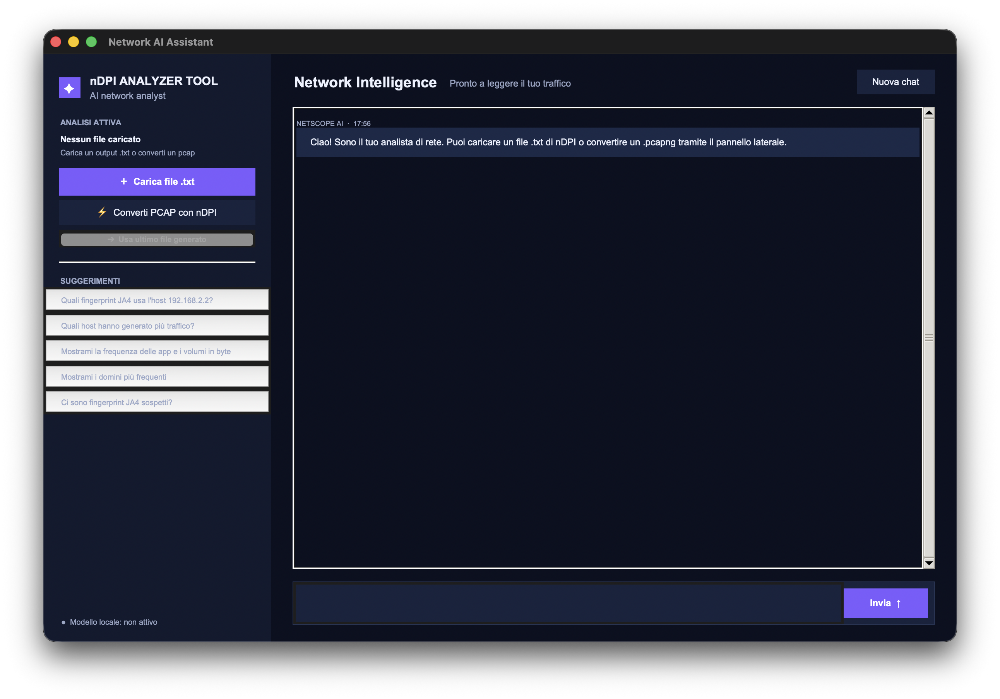
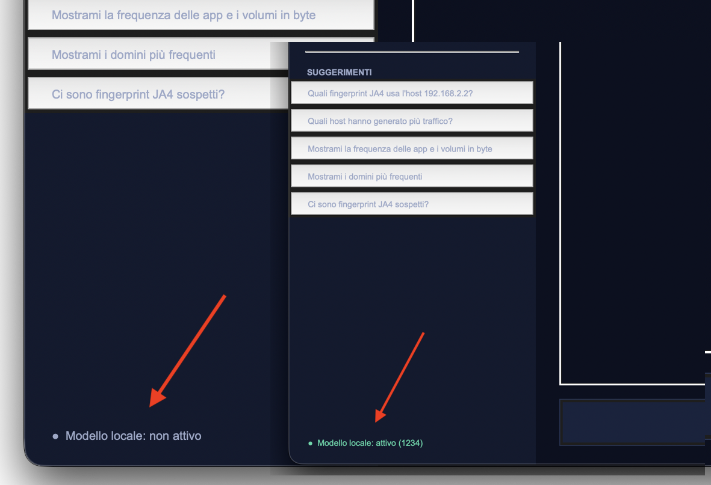
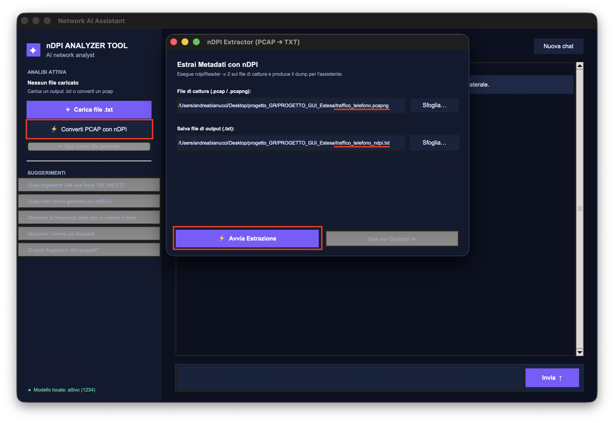
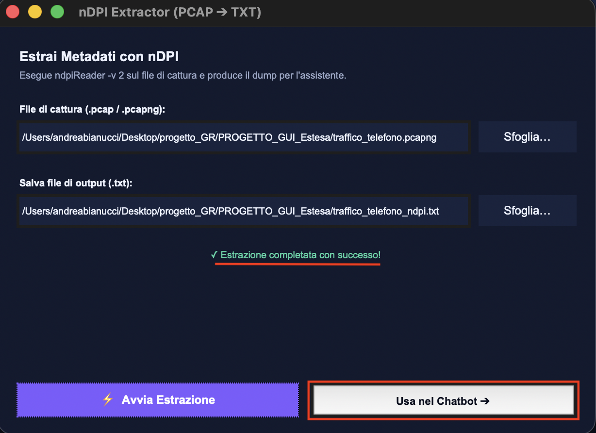
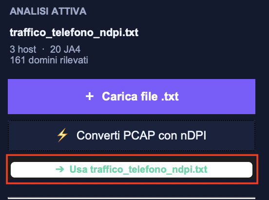
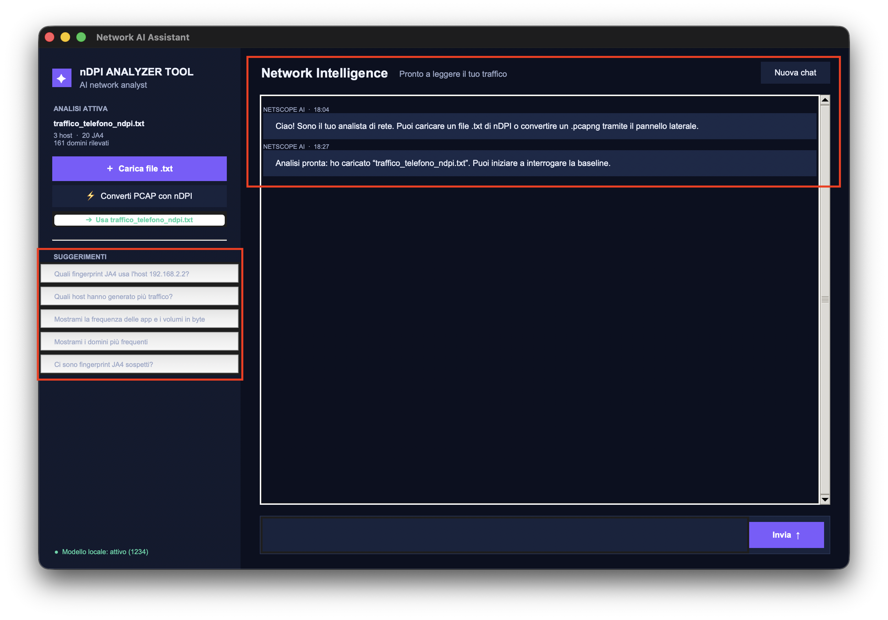
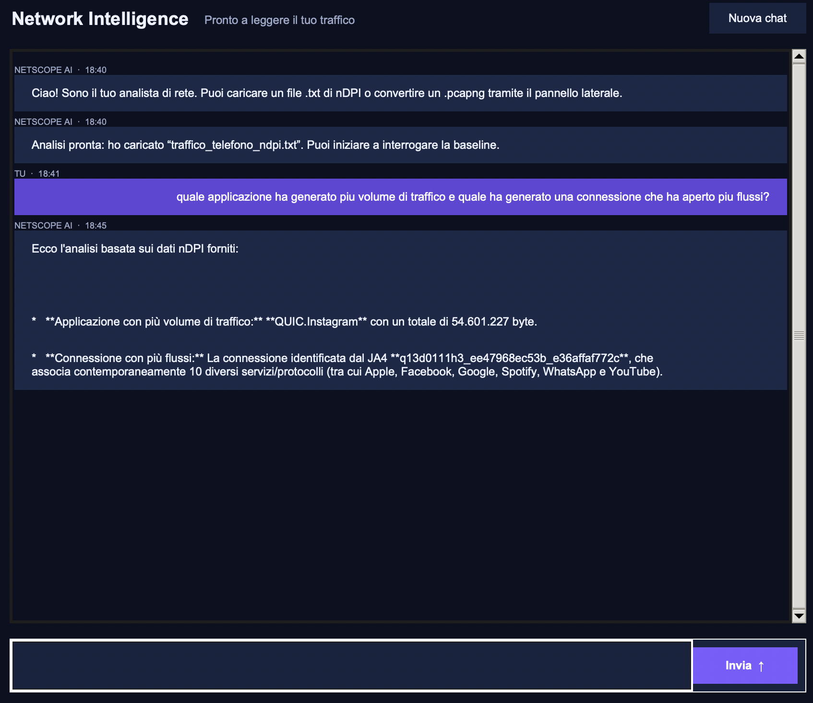

<h2 align="center">
  <strong>Analisi del Traffico di Rete, Fingerprinting Crittografico (JA4/nDPI) e Interrogazione della Baseline tramite AI Locale</strong>
</h2>

Relazione tecnica e documentazione del progetto per il corso di **Gestione di Reti**.

**Docente:** Prof. Luca Deri <br>
**Studente:** Andrea Bianucci <br>
**Data:** 11 Settembre 2026

---

### 1. Introduzione e Obiettivi
Il progetto implementa una pipeline completa per l’acquisizione del traffico, la sua dissezione a livello 7 (Applicativo), la profilazione comportamentale e l’interrogazione semantica dei dati di rete generati da un dispositivo mobile.
Nello specifico, lo studio mira ad associare le fingerprint crittografiche **JA4** ai domini contattati (SNI) e alle relative applicazioni, sfruttando le capacità di fingerprinting della libreria open-source **nDPI**.

Il lavoro prevede inoltre l'integrazione di un modello di **Intelligenza Artificiale (LLM)** eseguito interamente in locale, per consentire di rispondere a domande sul traffico tramite linguaggio naturale.

### 2. Metodologia e Raccolta Dati

1. **Configurazione Hotspot:** Disabilitazione della rete dati cellulare e associazione del dispositivo all'hotspot Wi-Fi generato dal computer portatile.
2. **Sniffing:** Attivazione della cattura sull'interfaccia tramite **Wireshark** per intercettare l'intero flusso di pacchetti generato dal telefono, generando il file `traffico_telefono.pcapng` fornito nel repository.
3. **Generazione Traffico:** Apertura ed utilizzo sequenziale di diverse applicazioni mobili (es. *Instagram, Spotify, WhatsApp, YouTube, TikTok*)
5. **Dissezione Layer-7:** Analisi offline tramite `ndpiReader -v 2` per l'estrazione di metadati applicativi, Server Name Indication (SNI), volumi di byte e fingerprint JA4.

### 3. Sviluppo del Software di Analisi
Per processare l'output di nDPI, è stato sviluppato uno piccolo tool in Python (`nDPIAnalyzerTool`) che esegue il parsing del testo e costruisce dinamicamente una **Knowledge Base** che riassume la baseline comportamentale del dispositivo, pronta per essere analizzata.

#### 3.1 Estrazione e Mappatura dei Dati
Tramite espressioni regolari (RegEx), lo script isola ogni singolo blocco di flusso estraendo:
* **Host Sorgente:** Indirizzo IP del dispositivo (es. `192.168.2.2`).
* **Protocollo L7 (Applicazione):** Riconosciuto nativamente da nDPI (es. `QUIC.Instagram`, `TLS.Spotify`).
* **Dominio / SNI:** Hostname richiesto in chiaro.
* **Fingerprint JA4:** Impronta crittografica del client/sessione.
* **Contatori di Frequenza e di Volume:** Lo script tiene traccia della mole di connessioni e della mole di traffico di ciasuna di essa, registrando quante volte un'applicazione o un dominio specifico vengono contattati dall'host e quanto traffico viene trasmesso, permettendo di quantificare in maniera oggettiva il comportamento standard del dispositivo.

#### 3.2 Struttura della Knowledge Base (KB)
Il parser aggrega le informazioni estratte dai blocchi di flusso all'interno di un dizionario relazionale:

```json
{
  "hosts": {
    "192.168.2.2": {
      "ja4": [
        "q13d0111h3_ee47968ec53b_e36affaf772c",
        ...
      ],
      "domains": [
        "instagram.com",
        ...
      ],
      "protocolli_di_rete": [
        "DNS",
        ...
      ],
      "frequenza_app": {
        "QUIC.Instagram": 142,
        ...
      },
      "frequenza_domini": {
        "graph.instagram.com": 85,
        ...
      },
      "volume_byte_app": {
        "QUIC.Instagram": 54601227,
        ...
      }
    }, 
     ...
  },
  "ja4_to_info": {
    "q13d0111h3_ee47968ec53b_e36affaf772c": {
      "domains": [
        "graph.instagram.com",
        ...
      ],
      "protocols": [
        "QUIC.Instagram",
        ...
      ],
      "hosts": [
        "192.168.2.2",
        "fde0:a9bd:1109:0:1c23:45ef:67ab:89cd"
      ]
    },
    ...
  },
  "all_domains": [
    "instagram.com",
    ...
  ]
}
```

Questa Knowledge Base viene infine serializzata eliminando spaziature ridondanti (`json.dumps(..., separators=(',', ':'))`) per minimizzare il consumo di token della finestra di contesto.

#### 3.3 Integrazione con Intelligenza Artificiale Locale
Per rispondere in modo dinamico a domande esplorative sul traffico (es. *"Quali domini sono contattati da una fingerprint JA4 specifica?"*), lo script è dotato di un modulo di interfacciamento verso un **Large Language Model (LLM)** ospitato in locale.
Attraverso un Local API Server compatibile con lo standard OpenAI (tramite l'applicativo *Bionic/LM Studio*), il modello LLM viene esposto localmente all’indirizzo `localhost:1234`, consentendo allo script, una volta compattata l'intera baseline estratta in formato JSON, di interagire con esso inviandola come contesto.

### 4. Sintesi Preliminare della Baseline
Dall'elaborazione del file di cattura iniziale `traffico_telefono_ndpi.txt`, l'algoritmo ha censito la seguente topologia di traffico per l'host target:
* **IP Dispositivo Mobile:** `192.168.2.2` (IPv4) / `fde0:a9bd:1109...` (IPv6)
* **Traffico Analizzato:** ~762 Flussi Unici
* **Impronte JA4 Distinte:** 20 impronte crittografiche
* **Protocolli Dominanti:** QUIC (Instagram, YouTube, WhatsApp, Facebook), TLS (Spotify, Apple)

---

## Manuale Utente: Come eseguire il progetto in locale

I file necessari contenuti nel repository sono:

```plaintext
.
├── main_app.py                 # Interfaccia grafica principale (Chatbot)
├── converter_window.py         # Modulo finestra di estrazione PCAP -> TXT con nDPI
├── analyzer.py                 # Backend di parsing flussi e client API per LLM locale
├── traffico_telefono.pcapng    # Dump originale dei pacchetti (Wireshark)
├── traffico_telefono_ndpi.txt  # Report Layer-7 generato con ndpiReader -v 2
└── README.md                   # Relazione tecnica e manuale del progetto
```

### Prerequisiti
* **Python 3.9+** installato sul sistema, con supporto standard a tkinter
* **Software per l'esecuzione di LLM in locale** (es. **LM Studio** o **Bionic**).
* **Eseguibile compilato ndpiReader** (necessario solo per convertire nuovi file .pcapng).

### Setup dell'Intelligenza Artificiale (Bionic / LM Studio)
Per abilitare la funzionalità di "Chatbot" interattivo basato su IA, è possibile avviare il server locale scegliendo uno dei due metodi seguenti. Si raccomanda l'uso di un modello linguistico efficiente (es. **Gemma 12B QAT**, **Llama 3 8B**, o **Phi-3 Mini** quantizzati).

**Metodo A: Tramite Interfaccia Grafica (GUI)**
1. Aprire Bionic o LM Studio.
2. Aprire la sezione **Local Server** (icona `<->`) e assicurarsi che il modello scelto sia caricato in memoria tramite l'apposito menu a tendina.
3. Avviare il server, che si metterà in ascolto sulla porta di default `1234` (`http://localhost:1234/v1/chat/completions`).

**Metodo B: Tramite Linea di Comando (CLI)**
In alternativa all'interfaccia grafica, è possibile gestire il tutto da un terminale separato:
1. Avviare il server API locale:
    ```bash
    lms server start
    ````
2. Caricare il modello in memoria (il tool proporrà una lista interattiva da cui selezionare il modello desiderato con le frecce direzionali):
    ```bash
    lms load
    ````
3. Spegnere il server
    ```bash
    lms server stop
    ````
4. Liberare memoria RAM
    ```bash
    lms unload --all
    ```

### Esecuzione dello Script
Aprire un terminale nella cartella del repository e lanciare lo script:

```bash
python3 main_app.py
````
<br>

---

# GUI nDPI Analyzer Tool

## Preparazione ambiente

Appena viene lanciato lo script, l'interfaccia mostrata è la seguente:



Questo indice segnala se il modello è correttamente raggiungibile su localhost:1234, oppure no:



Per analizzare il traffico, il tool consente sia di caricare un file .txt di output precedentemente generato, sia di generarlo direttamente a partire dal file .pcapng della cattura. In quest’ultimo caso, ndpiReader viene invocato automaticamente a runtime tramite l’apposita sezione nella sidebar del tool, consentendo di selezionare successivamente il file .txt generato come input per l’analisi:








## Interrogazione modello

L'interrogazione del modello avviene tramite l'apposita chat posizionata nella finestra destra del tool, che consente all'utente di digitare e sottomettere qualsiasi domanda in formato di testo naturale, alla quale il modello di AI risponderà.

Sulla barra laterale a sinistra, si possono trovare alcune domande esempio da poter sottomettere all'AI.





