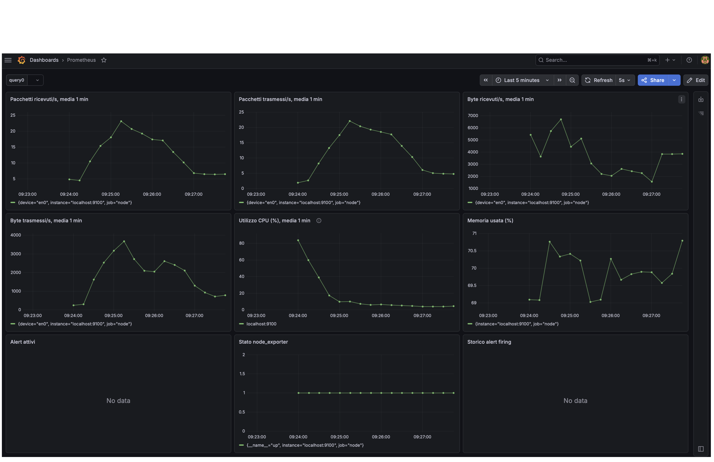
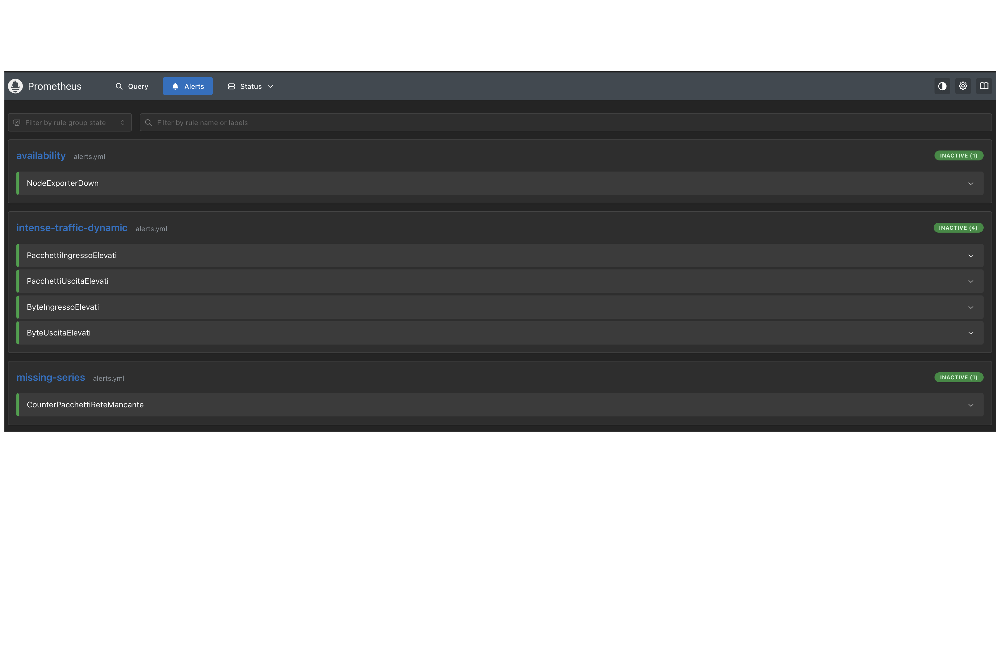
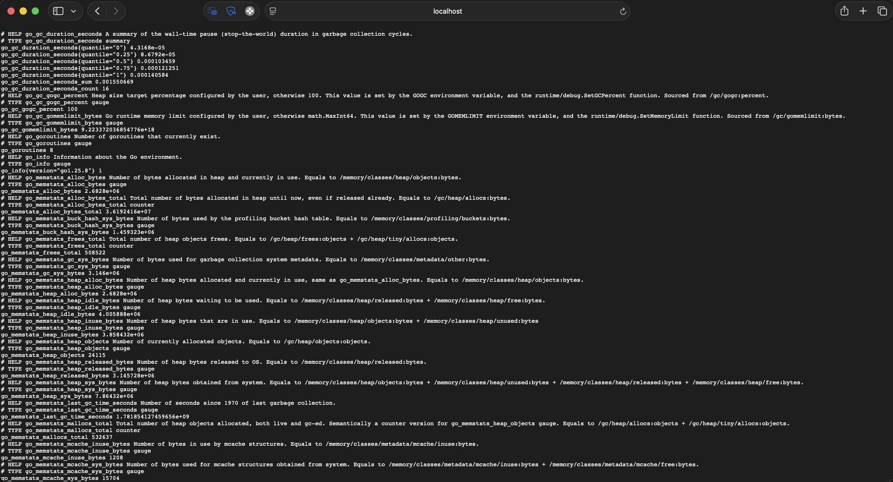
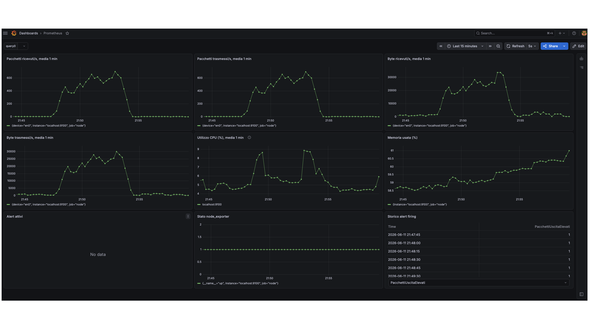

# Relazione: monitoraggio di metriche di rete e di sistema con Prometheus


## Informazioni di contatto

**Studente:** Alessandro Fiumanò  
**Matricola:** 674559  
**E-mail:** a.fiumano1@studenti.unipi.it

## Struttura del progetto
Il progetto è strutturato nel seguente modo:
- **`README`**: questo documento, contiene la relazione del progetto che consiste in guida all'installazione e documentazione del lavoro svolto.
- **`start.py`**: script principale in Python che automatizza l'avvio dei demoni (Prometheus, Node exporter, Alertmanager), gestisce la configurazione della dashboard su Grafana e istanzia il server web locale (usando Flask) per stampare su terminale gli alert in tempo reale.
- **`prometheus.yml`**: file di configurazione base di Prometheus, contenente le istruzioni per lo scraping delle metriche dai vari target e i riferimenti ad Alertmanager.
- **`alerts.yml`**: file contenente le regole di alerting scritte in PromQL, definite dinamicamente tramite il calcolo delle medie mobili.
- **`alertmanager.yml`**: file di configurazione di Alertmanager, che si occupa di ricevere gli allarmi da Prometheus e instradarli verso il webhook esposto da `start.py`.
- **`dashboard.json`**: template preconfigurato della dashboard per visualizzare le timeseries e le metriche di riferimento interattivamente su Grafana. 
- **`images/`**: cartella contenente le immagini usate per documentare configurazione, dashboard e risultati dell'esperimento.
- **`images/anteprima_grafana.png`**: dashboard Grafana in condizioni normali.
- **`images/anteprima_prometheus.png`**: schermata delle regole di alert caricate in Prometheus.
- **`images/anteprima_node_exporter.png`**: endpoint `/metrics` esposto da Node Exporter.
- **`images/anteprima_esperimento.png`**: dashboard Grafana al termine dell'esperimento.
- **`logs/`**: cartella generata automaticamente a runtime da `start.py` per raccogliere l'output di log dei demoni avviati in background; non inclusa nella consegna.


## Installazione e configurazione (Ubuntu 24 LTS, amd64)
Negli esempi seguenti si assume che la directory di lavoro sia la cartella `Fiumano/`. Se il progetto si trova in un percorso diverso, è sufficiente sostituire `Fiumano/...` con il percorso corrispondente.

Installare Grafana incollando il seguente blocco di comandi su terminale:

```bash
sudo apt-get install -y adduser libfontconfig1 musl
wget https://dl.grafana.com/grafana-enterprise/release/13.0.2/grafana-enterprise_13.0.2_26816849631_linux_amd64.deb
sudo dpkg -i grafana-enterprise_13.0.2_26816849631_linux_amd64.deb
```

Procedere con il download e l'estrazione, nella cartella corrente, degli eseguibili di Prometheus, Node Exporter e Alertmanager incollando il seguente blocco di comandi su terminale:
```bash
wget https://github.com/prometheus/prometheus/releases/download/v3.12.0/prometheus-3.12.0.linux-amd64.tar.gz
wget https://github.com/prometheus/node_exporter/releases/download/v1.11.1/node_exporter-1.11.1.linux-amd64.tar.gz
wget https://github.com/prometheus/alertmanager/releases/download/v0.32.2/alertmanager-0.32.2.linux-amd64.tar.gz

tar -xzf prometheus-3.12.0.linux-amd64.tar.gz
tar -xzf node_exporter-1.11.1.linux-amd64.tar.gz
tar -xzf alertmanager-0.32.2.linux-amd64.tar.gz

rm prometheus-3.12.0.linux-amd64.tar.gz
rm node_exporter-1.11.1.linux-amd64.tar.gz
rm alertmanager-0.32.2.linux-amd64.tar.gz
```

Installare quindi i requisiti minimi per eseguire `start.py`, ovvero le librerie `Flask` e `requests`, incollando il seguente comando su terminale:
```bash
sudo apt update
sudo apt install -y python3-flask python3-requests
```

Installati i requisiti appena elencati, è necessario sovrascrivere i file di configurazione. Se la cartella di lavoro contiene almeno i seguenti elementi:

```
Fiumano/
├── progetto_gestione_di_reti/
├── prometheus-3.12.0.linux-amd64/
├── node_exporter-1.11.1.linux-amd64/
└── alertmanager-0.32.2.linux-amd64/
```
allora eseguire i seguenti comandi da terminale per sovrascrivere i file di configurazione:

```bash
cp -f progetto_gestione_di_reti/prometheus.yml prometheus-3.12.0.linux-amd64/prometheus.yml
cp -f progetto_gestione_di_reti/alerts.yml prometheus-3.12.0.linux-amd64/alerts.yml
cp -f progetto_gestione_di_reti/alertmanager.yml alertmanager-0.32.2.linux-amd64/alertmanager.yml
``` 

Prima di procedere con la configurazione dell'ambiente, è necessario che Grafana sia in esecuzione, avviandolo con il comando `sudo systemctl start grafana-server` e verificando lo stato con `sudo systemctl status grafana-server`. In caso di problemi, consultare la documentazione ufficiale di Grafana.
Selezionare quindi l'interfaccia target da monitorare, eseguendo il comando `ifconfig` o `ip addr` da terminale e annotando il nome dell'interfaccia di rete attiva. Per esempio, se device = wlp1s0f0, allora eseguire il seguente comando per terminare la configurazione e avviare l'ambiente di monitoraggio locale:

```bash
python3 progetto_gestione_di_reti/start.py \
  --prometheus-dir prometheus-3.12.0.linux-amd64 \
  --node-exporter-dir node_exporter-1.11.1.linux-amd64 \
  --alertmanager-dir alertmanager-0.32.2.linux-amd64 \
  --dashboard progetto_gestione_di_reti/dashboard.json \
  --device wlp1s0f0
```

Successivamente è quindi possibile collegarsi a localhost:3000 da browser, accedere a Grafana con username e password di default (admin/admin) e visualizzare la dashboard preconfigurata per monitorare le metriche di rete e di sistema in tempo reale (Dashboards/Prometheus).

## Installazione e configurazione manuale su altri sistemi operativi
Il progetto non contiene gli eseguibili necessari alla riproduzione dell'esperimento, ovvero Prometheus, Node Exporter e Alertmanager. Tali software possono essere scaricati dal sito ufficiale di Prometheus, al seguente link: https://prometheus.io/download/, selezionando il pacchetto adatto al proprio sistema operativo e alla propria architettura:

- Prometheus, versione 3.12.0 usata nel progetto;
- Node Exporter, versione 1.11.1 usata nel progetto;
- Alertmanager, versione 0.32.2 usata nel progetto.

Come software di supporto per la visualizzazione della dashboard è stato impiegato Grafana, nella versione Enterprise 13.0.2, scaricabile dal seguente link: https://grafana.com/grafana/download.

L'esecuzione dell'esperimento non richiede configurazioni particolarmente complesse; per questo motivo dovrebbero essere supportate anche release recenti diverse da quelle appena indicate. Dopo aver scaricato ed estratto gli archivi, i file `prometheus.yml` e `alerts.yml` devono essere collocati nella directory di Prometheus, mentre il file `alertmanager.yml` deve essere collocato nella directory di Alertmanager. Se nelle directory sono già presenti file omonimi, questi devono essere sovrascritti. I file di configurazione forniti sono comuni a Linux e macOS: la differenza principale riguarda il nome dell'interfaccia di rete monitorata, ad esempio `wlp1s0f0` su Linux o `en0` su macOS, che può essere sostituito automaticamente tramite `start.py`. Windows non è supportato, se usato potrebbero verificarsi incongruenze. 

È possibile configurare manualmente Grafana tramite interfaccia web. Anche in questo caso è necessario avviare prima i servizi di monitoraggio con `start.py`, fornendo almeno i percorsi di Prometheus, Node Exporter e Alertmanager (assicurarsi che Grafana sia in esecuzione prima di procedere):

```bash
python3 progetto_gestione_di_reti/start.py \
  --prometheus-dir prometheus-3.12.0.linux-amd64 \
  --node-exporter-dir node_exporter-1.11.1.linux-amd64 \
  --alertmanager-dir alertmanager-0.32.2.linux-amd64
```

Una volta avviati i servizi, collegarsi all'indirizzo `http://localhost:3000`. Al primo accesso le credenziali predefinite sono `admin` come username e `admin` come password; Grafana può richiedere di impostare una nuova password, ma per un ambiente di test locale è possibile saltare il passaggio.

Dalla GUI di Grafana, aprire la sezione **Connections/Data sources**, selezionare **Add data source** e scegliere **Prometheus**. Nella pagina di configurazione impostare il campo relativo all'URL del server Prometheus con `http://localhost:9090`, quindi salvare usando **Save & test**. Successivamente, dalla sezione **Dashboards**, importare una nuova dashboard caricando il file JSON allegato al progetto, comune a Linux e macOS. A questo punto la configurazione del tool di visualizzazione è completata ed è possibile osservare le metriche raccolte durante l'esecuzione dell'esperimento.


## Start.py: funzionamento
Questo tool permette di automatizzare l'avvio dell'ambiente usando il tool `progetto_gestione_di_reti/start.py` allegato al progetto. Lo script può essere usato in due modalità:

1. **Solo avvio dei servizi**: avvia Prometheus, Node Exporter, Alertmanager e il server Flask per la ricezione degli alert;
2. **Configurazione e avvio**: oltre ad avviare i servizi, configura la dashboard Grafana e le regole di alerting sostituendo automaticamente l'interfaccia di rete da monitorare nei file comuni a Linux e macOS.

Nel primo caso è sufficiente fornire i percorsi delle directory dei tre software di monitoraggio, ad esempio:

```bash
python3 progetto_gestione_di_reti/start.py \
  --prometheus-dir prometheus-3.12.0.linux-amd64 \
  --node-exporter-dir node_exporter-1.11.1.linux-amd64 \
  --alertmanager-dir alertmanager-0.32.2.linux-amd64
```

Nel secondo caso devono essere forniti anche `--dashboard` e `--device`. Per ottenere il nome dell'interfaccia di rete da monitorare, è possibile usare il comando `ifconfig` su Ubuntu 24 LTS. Ad esempio, se l'interfaccia di rete da monitorare è `wlp1s0f0`, il comando completo sarà:

```bash
python3 progetto_gestione_di_reti/start.py \
  --prometheus-dir prometheus-3.12.0.linux-amd64 \
  --node-exporter-dir node_exporter-1.11.1.linux-amd64 \
  --alertmanager-dir alertmanager-0.32.2.linux-amd64 \
  --dashboard progetto_gestione_di_reti/dashboard.json \
  --device wlp1s0f0
```

I parametri `--dashboard` e `--device` devono essere usati insieme: se viene specificato solo uno dei due, lo script termina segnalando l'errore. Quando si usa la modalità di configurazione e avvio, Grafana deve essere già in esecuzione prima di invocare `start.py`, poiché lo script utilizza le API HTTP di Grafana su `http://localhost:3000` per configurare il datasource Prometheus e caricare la dashboard.

### Parametri di `start.py`
- `--prometheus-dir` *(obbligatorio)* — percorso della directory di Prometheus;
- `--node-exporter-dir` *(obbligatorio)* — percorso della directory di Node Exporter;
- `--alertmanager-dir` *(obbligatorio)* — percorso della directory di Alertmanager;
- `--dashboard` *(opzionale)* — percorso del file JSON della dashboard Grafana allegata al progetto, comune a Linux e macOS;
- `--device` *(opzionale)* — interfaccia di rete da monitorare, ad esempio `wlp1s0` su Linux o `en0` su macOS;
- `--grafana-user` *(default: `admin`)* — username di Grafana;
- `--grafana-password` *(default: `admin`)* — password di Grafana.

## Introduzione allo strumento e obiettivi
L'obiettivo del progetto è monitorare metriche di rete e di sistema di un host al variare del traffico, usando Prometheus come database temporale, affiancato a Grafana per la visualizzazione della dashboard rappresentativa dell'esperimento. L'architettura consiste nell'interazione di Prometheus con Node Exporter, sorgente di scrape delle metriche via HTTP per la raccolta dati. È presente infine un'ultima componente, Alertmanager, adibita alla gestione degli alert generati in caso di anomalie. Gli alert vengono inoltre visualizzati in tempo reale su terminale tramite lo script Python `start.py`, responsabile anche dell'avvio delle componenti considerate.

Prometheus è un sistema di monitoraggio basato su time series, progettato per la raccolta sequenziale di campioni nel tempo. La piattaforma utilizza un linguaggio proprietario, PromQL, per la formulazione delle query, tipicamente formattate nel seguente modo:

```promql
nome_metrica{label="valore"}[range]
```

Il nome della metrica identifica la grandezza osservata, le label permettono di filtrare specifiche serie temporali, mentre `range` qualifica un intervallo temporale da cui estrarre i campioni disponibili. Quest'ultimo parametro non è sempre presente: tipicamente viene usato in combinazione con valori di tipo counter, al fine di misurare dati omogenei nell'intervallo temporale specificato.

Come già accennato, Prometheus interroga periodicamente Node Exporter tramite richieste HTTP per la raccolta dei dati, che vengono visualizzati interattivamente su Grafana in accordo a query appositamente definite. A tal proposito, Prometheus è stato configurato con `scrape_interval=5s` e `evaluation_interval=5s`, intervalli di tempo ragionevoli rispettivamente per lo scrape verso Node Exporter e per la valutazione delle alert rules. Una volta avviato `start.py`, è possibile visualizzare la dashboard interattiva su Grafana all'indirizzo `localhost:3000`, previa esecuzione sull'host bersaglio. Le regole di alert sono definite in `alerts.yml`, mentre la configurazione di Prometheus è definita in `prometheus.yml`.

## Query impiegate
Molti dati saranno raccolti grazie all'impiego della funzione `rate`, che in PromQL calcola il tasso medio di incremento al secondo di un counter all’interno dell’intervallo temporale specificato.
Questo procedimento è necessario per andare a modellare le time series che si originano da counters: tale funzione permette di trasformare queste series da non stazionarie a stazionarie, permettendone una visualizzazione più chiara nel tempo. 
Ad esempio, in rate(...[1m]), il selettore [1m] indica che la funzione deve considerare i campioni disponibili nell’ultimo minuto per stimare la variazione media per unità di tempo.
```text
(valore_finale - valore_iniziale) / durata_intervallo
```

Si descrivono in seguito le queries impiegate.

1. Pacchetti ricevuti/s, media 1 min

```promql
rate(node_network_receive_packets_total{job="node", device="wlp1s0f0"}[1m])
```

Misura il numero medio di pacchetti ricevuti al secondo sull’interfaccia wlp1s0f0. Reagisce quando aumenta o diminuisce il numero di pacchetti in ingresso.

2. Byte ricevuti/s, media 1 min

```promql
rate(node_network_receive_bytes_total{job="node", device="wlp1s0f0"}[1m])
```

Misura il volume medio di byte ricevuti al secondo. Serve per distinguere un traffico fatto da tanti pacchetti piccoli da un traffico con grande quantità di dati. Reagisce al variare del volume di traffico in ingresso.

3. Pacchetti trasmessi/s, media 1 min

```promql
rate(node_network_transmit_packets_total{job="node", device="wlp1s0f0"}[1m])
```

Misura i pacchetti inviati al secondo sull'interfaccia wlp1s0f0. Reagisce sl variare del numero di pacchetti trasmessi, come per risposte di rete o traffico generato localmente.

4. Byte trasmessi/s, media 1 min

```promql
rate(node_network_transmit_bytes_total{job="node", device="wlp1s0f0"}[1m])
```

Misura il volume di byte trasmessi al secondo. Reagisce quando aumenta il traffico in uscita in termini di byte.

5. Utilizzo CPU (%), media 1 min

```promql
100 * (1- avg by (instance) (rate(node_cpu_seconds_total{job="node", mode="idle"}[1m])))
```

Calcola la percentuale di CPU usata partendo dal tempo idle. Se la CPU è idle all’80%, allora è usata al 20%. Serve per vedere se il traffico anomalo impatta anche il carico del sistema. Reagisce quando l’host lavora di più: processi, rete, kernel, Prometheus/node_exporter, ecc.

6. Memoria usata (%)

```promql
100 * (1 - node_memory_MemAvailable_bytes{job="node"} / node_memory_MemTotal_bytes{job="node"})
or
100 * (1 - (node_memory_free_bytes{job="node"} + node_memory_inactive_bytes{job="node"}) / node_memory_total_bytes{job="node"})
```

Calcola la percentuale di memoria usata. L'operatore `or` permette di supportare sia Linux sia macOS nello stesso pannello: su Linux Node Exporter espone tipicamente metriche come `node_memory_MemAvailable_bytes` e `node_memory_MemTotal_bytes`, mentre su macOS possono essere disponibili metriche con nomi diversi, come `node_memory_free_bytes`, `node_memory_inactive_bytes` e `node_memory_total_bytes`. Essendo una gauge, la memoria rappresenta lo stato corrente del sistema e reagisce quando cambia la quantità di memoria disponibile.

7. Stato node_exporter

```promql
up{job="node"}
```

Vale 1 se Prometheus riesce a contattare node_exporter, 0 se non riesce. Serve come metrica di disponibilità del target to scrape. 

Infine, sono state aggiunte altre due query per il monitoraggio degli alerts attivi e della loro cronologia, in supporto alle notifiche attive su terminale gestite da Alertmanager.

## Configurazione: gestione dell'alerting 
Si descrivono in seguito gli alert che sono stati adoperati per intercettare anomalie, intese come improvvisi aumenti di traffico. È stato scelto di non configurare delle soglie statiche basate su valori ricavati empiricamente dal comportamento al caso medio della LAN, bensì di fornire condizoni di guardia sensibili alle variazioni dei trend. Pur essendo dinamici, gli alert sono stati calibrati per rilevare variazioni improvvise durante una finestra di monitoraggio di circa 5 minuti; in un sistema operativo continuativamente, invece, sarebbe opportuno costruire la baseline su intervalli più lunghi, ad esempio giornalieri, così da ottenere segnalazioni più affidabili.

1. NodeExporterDown
```promql
up{job="node"} == 0
```
Scatta quando Prometheus non riesce a raccogliere metriche da node_exporter. È fondamentale perché, se node_exporter non è raggiungibile, tutte le metriche dell'host monitorato smettono di essere aggiornate.

2. CounterPacchettiReteMancante
```promql
absent_over_time(node_network_receive_packets_total{job="node", device="wlp1s0f0"}[30s])
```
Scatta se la serie dei pacchetti ricevuti non produce campioni per 30 secondi. In caso di assenza di dati non viene inventato alcun valore, per esempio, tramite interpolazione.

3. PacchettiIngressoElevati
```promql
rate(node_network_receive_packets_total{job="node", device="wlp1s0f0"}[30s]) 
          > 
(avg_over_time(rate(node_network_receive_packets_total{job="node", device="wlp1s0f0"}[30s])[5m:15s]) * 3 + 100)
```
Scatta quando il numero medio di pacchetti ricevuti al secondo negli ultimi 30 secondi supera tre volte la media calcolata sugli ultimi 5 minuti, con un margine aggiuntivo di 100 pacchetti al secondo. In questo contesto, [5m:15s] indica che, per costruire la media di riferimento, Prometheus valuta rate(...[30s]) ogni 15 secondi lungo gli ultimi 5 minuti. È uno degli alert principali per rilevare improvvisi aumenti di traffico in ingresso sull'interfaccia monitorata.

4. PacchettiUscitaElevati
```promql
rate(node_network_transmit_packets_total{job="node", device="wlp1s0f0"}[30s]) 
          > 
(avg_over_time(rate(node_network_transmit_packets_total{job="node", device="wlp1s0f0"}[30s])[5m:15s]) * 3 + 50)
```
Scatta quando il numero medio di pacchetti trasmessi al secondo negli ultimi 30 secondi supera tre volte la media calcolata sugli ultimi 5 minuti, con un margine aggiuntivo di 50 pacchetti al secondo. Serve a rilevare improvvisi aumenti del traffico in uscita dall'interfaccia monitorata.

5. ByteIngressoElevati
```promql
rate(node_network_receive_bytes_total{job="node", device="wlp1s0f0"}[30s]) 
          > 
(avg_over_time(rate(node_network_receive_bytes_total{job="node", device="wlp1s0f0"}[30s])[5m:15s]) * 3 + 20000)
```
Scatta quando il volume medio di byte ricevuti al secondo negli ultimi 30 secondi supera tre volte la media calcolata sugli ultimi 5 minuti, con un margine aggiuntivo di 20.000 byte al secondo. Questo alert permette di rilevare improvvisi aumenti del volume di traffico in ingresso, non sempre infatti corrispondono a un incremento altrettanto marcato del numero di pacchetti.

6. ByteUscitaElevati
```promql
rate(node_network_transmit_bytes_total{job="node", device="wlp1s0f0"}[30s]) 
          > 
(avg_over_time(rate(node_network_transmit_bytes_total{job="node", device="wlp1s0f0"}[30s])[5m:15s]) * 3 + 20000)
```
Scatta quando il volume medio di byte trasmessi al secondo negli ultimi 30 secondi supera tre volte la media calcolata sugli ultimi 5 minuti, con un margine aggiuntivo di 20.000 byte al secondo. Completa il monitoraggio del traffico in uscita, affiancando al controllo sul numero di pacchetti quello relativo alla quantità complessiva di dati trasmessi.

La configurazione di Alertmanager raggruppa gli alert per `alertname`, attende 10 secondi prima del primo invio, usa un intervallo di raggruppamento di 1 minuto e ripete gli alert non risolti ogni 4 ore. Gli alert sono inoltrati al webhook Flask locale esposto da `start.py` su `http://127.0.0.1:5001/`, che li stampa in tempo reale sul terminale.

In caso di assenza di dati, Grafana mostra un valore nullo/interrotto quando Prometheus non restituisce alcun valore per quella serie nel timestamp visualizzato. Per le query `rate(...[1m])` ciò accade se nella finestra di 1 minuto non ci sono almeno due campioni del counter; per le metriche istantanee/gauge, invece, accade quando non esiste un campione recente entro il lookback di Prometheus o la serie è assente.

## Presentazione della dashboard
In condizioni normali, la dashboard su Grafana assume la seguente configurazione.

La presenza della voce "No data" in prossimità dei pannelli dedicati agli alert è indice del fatto che non ve ne sono di attivi, e non ve ne sono stati nella finestra temporale monitorata. Dalla dashboard è infatti possibile indicare l'intervallo di tempo da visualizzare, nel caso dell'anteprima precedentemente fornita si tratta degli ultimi 5 minuti. Si noti come in momenti di assenza di campioni, Grafana mostri valori nulli o interrotti: la time series è graficamente assente prima dell'attivazione di Prometheus, condizione che ha coerentemente provocato la mancanza di dati osservabili e quindi con cui popolare i grafici. 

Parallelamente, Prometheus è sincronizzato e dispone di una propria interfaccia per il monitoraggio degli alerts attivi recapitati anche da Alertmanager e mostrati in tempo reale anche sulla dashboard Grafana.


Allo stesso tempo, Node Exporter è attivo ed espone regolarmente le metriche su localhost:9100/metrics, come mostrato nell’immagine seguente:


## Esecuzione dell'esperimento
L'esperimento è stato eseguito su un host con macOS 26.5.1, 16 GB di RAM e interfaccia di rete `en0`. Il traffico anomalo è stato generato da un secondo host collegato alla stessa LAN. L'obiettivo della prova consisteva nel verificare che Prometheus raccogliesse correttamente le metriche esposte da Node Exporter, che Grafana visualizzasse l'andamento temporale delle metriche e che Alertmanager notificasse gli alert generati dalle regole definite in `alerts.yml`.
 
L'ambiente locale è stato avviato tramite il seguente comando:

```bash
alessandrofiumano@MacBook-Air-7 progetto_gestione_di_reti % python3 start.py --prometheus-dir /Users/alessandrofiumano/Downloads/prometheus --node-exporter-dir /Users/alessandrofiumano/Downloads/node_exporter --alertmanager-dir /Users/alessandrofiumano/Downloads/alertmanager --dashboard ./dashboard.json --device en0
```

Una volta avviato, durante la prima fase stabile, sono stati verificate le seguenti condizioni: 
- Prometheus raggiungibile su `http://localhost:9090`;
- Node Exporter esponeva le metriche su `http://localhost:9100/metrics`;
- Alertmanager attivo su `http://localhost:9093`;
- Grafana attivo su `http://localhost:3000`;
- la dashboard `dashboard.json` importata correttamente;
- la query `up{job="node"}` restituiva valore 1.

La prova è quindi divisa in tre fasi:
- fase stabile (21:44:00-21:47:00): osservazione passiva della dashboard per circa 5 minuti;
- fase di stress (21:47:00-21:53:00): generazione di traffico ARP anomalo dal secondo host nella LAN tramite una versione modificata del programma `psend` usato durante il corso;
- fase di recupero (21:53:00 - 21:59:00): interruzione del traffico ARP e osservazione del ritorno delle metriche verso valori bassi.

Durante la fase di stress il secondo host ha inviato ARP request ripetute verso l'host monitorato, usando MAC sorgenti variabili. Questo ha costretto l'host bersaglio a rispondere, producendo un aumento sia dei pacchetti ricevuti sia dei pacchetti trasmessi sull'interfaccia `en0`.

Si allega in seguito l'immagine della dashboard rappresentativa dell'esperimento.



Si riporta in seguito anche l'output ottenuto su terminale durante l'esecuzione del comando citato sopra, il quale evidenzia i momenti in cui sono stati rilevati alert attivi.

```text
Configuration completed for device en0.
Prometheus is not running. Starting Prometheus...
Node Exporter is not running. Starting Node Exporter...
Alertmanager is not running. Starting Alertmanager...
Prometheus datasource already exists.
Dashboard uploaded successfully: http://localhost:3000/d/adpfllk/prometheus
Dashboard configured and uploaded to Grafana which runs on http://localhost:3000.
All services started, Prometheus runs on http://localhost:9090, Node Exporter on http://localhost:9100/metrics, Alertmanager on http://localhost:9093, and the alert receiver on http://localhost:5001.
[2026-06-11 21:47:53] [firing] PacchettiUscitaElevati
severity: warning
summary: Picco anomalo pacchetti in uscita
description: Il volume di pacchetti in uscita (rate 30s) è più che triplicato rispetto alla media degli ultimi 5 minuti.

[2026-06-11 21:48:03] [firing] PacchettiIngressoElevati
severity: warning
summary: Picco anomalo pacchetti in ingresso
description: Il volume di pacchetti in ingresso (rate 30s) è più che triplicato rispetto alla media degli ultimi 5 minuti.

[2026-06-11 21:49:03] [resolved] PacchettiIngressoElevati
severity: warning
summary: Picco anomalo pacchetti in ingresso
description: Il volume di pacchetti in ingresso (rate 30s) è più che triplicato rispetto alla media degli ultimi 5 minuti.

[2026-06-11 21:49:28] [firing] PacchettiIngressoElevati
severity: warning
summary: Picco anomalo pacchetti in ingresso
description: Il volume di pacchetti in ingresso (rate 30s) è più che triplicato rispetto alla media degli ultimi 5 minuti.

[2026-06-11 21:49:53] [resolved] PacchettiUscitaElevati
severity: warning
summary: Picco anomalo pacchetti in uscita
description: Il volume di pacchetti in uscita (rate 30s) è più che triplicato rispetto alla media degli ultimi 5 minuti.

[2026-06-11 21:50:28] [resolved] PacchettiIngressoElevati
severity: warning
summary: Picco anomalo pacchetti in ingresso
description: Il volume di pacchetti in ingresso (rate 30s) è più che triplicato rispetto alla media degli ultimi 5 minuti.
```


## Osservazioni e conclusioni
La dashboard mostra una fase iniziale stabile, seguita da una netta impennata delle metriche di rete durante la generazione del traffico ARP. I pannelli relativi a pacchetti ricevuti/s, pacchetti trasmessi/s, byte ricevuti/s e byte trasmessi/s presentano un andamento coerente: dopo l'avvio della fase di stress crescono rapidamente, rimanendo elevati per alcuni minuti per poi calare dopo l'interruzione del traffico.

L'output del terminale conferma che Alertmanager ha ricevuto alert durante la fase anomala. In particolare, `PacchettiUscitaElevati` passa allo stato `firing` alle 21:47:53 e `PacchettiIngressoElevati` passa allo stato `firing` alle 21:48:03. Gli stessi alert risultano poi `resolved` dopo la stabilizzazione del traffico, rispettivamente alle 21:49:53 e alle 21:50:28. Questo conferma che le regole basate sul confronto con la media mobile hanno captato correttamente le variazioni improvvise che si sono manifestate.

Le metriche in byte seguono lo stesso andamento delle metriche in pacchetti, perché l'host monitorato risponde alle richieste ARP ricevute dal secondo host. La CPU mostra solo aumenti contenuti, mentre la memoria rimane sostanzialmente stabile; quindi l'esperimento ha impattato principalmente sulle metriche di rete, non sulle metriche generali di sistema.

L'esperimento dimostra che la pipeline Prometheus, Node Exporter, Grafana e Alertmanager funziona correttamente per monitorare un host locale e segnalare variazioni anomale del traffico di rete. Il test resta comunque limitato a una simulazione controllata in LAN e non rappresenta una valutazione completa di tutti i possibili disservizi di rete, fornendo piuttosto un'analisi volumetrica.