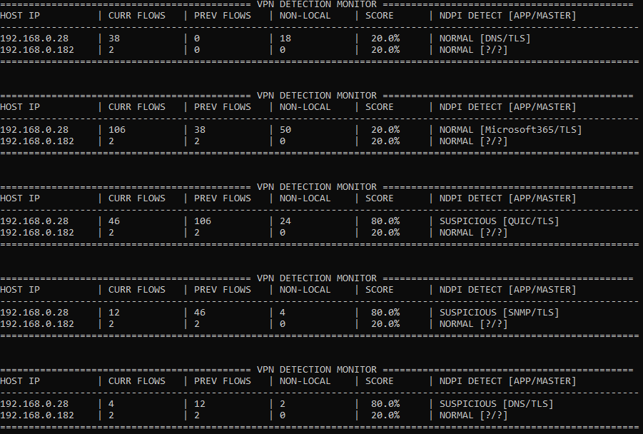
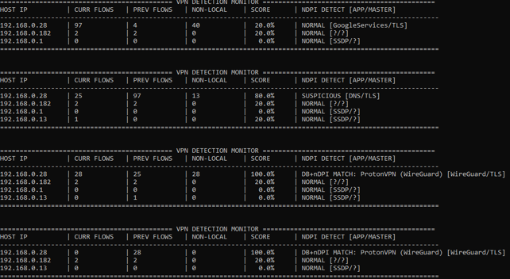
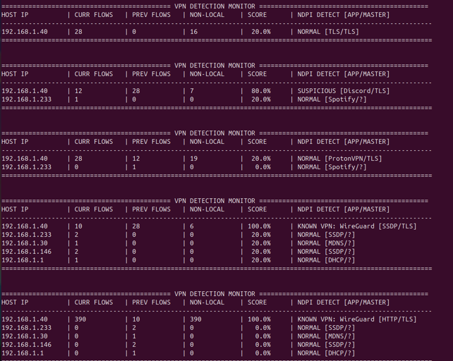

# Rilevamento e Analisi di Flussi di Rete VPN tramite Deep Packet Inspection e Analisi Comportamentale degli Host

**Gruppo**

- Riccardo Nedelcu, 673331, <r.nedelcu@studenti.unipi.it>
- Alessandro Silvestri, 623495, <a.silvestri12@studenti.unipi.it>
- Andrei Mickel Victorino, 673721, <a.victorino@studenti.unipi.it>

---

## 1. Obiettivi del lavoro

Il progetto ha previsto lo sviluppo di una sonda di monitoraggio di rete scritta in linguaggio C, denominata `vpnFlows_detector`, che intercetta il traffico di un'interfaccia di rete o di un file di cattura storico (`.pcap`).

Per le nostre simulazioni, abbiamo usufruito del servizio ProtonVPN. In fase di attivazione, tale servizio tenta innanzitutto di stabilire la connessione utilizzando protocolli e porte note. In questo stadio, il nostro applicativo è in grado di identificare immediatamente il flusso riscontrando una corrispondenza esatta nel database statico delle porte e dei protocolli noti inserito.

Tuttavia, essendo che i protocolli VPN possono variare continuamente le porte di comunicazione, come per le connessioni WireGuard, il rilevamento non può più basarsi sulle firme statiche di livello trasporto, ma deve necessariamente affidarsi all'analisi profonda del payload tramite Deep Packet Inspection. Ai nostri scopi, sono stati implementati i dissectors messi a disposizione della libreria nDPI, per identificare i protocolli applicativi.

I vari dati ottenuti permetteranno infine di aggregare e mostrare le informazioni rilevanti sui flussi catturati durante gli esperimenti, associando ad ogni host locale osservato un punteggio di sospetto relativo all'uso di una VPN.

### 1.1 Considerazioni sul lavoro effettuato

Lo strumento assume di osservare il traffico da un punto in cui gli host locali sono identificabili come tali (indirizzi privati secondo RFC 1918, oltre a loopback, link-local e CGNAT), tipicamente l'interfaccia di un client o un punto di osservazione a monte di una LAN. Solo agli host con indirizzo privato vengono attribuiti stato e punteggio.

nDPI riconosce già diversi protocolli VPN (WireGuard, OpenVPN, NordVPN, ecc.). La distinzione sta nell'oggetto dell'analisi, dove nDPI classifica solamente i flussi, mentre noi poniamo parametri ulteriori per l'analisi di essi.

Da questa differenza discendono tre obiettivi che la sola DPI non copre:

1. **Aggregazione per host**: il programma mantiene lo stato per indirizzo IP locale, aggrega le detection dei singoli flussi sull'host che li ha originati e ne segue l'evoluzione nel tempo, producendo una vista sintetica per host anziché un elenco di flussi classificati.

2. **Copertura del caso in cui la DPI fallisce**: la classificazione di nDPI si basa sul riconoscimento di pattern nel payload e funziona quando l'handshake del protocollo è riconoscibile.

   Non funziona, o funziona in modo parziale, quando la VPN è offuscata o incapsulata (tunnel su TLS/443, WireGuard su porte arbitrarie), quando la cattura inizia a tunnel già stabilito e l'handshake iniziale non è più osservabile, o quando il protocollo semplicemente non è coperto dai dissector, restituendo `Unknown` oppure una classificazione generica come TLS.

   L'euristica comportamentale descritta successivamente è pensata proprio per questa zona d'ombra, osservando analiticamente come cambia la forma del traffico dell'host quando un tunnel si attiva.

3. **Affidabilità fra diverse fonti**: le due evidenze, firma nota/DPI da un lato ed anomalia comportamentale dall'altro, hanno affidabilità diversa e vengono tenute distinte nell'output, così che un possibile operatore possa capire *perché* un host è stato segnalato e non solo *che* è stato segnalato.

---

## 2. Euristiche di rilevamento

Il rilevamento è organizzato su tre livelli, applicati in cascata a ogni flusso e riassunti in un unico punteggio per host.

### 2.1 Definizione di flusso nel sistema

Un flusso è identificato dalla 5-tupla (IP sorgente, IP destinazione, porta sorgente, porta destinazione, protocollo di trasporto), portata in **forma canonica**. Gli endpoint vengono ordinati, così che il traffico di andata e quello di ritorno ricadano nello stesso flusso e non vengano contati molteplici volte. I flussi sono mantenuti in una tabella hash a concatenazione esterna di 65.536 bucket e scadono dopo 120 secondi di inattività (`FLOW_IDLE_SEC`).

Alla creazione di ogni flusso vengono fissati una volta per tutte:

- **owner**: l'endpoint locale, cioè quello con indirizzo privato quando l'altro è pubblico; se entrambi gli endpoint sono privati o entrambi pubblici, si assume come owner il sorgente del primo pacchetto osservato;
- **peer**: il lato remoto, con la relativa porta.

Questa scelta è rilevante per la correttezza dell'attribuzione delle statistiche di detection, che vengono sempre imputate all'owner e non al sorgente del pacchetto corrente, che sui pacchetti di ritorno potrebbe essere il server remoto.

### 2.2 Primo livello: firme statiche

Ogni flusso viene confrontato con un piccolo database di firme note, che associa protocollo di trasporto e porta a un servizio VPN (attualmente UDP/51820 per WireGuard e UDP/1194 per OpenVPN). Il match è immediato e non richiede di attendere pacchetti successivi, quindi copre il caso in cui il client VPN, all'avvio, tenta la connessione sulle porte standard.

### 2.3 Secondo livello: classificazione nDPI

Ogni flusso ha un proprio contesto di tracking nDPI. I pacchetti vengono passati al motore finché non si ottiene una classificazione. Se dopo 24 pacchetti (TCP) o 10 pacchetti (UDP) il flusso è ancora non classificato, si forza `ndpi_detection_giveup()` per ottenere una classificazione best-effort ed evitare che il flusso resti `Unknown` a tempo indefinito. Lo stesso giveup viene tentato anche sui flussi che scadono per inattività, così che anche i flussi brevi ricevano una classificazione.

Se il protocollo applicativo o quello master corrisponde a uno dei nomi in una lista di protocolli VPN (`NordVPN`, `OpenVPN`, `WireGuard`), l'host owner viene marcato come utilizzatore di VPN.

Le due fonti hanno una precedenza definita: una detection proveniente dal database statico non viene sovrascritta da nDPI, ma se nDPI conferma la stessa detection l'host passa allo stato `DB+nDPI MATCH`, che è l'evidenza più forte prodotta dallo strumento.

### 2.4 Terzo livello: euristica comportamentale sul numero di flussi

Quando un qualsiasi utente attiva ed usufruisce di un servizio VPN, tutto il traffico di rete da lui generato viene incapsulato in un unico tunnel verso un solo endpoint remoto. In questo caso, l'euristica cerca di rilevare se il numero di nuovi flussi distinti generati dall'host cala bruscamente mentre il volume di traffico resta paragonabile.

Il tempo viene perciò suddiviso in intervalli di 10 secondi (`INTERVAL_SEC`). Per ogni host si contano i flussi nuovi creati nell'intervallo corrente (`curr`) e si conserva il conteggio dell'intervallo precedente (`prev`). Si tiene inoltre traccia di quanti di questi flussi siano diretti verso indirizzi pubblici (`non-local`). Al termine di ogni intervallo si calcola il rapporto `curr / prev` e si assegna il punteggio secondo le seguenti regole:

| Condizione | Stato | Score |
|---|---|---|
| Detection da DB statico confermata da nDPI | `DB+nDPI MATCH` | 1.0 |
| Detection da DB statico non confermata | `DB MATCH` | 0.8 |
| Detection da nDPI su protocollo VPN noto | `KNOWN VPN` | 1.0 |
| `curr / prev < 0.5` | `SUSPICIOUS` | 0.8 |
| `curr / prev >= 0.5`, oppure host appena osservato (`prev = 0`) | `NORMAL` | 0.2 |
| Nessun flusso nell'intervallo (`curr = 0`) | `NORMAL` | 0.0 |

La soglia di 0.5 (`DROP_RATIO_THRESHOLD`) significa che si segnala un host quando il numero di nuovi flussi si dimezza da un intervallo al successivo.

Un host marcato come VPN mantiene lo score bloccato a 1.0 finché continua a essere osservato come traffico VPN. Dopo 2 intervalli consecutivi senza matching VPN (`VPN_EXPIRY_INTERVALS`), ovvero 20 secondi nella nostra implementazione, lo stato decade e l'host torna alla valutazione comportamentale ordinaria. Gli host che restano senza traffico per più di 2 intervalli vengono rimossi dalla tabella, per evitare che l'output accumuli indefinitamente host non più attivi. Gli host con detection VPN attiva sono esclusi da questa rimozione.

### 2.5 Limiti del sistema

L'euristica comportamentale è deliberatamente semplice. I suoi limiti principali sono i seguenti:

- **Lo score non è una probabilità**: i valori 0.0, 0.2, 0.8 e 1.0 sono etichette ordinali di quattro stati discreti, non stime di verosimiglianza; il fatto che siano stampati come percentuale è una convenzione di presentazione, e non una vera traslazione probabilistica.

- **Falsi positivi**: qualunque causa di riduzione dei nuovi flussi produce lo stesso segnale di una VPN. Chiudere il browser, terminare una sessione di lavoro, mettere in pausa uno streaming, la sospensione della macchina o semplicemente un intervallo in cui l'utente smette di interagire generano tutti un rapporto `curr/prev` inferiore a 0.5. Anche il passaggio a un'unica connessione persistente ad alto volume (come un download lungo, una videochiamata) produce pochi flussi nuovi con molto traffico, cioè esattamente il profilo che l'euristica associa a un tunnel.

- **Falsi negativi**: se la cattura inizia quando la VPN è già attiva non esiste un `prev` alto da confrontare, perdendo le analisi di transizione tra uso VPN e meno, facendo apparire l'host come poco attivo. Analogamente, in *split tunneling* solo una parte del traffico passa nel tunnel e la molteplicità di destinazioni resta alta, e un host poco attivo, con pochi flussi per intervallo, produce rapporti instabili in cui la soglia perde significato.

- **Aggregazione per indirizzo IP**: l'unità di analisi è l'indirizzo IP privato. Dietro un NAT più dispositivi condividono lo stesso indirizzo e i loro comportamenti si sommano, mascherando il calo di un singolo host; per contro, un dispositivo che cambia indirizzo (DHCP, roaming) viene visto come due host distinti e perde la propria storia.

- **Sensibilità ai parametri**: i valori di 10 secondi per l'intervallo e di 0.5 per la soglia sono stati scelti empiricamente sulla base delle catture di prova e non sono il risultato di una taratura sistematica su un dataset etichettato. Intervalli più brevi rendono la misura più reattiva ma più rumorosa, rendendo le soglie più alte con possibili più falsi positivi.

- **Copertura del traffico**: l'analisi è limitata a IPv4 e ai trasporti TCP e UDP; traffico IPv6, ARP e altri protocolli di livello 3 e 4 non generano flussi e non contribuiscono ai conteggi. Un tunnel su IPv6 o su un protocollo diverso (per esempio ESP/IPsec, protocollo 50) risulta quindi invisibile sia alla DPI sia all'euristica. Il parsing del livello collegamento copre Ethernet con tag VLAN, Linux cooked capture, raw IP e loopback.

- **Limiti dimensionali**: la tabella degli host è statica e limitata a 1.024 voci, quella dei flussi vivi a 65.536. Oltre tali soglie i nuovi elementi vengono ignorati, caratteristica limitante in potenziali osservazioni di rete più ampie.

---

## 3. Prerequisiti ed istruzioni per eseguire il progetto

### 3.1 Prerequisiti di sistema e dipendenze

Il software è progettato per sistemi operativi Linux e richiede un compilatore C, oltre ad alcune librerie di sviluppo di sistema.

Per installare le dipendenze su sistemi basati su Debian/Ubuntu, eseguire da terminale:

```bash
sudo apt-get update
sudo apt-get install libpcap-dev libcap-dev
sudo apt-get install libndpi-dev
```

È inoltre necessaria la libreria di Deep Packet Inspection nDPI:

```bash
sudo apt-get install software-properties-common wget
sudo add-apt-repository universe
wget https://packages.ntop.org/apt-stable/22.04/all/apt-ntop-stable.deb
sudo apt install ./apt-ntop-stable.deb
sudo apt-get clean all
sudo apt-get update
sudo apt-get install pfring-dkms nprobe ntopng n2disk cento ntap
```

### 3.2 Istruzioni per la Compilazione

Compilare il progetto tramite `gcc` linkando le librerie pcap, cap, ndpi e la libreria matematica standard:

```bash
gcc -Wall -g -O3 -I/usr/include/ndpi -I/usr/local/include/ndpi vpnFlows_detector.c -o vpnFlows_detector.out -lndpi -lpcap -lcap -lm -lrt
```

**Nota:** la compilazione è gestita tramite Makefile. È sufficiente eseguire il comando `make` dalla directory del progetto, che produce direttamente l'eseguibile `vpnFlows_detector.out`.

### 3.3 Istruzioni per l'Esecuzione

I privilegi elevati sono richiesti **solo per la cattura live su interfaccia di rete**, dove è necessario aprire un socket raw (root oppure la capability `CAP_NET_RAW`). In quel caso il programma provvede autonomamente al *privilege dropping* subito dopo l'apertura dell'interfaccia, mantenendo le sole capability necessarie e passando all'utente `nobody`.

**Modalità di Analisi con interfaccia di Rete:**

```bash
sudo ./vpnFlows_detector.out -i <nome_interfaccia>
```

**Modalità di Analisi con lettura file PCAP:**

```bash
./vpnFlows_detector.out -i /<percorso_del_file>/traffico.pcap
```

**Opzioni disponibili:**

- `-i <device|path>`: specifica l'interfaccia di rete di ascolto (es. `eth0`, `wlan0`) o il percorso di un file di dump `.pcap`.
- `-l <len>`: configura la *snaplength* (default 1518 byte per non troncare i certificati TLS).
- `-f <filtro>`: applica un filtro BPF (Berkeley Packet Filter) in sintassi pcap standard (es. `"udp port 51820"` o `"ip"`).
- `-w <path>`: scrittura dei pacchetti catturati in un file `.pcap` apposito.
- `-v <mode>`: opzioni facoltative per la verbosità (`1`: verbose, `2`: very verbose).
- `-h`: stampa il menu di aiuto.

### 3.4 Lettura dell'output

Ogni intervallo produce una tabella con una riga per host. Le colonne riportano l'indirizzo dell'host, i flussi nuovi dell'intervallo corrente (`CURR FLOWS`) e di quello precedente (`PREV FLOWS`), quanti di essi siano diretti a indirizzi pubblici (`NON-LOCAL`), il punteggio di sospetto (`SCORE`) e l'esito della classificazione con i protocolli applicativo e master rilevati da nDPI (`[APP/MASTER]`).

Il cuore del progetto ricade nell'assegnamento dell'etichetta di stato, che indica i vari livelli di matching del rilevamento di potenziali host VPN (`DB MATCH`, `DB+nDPI MATCH`, `KNOWN VPN`, `SUSPICIOUS`, `NORMAL`).

---

## 4. Simulazioni

### 4.1 Test di analisi con lettura file PCAP

Abbiamo utilizzato Wireshark per creare 2 file pcap differenti, uno senza utilizzare VPN e uno utilizzando ProtonVPN su un device con WSL.

Poi, utilizzando il comando per eseguire il codice con i file pcap, abbiamo verificato che il programma accedesse ai file e che riuscisse, tramite il confronto con le firme di protocollo e porta note, a identificare il flusso unico creato da ProtonVPN, per poi darne conferma utilizzando anche nDPI.

Il primo test, dalle analisi effettuate, risulta in nessuna corrispondenza e quindi nessuna VPN rintracciata, con score massimo del 20%. Gli host restano nello stato `NORMAL` per tutta la durata della cattura.

Nel secondo test invece il programma è riuscito a rintracciare la VPN e ad identificarne il servizio, cioè Proton, e successivamente il protocollo utilizzato, ovvero WireGuard, con score pari al 100%, dato dalla concordanza fra il match sulle firme statiche e la classificazione dei dissector nDPI (`DB+nDPI MATCH`).

I comandi utilizzati sono i seguenti:

```bash
./vpnFlows_detector.out -i testVPN/Test-noVPN.pcap
./vpnFlows_detector.out -i testVPN/Test1-conVPN.pcap
```

I risultati ottenuti sono mostrati di seguito.

**Risultato test senza VPN:**



**Risultato test con VPN:**



Si osservi che nella cattura senza VPN compaiono comunque intervalli marcati `SUSPICIOUS`: sono i falsi positivi previsti come enunciato precedentemente, prodotti dalla normale variabilità del numero di flussi fra un intervallo e il successivo.

Infatti, nel primo caso si ha solo il segnale comportamentale, che da solo non è conclusivo, mentre nel secondo la conferma della DPI porta l'host allo stato di detection piena.

### 4.2 Test di analisi con interfaccia di rete

È stato eseguito un test sull'interfaccia di rete di un device con SO Ubuntu, che ha confermato il corretto rilevamento della VPN, con score del 100%. Anche in questo caso è stato utilizzato ProtonVPN per effettuare la simulazione. Dato che il test è stato effettuato su Ubuntu, il programma ha utilizzato solamente nDPI per rilevare la VPN in quanto, con questo SO, Proton non utilizza i protocolli e le porte note, ma crea un'interfaccia di rete virtuale.

La VPN è stata inizializzata poco dopo l'avvio del programma in modo da generare un numero consono di flussi per eseguire al meglio il test. Questa scelta ha permesso di osservare la transizione fra i due regimi di traffico, che è la condizione in cui l'euristica comportamentale è applicabile.

Il comando utilizzato è il seguente (qui `sudo` è necessario, trattandosi di cattura live):

```bash
sudo ./vpnFlows_detector.out -i wlp62s0
```

Il risultato ottenuto da terminale è mostrato qua sotto:



Questo test è anche il caso d'uso che motiva l'esistenza dello strumento. Su Ubuntu il client Proton non usa le porte note, quindi il primo livello di rilevamento non produce alcun match e perciò la sola lista di firme statiche non avrebbe rilevato nulla.
