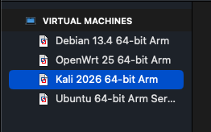
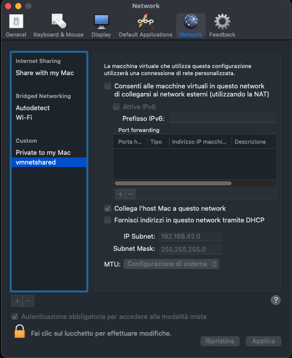
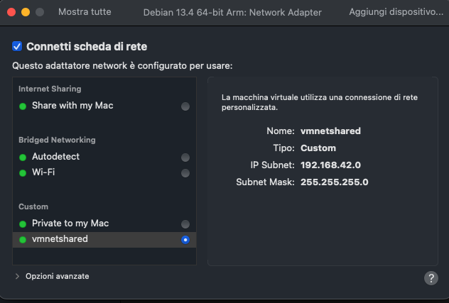
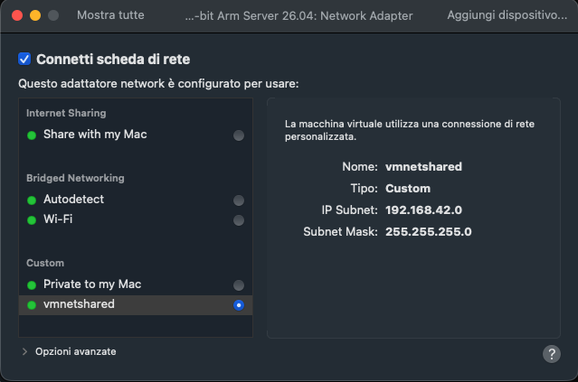
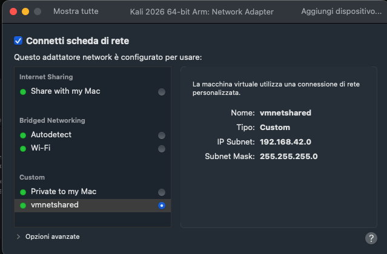
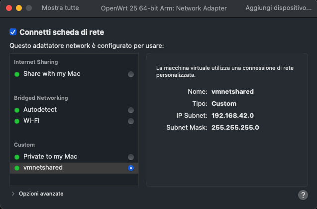
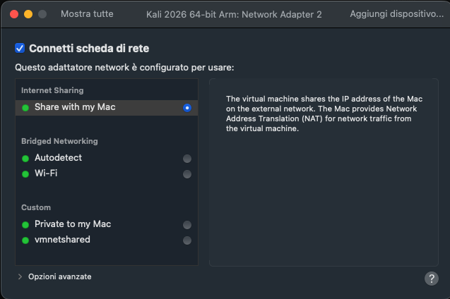

# VM Information

These virtual machines were the first lab solution used to develop and test the project in a controlled environment.

For the general lab comparison, see [`../README.md`](../README.md). For the
Docker lab, see [`../docker/README.md`](../docker/README.md).

## VM Software

VMware Fusion, available for free, was used to run the virtual machines.

## x86 Hosts

On x86 hosts, ARM VM emulation can be attempted, but it is expected to be slower and less practical. In that case, switching to the Docker environment is recommended.

## VM Operating System Versions

- OpenWrt 25.12.4 armv8/aarch64
- Debian 13.4.0 arm64
- Ubuntu Server 26.04 arm64
- Kali Linux 2026.1 arm64

The VMware Fusion library should contain the four lab machines:



## VM Disk Downloads

The VM disks can be downloaded from the following links:

- [Download OpenWrt disk](http://vps.giulionisi.me/DHCP-Starv-Detect-Lab/openwrt-disk.zip)
- [Download Debian disk](http://vps.giulionisi.me/DHCP-Starv-Detect-Lab/debian-disk.zip)
- [Download Ubuntu disk](http://vps.giulionisi.me/DHCP-Starv-Detect-Lab/ubuntu-disk.zip)
- [Download Kali Linux disk](http://vps.giulionisi.me/DHCP-Starv-Detect-Lab/kali-disk.zip)

Default VM credentials:

| VM | Username | Password |
|---|---|---|
| OpenWrt | `root` | empty password |
| Debian | `giulio` | `test123` |
| Ubuntu | `giulio` | `test123` |
| Kali Linux | `giulio` | `test123` |

The downloaded VM disks also include a `lab/` directory in each VM home
directory. It contains the utility scripts used to configure the shared test
network, temporary NAT access, package dependencies, and router/client helpers.
The downloaded disks should already have all required dependencies installed;
the dependency scripts are kept there to make the setup reproducible or to
repair a VM if needed.

## VM Roles

- OpenWrt simulates the router running the DHCP server to attack and defend.
- Debian simulates a legitimate network user.
- Ubuntu runs the project components, including detection and defense/mitigation.
- Kali Linux is used to launch the DHCP starvation attack.

## Shared Test Network

The VMs must share one isolated custom network used by the tests. In the lab
this network is named `vmnetshared` and uses the `192.168.42.0/24` subnet.

1. Open VMware Fusion preferences, go to the Network section, and add a new
   custom network. Configure it as the common test network: disable VMware DHCP
   for it, and set the subnet to `192.168.42.0` with mask `255.255.255.0`.



2. After creating the virtual machines, configure one network adapter on each
   VM to use the same custom network. This is the adapter used by the test
   topology and by the static addresses configured by the utility scripts.

| VM | Network adapter setting |
|---|---|
| Debian |  |
| Ubuntu |  |
| Kali Linux |  |
| OpenWrt |  |

After starting the VMs, run the `shared.sh` scripts on Debian, Ubuntu, and Kali,
and `setup-shared.sh` on OpenWrt, to assign the static IP addresses shown below.

## Temporary NAT Adapter for Package Installation

To install OS packages and project dependencies, add a second temporary network
adapter to each VM and configure it as `Share with my Mac` NAT. After adding
the adapter, run the VM's `nat.sh` script to enable Internet access, install the
needed packages using the appropriate install scripts, then remove the adapter
when setup is complete.



## Static IP Addresses

The VM utility scripts assign the following default addresses on the shared test network:

| VM | Script | Interface | Static address |
|---|---|---|---|
| OpenWrt | `open-wrt-scripts/setup-shared.sh` | `lan` | `192.168.42.4/24` |
| Debian | `debian-scripts/shared.sh` | `ens160` | `192.168.42.3/24` |
| Kali Linux | `kali-scripts/shared.sh` | `eth0` | `192.168.42.5/24` |
| Ubuntu | `ubuntu-scripts/shared.sh` | `ens160` | `192.168.42.6/24` |

## DHCP Server

The VM lab uses the default OpenWrt DHCP server, `dnsmasq`.
The DHCP pool used by the tests is `192.168.42.100` - `192.168.42.249`
(150 addresses) on the shared test network.

## Scripts

The `vms-scripts/` directory contains utility scripts grouped by VM role:

```text
vms-scripts/
├── debian-scripts/
│   ├── dhcpget.sh
│   ├── install-deps.sh
│   ├── nat.sh
│   └── shared.sh
├── kali-scripts/
│   ├── install-deps.sh
│   ├── nat.sh
│   └── shared.sh
├── open-wrt-scripts/
│   ├── install-netconf.sh
│   ├── nat.sh
│   ├── resetpool.sh
│   ├── setup-shared.sh
│   └── statuspool.sh
└── ubuntu-scripts/
    ├── dhcpget.sh
    ├── install-proj-deps.sh
    ├── nat.sh
    └── shared.sh
```

Debian scripts:

- `shared.sh` configures the shared/LAN interface with a static address for the test network.
- `nat.sh` configures a temporary NAT interface so the VM can download packages; on macOS with VMware Fusion, `/Library/Preferences/VMware Fusion/vmnet8/nat.conf` can be checked to find the host gateway values.
- `install-deps.sh` installs the DHCP client and process/network tools used by the tests.
- `dhcpget.sh` clears old DHCP state, restarts `dhcpcd`, and prints the newly assigned address.

Kali scripts:

- `shared.sh` configures the shared/LAN interface and enables SSH access.
- `nat.sh` configures a temporary NAT interface so the VM can download packages; on macOS with VMware Fusion, `/Library/Preferences/VMware Fusion/vmnet8/nat.conf` can be checked to find the host gateway values.
- `install-deps.sh` installs the attack-side tools, including `iproute2`, `procps`, and `yersinia`.

OpenWrt scripts:

- `setup-shared.sh` persistently configures the LAN interface for the test network.
- `nat.sh` configures a temporary NAT interface so OpenWrt can download packages; on macOS with VMware Fusion, `/Library/Preferences/VMware Fusion/vmnet8/nat.conf` can be checked to find the host gateway values.
- `install-netconf.sh` installs and enables the NETCONF SSH subsystem handler;
  the `netconf-handler-dnsmasq.sh` file must first be uploaded/copied to
  OpenWrt and then passed to the script as its argument.
- `resetpool.sh` clears the DHCP lease file, disables whitelist-only mode, and restarts `dnsmasq`.
- `statuspool.sh` prints used and available DHCP leases.

Ubuntu scripts:

- `shared.sh` configures the shared/LAN interface with a static address for the test network.
- `install-proj-deps.sh` installs the build/runtime dependencies for the detector.
- `nat.sh` configures a temporary NAT interface so the VM can download packages; on macOS with VMware Fusion, `/Library/Preferences/VMware Fusion/vmnet8/nat.conf` can be checked to find the host gateway values.
- `dhcpget.sh` clears old DHCP state, restarts `dhcpcd`, and prints the newly assigned address.

## Manual Usage

For manual VM lab usage, install dependencies on each machine with the
appropriate utility script, then synchronize the repository files to the VMs so
the paths match the project configuration.

On Ubuntu, build the detector from
`src/defense/dhcp_starvation_detector` with `make`, then run the detector with
the desired configuration and runtime parameters. Ubuntu is the machine that
executes detection and mitigation.

On Kali Linux, launch DHCP starvation traffic manually with either `yersinia` or
the Python attack script at `src/attack/dhcp_starvation_attack.py`, choosing the
attack parameters you want to test.

On Debian, use `debian-scripts/dhcpget.sh` when you want the legitimate client
to request a DHCP lease during an attack and observe whether it is still allowed
through the mitigation path.

On OpenWrt, use `open-wrt-scripts/statuspool.sh` to inspect the DHCP pool and
`open-wrt-scripts/resetpool.sh` to clear leases, disable whitelist-only mode,
and restart `dnsmasq` between manual experiments.

## Test Suite Usage

The VM lab can also be driven automatically by the host-side test suite. Before
running it, install the required dependencies on each VM with the appropriate
utility scripts, start all four VMs, and run the shared-network setup scripts
so the expected static IP addresses are assigned: `shared.sh` on Debian,
Ubuntu, and Kali, and `setup-shared.sh` on OpenWrt.

Then run the suite from the repository root:

```bash
python3 tests/run_tests.py --env-type vms
```

The suite checks VM connectivity and dependencies, synchronizes the current
workspace into the lab, builds the detector on Ubuntu, resets the router state,
runs the selected tests, and collects logs/results back under `tests/results/`.
See [`../../tests/README.md`](../../tests/README.md) for options, groups, and
result layout.
