## Autore:    Giuseppe Nozza
## Matricola: 689223
## Email:     g.nozza@studenti.unipi.it

# ClickHouse Ingestion and Behavioural Analysis (CHIBA)

## 1. Descrizione del progetto

### 1.1 Obiettivi
Lo scopo di questo tool di telemetria è quello di analizzare il comportamento di flussi di rete in tempo reale
e da file PCAP ai fini del rilevamento di DDoS, esfiltrazione di dati, network scan, port scan rapido e lento.


### 1.2 Dalla cattura con la sonda all'esportazione binaria
```
+------------------------------------------+
| BOOT: chiba [-h] [-r <path>] [-i <dev>]  |
| * Lettura chiba.conf / ENV               |
| * fork() ed execvp()                     |
+-------------------+------------------+---+
                    |                  |
                    v                  |
+------------------------------+       |
|  PROCESSO FIGLIO: softflowd  |       |
|  (Cattura live / file PCAP)  |       |
+---------------+--------------+       |
                |                      |
                | Datagrammi UDP       |
                v                      v
+---------------+----------------------+-----------------------------------+
|                   PROCESSO PADRE: CHIBA Daemon                           |
|                                                                          |
| +--------------------+  +--------------------+  +--------------------+   |
| | THREAD AUSILIARIO  |  | SHARED RING BUFFER |  |    MAIN THREAD     |   |
| |    (Collettore)    |  | (Buffer circolare) |  |   (Esportatore)    |   |
| |                    |  |                    |  |                    |   |
| |* poll() con timeout|  |* Coda FIFO         |  |* Trigger temporale |   |
| |  di 1 secondo      |  |* Sincronizzazione  |  |* Trigger           |   |
| |* Parsing NF9       |  |  con mutex         |  |  volumetrico       |   |
| +---------+----------+  +----+----------+----+  +---------+----------+   |
|           |                  ^          |                 ^          |   |
|           +------------------+          +-----------------+          |   |
|                                                                      |   |
+----------------------------------------------------------------------+---+
                                                                       |
                                                            Trasferimento bulk
                                                            HTTP POST (RowBinary)
                                                                       |
                                                                       v
+--------------------------------------------------------------------------+
|                            CLICKHOUSE SERVER                             |
|                               (Ingestione)                               |
+--------------------------------------------------------------------------+
```
### 1.2.1 Parsing CLI e gestione della configurazione
Il parsing della CLI è stato implementato tramite la funzione POSIX `getopt()`. La definizione della sorgente del traffico di rete è definita in questa fase. La modalità di cattura live su interfaccia e quella da file PCAP sono mutualmente esclusive.
I parametri necessari a comporre l'URL dell'interfaccia HTTP di ingestione di ClickHouse vengono estratti dal file `chiba.conf` tramite la routine `load_config()`. Tali parametri possono essere sovrascritti a runtime, tramite variabili d'ambiente dedicate. Di seguito l'output dell'esecuzione di `chiba` col parametro informativo (`-h`). I dettagli sul path di esecuzione del tool verranno discussi nella sezione 2.
```
./bin/chiba -h
[INFO] chiba.conf read correctly.
Usage: chiba [-h] [-r <path>] [-i <device>]

Options:
  -h               Print help
  -r <path>        Static PCAP file path
  -i <device>      Live network interface name

Environment Variables for ClickHouse HTTP interface (override chiba.conf):
  CH_HOST          Host (default: 127.0.0.1)
  CH_DB            Database (default: chiba)
  CH_TABLE         Destination table (default: ingest_flows)
```

### 1.2.2 Gestione di softflowd
La sonda `softflowd` viene istanziata da `chiba` tramite `fork()` ed `execvp()`, venendo eseguita in background come processo figlio concorrente mentre il processo padre prosegue con l'inizializzazione del demone.

I descrittori `stdout` e `stderr` del figlio vengono rediretti su `/dev/null` per evitare interferenze con i log di CHIBA.

L'esportazione dei record NetFlow v9 verso il thread collettore avviene tramite datagrammi UDP (su `127.0.0.1:9995`). La scelta di UDP è dettata da ovvie ragioni di performance, azzerando l'overhead di connessione, handshake e acknowledge tipici di TCP in favore del throughput. 

L'array di argomenti passato a `execvp()` differenzia i parametri di cattura e le politiche di esportazione dei flussi:

* **Modalità live:** la sonda cattura il traffico in tempo reale dall'interfaccia. I timeout di flusso sono bilanciati per il monitoraggio continuo. Ogni flusso vive al più 60 secondi prima dell'esportazione. L'inattività UDP è impostata ad un massimo di 30 secondi, mentre i flussi TCP inattivi vengono esportati entro 5 minuti. Questo compromesso previene la saturazione della tabella dei flussi attivi di `softflowd` ed evita un'eccessiva frammentazione delle connessioni lunghe, assicurando dati aggiornati al collettore senza generare overhead di rete non rilevante.

* **Modalità offline:** la sonda processa sequenzialmente la traccia PCAP statica. I vincoli temporali (tempo di vita ed emissione) sono ridotti a un secondo e la tabella dei flussi è vincolata alla dimensione minima. Questo forza l'espulsione immediata di ogni record verso il socket UDP, consentendo una scansione del dump senza le pause e i tempi morti del traffico originale.

Subito dopo la `fork()`, il processo padre effettua un controllo non bloccante sullo stato della sonda tramite:
```c
if (waitpid(pid, &status, WNOHANG) > 0) { ... }
```
L'uso del flag `WNOHANG` evita blocchi e permette di intercettare subito un eventuale fallimento all'avvio di `softflowd` (ad esempio per interfaccia inesistente, privilegi insufficienti o percorso PCAP errato).

Infine, la terminazione sicura del processo figlio è gestita dal demone al momento dell'arresto (o a fine elaborazione del file PCAP): CHIBA invia un `SIGTERM` al PID registrato e invoca `waitpid()` in modalità bloccante per raccogliere lo stato di uscita del processo, evitando la permanenza di processi zombie nel sistema.

### 1.2.3 Parsing dei record NetFlow v9
Il compito del thread collettore è ricevere i pacchetti UDP inviati dalla sonda e trasformarli in record strutturati pronti per il database. L'adozione di NetFlow v9 comporta una complessità aggiuntiva rispetto a formati rigidi come NetFlow v5: i pacchetti non hanno una struttura fissa, ma separano la descrizione dello schema dai dati effettivi.

All'avvio e a intervalli regolari, la sonda trasmette dei pacchetti di schema (**Template FlowSet**) che dichiarano la composizione del flusso: quali campi sono presenti, il loro ordine e la loro dimensione in byte. Il parser memorizza queste definizioni in una tabella statica interna per tutta la durata dell'esecuzione, senza ricorrere ad allocazioni dinamiche sulla memoria heap.

Quando arrivano i pacchetti contenenti il traffico effettivo (**Data FlowSet**), il parser consulta lo schema memorizzato ed estrae i valori direttamente dal payload binario. In questa fase vengono svolte tre operazioni principali:

* **Decodifica e ordinamento dei byte:** i contatori di traffico e le porte di rete vengono estratti interpretando la loro lunghezza reale (variabile da 1 a 8 byte) e convertiti dal formato di rete (big-endian) all'ordinamento nativo dell'architettura host.

* **Unificazione dello spazio di indirizzamento:** per gestire contemporaneamente IPv4 e IPv6 con una sola logica, gli indirizzi IPv4 vengono mappati nel formato standard a 128 bit (`IPv4-mapped`). Questo garantisce che ogni flusso abbia la medesima rappresentazione L3 a prescindere dal protocollo IP sottostante.

* **Normalizzazione nel formato interno:** i valori estratti vengono scritti in una struttura compatta derivata dai campi standard di telemetria Cisco:

```c
typedef struct flow_data {
  u_int32_t start_time;
  u_int32_t end_time;

  u_int8_t  srcaddr[16];
  u_int8_t  dstaddr[16];

  u_int32_t dPkts;
  u_int32_t dOctets;
  u_int16_t srcport;
  u_int16_t dstport;
  u_int8_t  prot;
} __attribute__((packed)) flow_data;
```
L'uso dell'attributo `__attribute__((packed))` impedisce al compilatore di inserire byte di allineamento alla fine della struttura dati. La struct ha una dimensione netta corrispondente all'esatta sequenza binaria attesa da ClickHouse per l'inserimento diretto via HTTP, consentendo il trasferimento dell'intero blocco di memoria in formato `RowBinary` senza passaggi intermedi di serializzazione. 

### 1.2.4 Pattern produttore-consumatore, double buffering
Il disaccoppiamento tra la ricezione ad alta frequenza dei pacchetti UDP e la persistenza dei dati sul database è affidato al pattern produttore-consumatore, implementato tramite una coda circolare condivisa (`ring_buffer`). Il thread ausiliario opera come produttore inserendo i record decodificati, mentre il thread principale agisce da consumatore estraendo i dati da inviare a ClickHouse.

L'accesso alla risorsa condivisa è regolato da un unico `mutex`, eliminando deliberatamente l'uso di variabili di condizione. Le condition variables risultano superflue perché il consumatore non deve svegliarsi a ogni singolo inserimento, né il produttore deve attendere lo svuotamento della coda: il thread principale valuta l'estrazione in base a trigger asimmetrici (il superamento di una soglia volumetrica di record accumulati o la scadenza di un intervallo temporale massimo). L'assenza di chiamate a `pthread_cond_signal` e a `pthread_cond_wait` rimuove l'overhead dei context switch e riduce il tempo di detenzione del lock.

Durante l'invocazione del trasferimento in massa, la gestione della memoria sfrutta una logica di *double buffering*: mentre il blocco di flussi viene isolato e trasmesso via HTTP, il produttore dispone della metà libera del buffer per continuare a registrare i nuovi arrivi, impedendo la perdita di record o la sovrascrittura di dati non ancora consumati in coda.

### 1.2.4.1 Osservazione sull'implementazione del ring buffer
La coda circolare non implementa una classica routine di estrazione singola (`pop` elemento per elemento). L'estrazione avviene esclusivamente a blocchi durante il trasferimento in massa, eliminando l'overhead di sincronizzazione per singolo record e minimizzando la contesa sul mutex condiviso.

L'avanzamento degli indici circolari sfrutta un buffer con dimensione rigidamente vincolata a una potenza di due. Questa proprietà algebrica permette di calcolare il nuovo indice senza ricorrere all'operatore modulo, applicando una maschera a livello di bit:
```c
/* Accodamento del singolo record (produttore) */
rb->tail = (rb->tail + 1) & (rb->size - 1);

/* Avanzamento dell'indice di testa di n record (consumatore) */
rb->head = (rb->head + n) & (rb->size - 1);
```

### 1.2.5 Streaming HTTP
Il thread principale gestisce la trasmissione dei flussi verso ClickHouse estraendo i record accumulati al raggiungimento della soglia volumetrica del batch o allo scadere dell'intervallo temporale prefissato.

I dati estratti dalla coda circolare transitano preliminarmente all'interno di un buffer lineare di esportazione (`export_buffer`). Questo passaggio intermedio è necessario per due motivi: da un lato linearizza la memoria nel caso in cui il blocco di flussi si trovi a cavallo tra la fine e l'inizio fisico del ring buffer, dall'altro consente di rilasciare il mutex subito dopo l'operazione di copia, evitando di trattenerlo durante l'intera durata del trasferimento di rete.

### 1.2.5.1 Ingestione dei flussi tramite libcurl-easy 
L'adozione di quest'interfaccia sincrona consente di gestire il canale HTTP in modo lineare all'interno del thread esportatore, articolando la trasmissione in quattro passaggi sequenziali:

* **Configurazione dell'endpoint:** la richiesta indirizza l'istanza locale di ClickHouse passando l'istruzione SQL direttamente come parametro di query nell'URL con formato `RowBinary`. In questo modo la definizione dell'istruzione di inserimento rimane separata dal corpo della richiesta `POST`, che viene riservato interamente al flusso di dati grezzo.

* **Associazione del payload:** il buffer lineare viene collegato direttamente al corpo della richiesta `POST` insieme al conteggio complessivo dei byte da trasmettere. Poiché il formato `RowBinary` non prevede intestazioni, metadati né caratteri di delimitazione, ClickHouse interpreta lo stream leggendo la memoria sequenzialmente e mappandola in modo posizionale (1:1) sulle colonne della tabella di destinazione. Questo schema azzera qualsiasi overhead computazionale legato alla serializzazione o alla formattazione testuale dei flussi.

* **Esecuzione del trasferimento:** l'invio avviene in modalità sincrona tramite `curl_easy_perform()`, bloccando l'esportatore fino all'effettivo completamento del caricamento del blocco; la gestione del canale di trasporto garantisce inoltre il riutilizzo della connessione TCP sottostante tra batch consecutivi, riducendo la latenza complessiva.

* **Validazione dell'esito:** al termine della trasmissione viene verificata la risposta restituita dal DBMS, accertando l'avvenuta persistenza del blocco corrente nel database prima di reimpostare i puntatori e procedere con l'accumulo del blocco successivo.

### 1.2.6 Pulizia della memoria
Tutte le allocazioni dinamiche sulla memoria heap e l'acquisizione delle risorse di sistema sono confinate esclusivamente alla fase preliminare di configurazione e predisposizione dell'ambiente di esecuzione. In questo intervallo iniziale, il processo padre valida i parametri CLI, apre il descrittore del socket UDP, istanzia la sonda figlia, abbassa i privilegi utente a `nobody`, alloca le code, inizializza il contesto di `libcurl` e lancia il thread ausiliario.

Nella fase di monitoraggio, dopo l'avvio del thread ausiliario, non viene eseguita alcuna invocazione a `malloc()` o `free()`.

La gestione della deallocazione rispetta in modo speculare la sequenza temporale di acquisizione tramite uno schema a cascata LIFO. Al momento dell'arresto del demone — intercettato tramite i gestori dei segnali `SIGINT`/`SIGTERM` o alla chiusura del processo figlio al termine di un file PCAP — il programma esce dal ciclo principale e dealloca i componenti in ordine inverso rispetto a quello di allocazione. Ecco un esempio pratico direttamente dal `main` di `chiba`:

```c
/* LIFO cleanup */
curl_easy_cleanup(curl);
curl_global_cleanup();
export_buffer_destroy(eb);
ring_buffer_destroy(rb);

kill(pid, SIGTERM);
waitpid(pid, NULL, 0);
close(sockfd);

puts("[INFO] Shutting down");
return (EXIT_SUCCESS);
```

In caso di errori di inizializzazione o allocazione di un componente, le risorse allocate fino a quel momento vengono deallocate tramite una catena ordinata di `goto`:

```c
/* LIFO cascade cleanup */
err_curl_easy:
    curl_easy_cleanup(curl);
err_curl_global:
    curl_global_cleanup();
err_eb:
    export_buffer_destroy(eb);
err_rb:
    ring_buffer_destroy(rb);
err_child:
    kill(pid, SIGTERM);
    waitpid(pid, NULL, 0);
err_socket:
    close(sockfd);

fprintf(stderr, "[ERROR] Shutting down: see error above\n");
return (EXIT_FAILURE);
```
### 1.2.6.1 Controlli con Valgrind
La correttezza della gestione della memoria e la completa deallocazione delle risorse sono state verificate tramite Valgrind, sottoponendo il demone a due scenari operativi distinti con tracciamento esplicito dei blocchi heap e dei file descriptor.

Questo primo test verifica il ciclo di vita completo del programma su una traccia PCAP contenente traffico IPv6.
```
valgrind --leak-check=full --show-leak-kinds=all --track-fds=yes ./bin/chiba -r ./pcap/DHCPv6.pcap

==16921== FILE DESCRIPTORS: 4 open (3 std) at exit.
==16921== Open AF_UNIX socket 12: <unknown>
==16921==    <inherited from parent>
==16921== 
==16921== HEAP SUMMARY:
==16921==     in use at exit: 0 bytes in 0 blocks
==16921==   total heap usage: 4,293 allocs, 4,293 frees, 2,842,787 bytes allocated
==16921== 
==16921== All heap blocks were freed -- no leaks are possible
==16921== 
==16921== ERROR SUMMARY: 0 errors from 0 contexts (suppressed: 0 from 0)
```
Il report attesta la corrispondenza tra allocazioni e deallocazioni. L'analisi dei descrittori evidenzia la corretta chiusura del socket UDP di ricezione e dei canali ridiretti; il descrittore residuo non standard risulta ereditato dal processo genitore della shell, escludendo fughe di risorse interne al demone.

Questo test, invece, ci permette di verificare che anche a fronte di una interruzione asincrona il programma supera i memory checks. 
```
valgrind --leak-check=full --show-leak-kinds=all --track-fds=yes ./bin/chiba -i lo

==17519==
==17519== FILE DESCRIPTORS: 3 open (3 std) at exit.
==17519==
==17519== HEAP SUMMARY:
==17519==     in use at exit: 0 bytes in 0 blocks
==17519==   total heap usage: 4,315 allocs, 4,315 frees, 2,858,557 bytes allocated
==17519==
==17519== All heap blocks were freed -- no leaks are possible
==17519==
==17519== For lists of detected and suppressed errors, rerun with: -s
==17519== ERROR SUMMARY: 0 errors from 0 contexts (suppressed: 0 from 0)
```


### 1.3 Schema e pipeline dati in ClickHouse
```
+----------------------------------------------------------------------------+
|                   TABELLA PRINCIPALE: chiba.ingest_flows                   |
|                     Record di flusso grezzi (Raw Data)                     |
+-------------------------------------+--------------------------------------+
                                      |
                  +-------------------+---------+-------------------+
                  | Materialized Views (Stati intermedi)            |
                  v                             v                   v
+------------------------------------+  +----------------+  +----------------+
|         chiba.host_src_agg         |  |  host_dst_agg  |  |  service_agg   |
| * Aggregati host sorgente          |  |* Aggreg. target|  |* Ripartiz. L4  |
| * Unicita' destinazioni e porte    |  |* IP src unici  |  |* IP src unici  |
| * Volumi totali byte e pacchetti   |  |* Volumi PPS/BPS|  |* Volumi porta  |
+------------------+-----------------+  +-------+--------+  +-------+--------+
                   |                            |                   |
         +---------+---------+                  |                   |
         | Stati             | Finestra         | Stati             | Stati
         | (-Merge)          | (24 ore)         | (-Merge)          | (-Merge)
         v                   v                  v                   v
+----------------+  +----------------+  +----------------+  +----------------+
| host_src_view  |  | slow_scanners  |  | host_dst_view  |  |  service_view  |
|* Port scan v.  |  |* Scan stealth  |  |* Rilev. DDoS / |  |* Analisi L4    |
|* Network sweep |  |  bassa frequen.|  |  SYN/UDP flood |  |* Top porte dst |
|* Egress anomalo|  |* Finestra 24h  |  |* Carico target |  |* Distrib. byte |
+-------+--------+  +-------+--------+  +-------+--------+  +-------+--------+
        |                   |                   |                   |
        +-------------------+---------+---------+-------------------+
                                      |
                                      v
+----------------------------------------------------------------------------+
|                             DASHBOARD GRAFANA                              |
|                    (Telemetria e Rilevamento Anomalie)                     |
+----------------------------------------------------------------------------+
```
### 1.3.1 Schema della tabella base 
La tabella `chiba.ingest_flows` memorizza i dati grezzi e costituisce la sorgente dati per tutte le viste materializzate della pipeline di analisi. Qui di seguito sono riportate le scelte architetturali fatte:

* I tipi di dato delle colonne sono in corrispondenza biunivoca con i campi della struct `flow_data` di cui abbiamo parlato nella sezione 1.2.3. Come discusso in 1.2.5.1, invece, il formato `RowBinary` non necessita alcuna decodifica o conversione.

* `ENGINE = MergeTree()`: usare il motore colonnare standard permette di organizzare i record su disco in parti compattate asincronamente in background.

* `PARTITION BY toYYYYMMDD(toDateTime(START_TIME))`: questa clausola permette di segmentare fisicamente i dati su base giornaliera. 

* `ORDER BY (START_TIME, SRCADDR, DSTADDR)`: la precedenza assegnata a `START_TIME` ottimizza la scansione per intervalli temporali. L'inclusione di `SRCADDR` e `DSTADDR` accelera le operazioni di filtraggio e raggruppamento nelle query di ispezione e analisi ad-hoc sui dati grezzi. 

### 1.3.2 Aggregazione dei dati e Materialized Views
Per evitare che le interrogazioni di telemetria e rilevamento anomalie debbano scansionare milioni di record grezzi, la pipeline interpone un livello di pre-aggregazione continua basato su tre tabelle con motore `AggregatingMergeTree` (`host_src_agg`, `host_dst_agg`, `service_agg`) alimentate da altrettante Materialized View.  

In ClickHouse le Materialized View operano come trigger in scrittura: all'arrivo di ogni blocco su `ingest_flows`, i dati vengono intercettati direttamente in memoria ed elaborati secondo una duplice logica:  
* **Discretizzazione temporale:** la funzione `toStartOfMinute(toDateTime(START_TIME))` riconduce i timestamp dei singoli flussi a finestre temporali fisse di un minuto (`TIME_BUCKET`). Questo intervallo costituisce la granularità base su cui vengono calcolate tutte le metriche successive.  

* **Memorizzazione degli stati intermedi:** anziché calcolare un valore numerico scalare definitivo, le viste materializzate impiegano le varianti combinatorie delle funzioni di aggregazione (`*State`). I valori risultanti sono stati binari intermedi che conservano la struttura necessaria (ad esempio lo stato probabilistico HyperLogLog per `uniqState` o gli estremi temporali per `min`/`max`) per essere fusi tra loro in momenti diversi.  

Le tre viste materializzate separano il traffico su tre dimensioni di analisi indipendenti:  

1. `host_src_mv`: raggruppa per (`TIME_BUCKET`, `SRCADDR`, `PROT`), monitorando la dispersione delle connessioni generate (indirizzi e porte di destinazione uniche) per l'individuazione di scansioni e traffico anomalo in uscita.
  
2. `host_dst_mv`: raggruppa per (`TIME_BUCKET`, `DSTADDR`), quantificando i flussi convergenti e il numero di sorgenti uniche verso ciascun host per intercettare attacchi di tipo flood e DDoS.  

3. `service_mv`: raggruppa per (`TIME_BUCKET`, `DSTPORT`, `PROT`), aggregando la concentrazione dei volumi sui singoli servizi di rete e porte bersaglio.

### 1.3.3 Logica delle Views
Le viste logiche costituiscono il layer di presentazione del database, esponendo ai pannelli di Grafana interfacce pronte per l'interrogazione. Nelle Views vengono applicate le funzioni di combinazione (`*Merge`), permettendo l'esposizione di metriche scalari pronte per l'interrogazione. Questo elimina la necessità di conoscere le strutture dati interne del motore di aggregazione.    

Oltre alla risoluzione 1:1 dei singoli bucket per la telemetria ordinaria, questo layer consente la creazione di viste analitiche dedicate, come `slow_scanners_view`: quest'ultima ri-aggrega i bucket su un intervallo esteso di 24 ore per calcolare metriche derivate e filtrare le anomalie stealth direttamente a livello DBMS.

### 1.4 Monitoraggio e alerting
L'infrastruttura di visualizzazione e allarmistica è realizzata tramite Grafana, interfacciato a ClickHouse mediante il plugin ufficiale. La dashboard di `chiba` indirizza ogni query alle viste logiche trattate nel paragrafo precedente. Le query sfruttano le macro temporali native di Grafana (in particolare `$__timeFilter(TIME_BUCKET)`), delegando interamente al database il filtraggio e l'aggregazione colonnare. 

### 1.4.1 Pannelli di traffico e telemetria
> **Disclaimer sulla privacy:** le schermate e i dati telemetrici riportati provengono da un ambiente di test controllato. Non vengono mostrati indirizzi IP privati o sensibili riconducibili a infrastrutture di produzione reali; gli host visibili appartengono a indirizzamenti di laboratorio (RFC 1918) o a servizi e CDN pubbliche ampiamente note.

La dashboard è divisa in quattro schede tematiche:

* **Inbound Traffic:** interroga `chiba.host_dst_view` per monitorare il carico verso i target interni.
Include una tabella con i primi dieci host per volume, pacchetti e picco di sorgenti concorrenti
(`max(UNIQUE_SRCADDR)`), affiancata dalle serie temporali di PPS e BPS calcolate sulla durata dei flussi.

  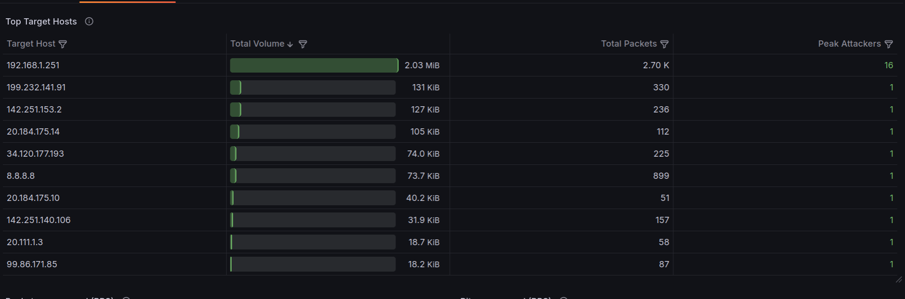
  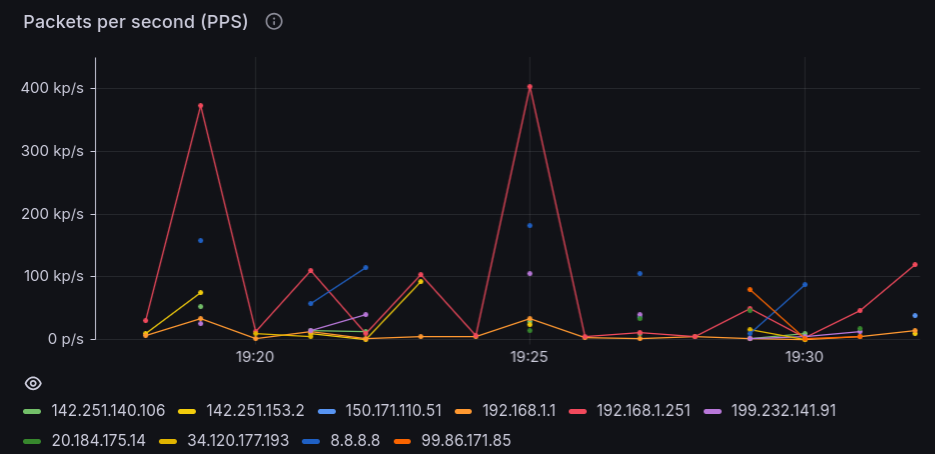
  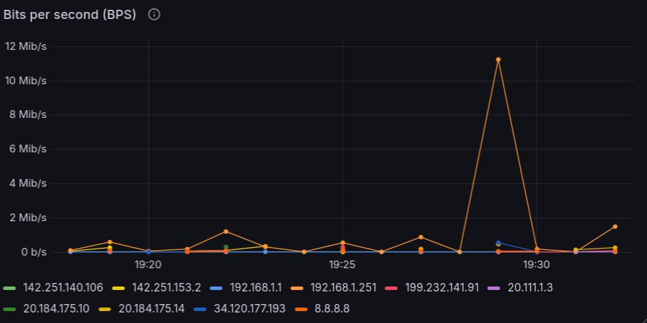

* **Outbound Traffic:** sfrutta `chiba.host_src_view` per individuare i top talker locali. Correla i volumi
emessi con la cardinalità delle destinazioni (`max(UNIQUE_DSTADDR)`) e delle porte contattate
(`max(UNIQUE_DSTPORT)`), tracciando l'evoluzione nel tempo di banda e pacchetti uscenti.

  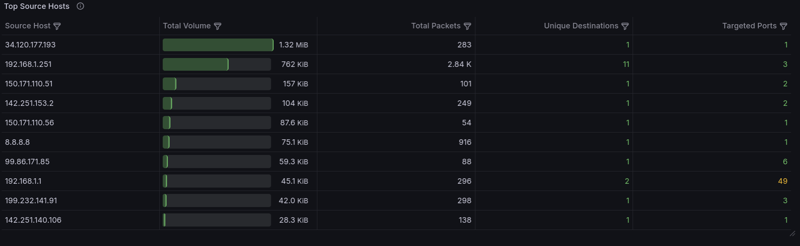
  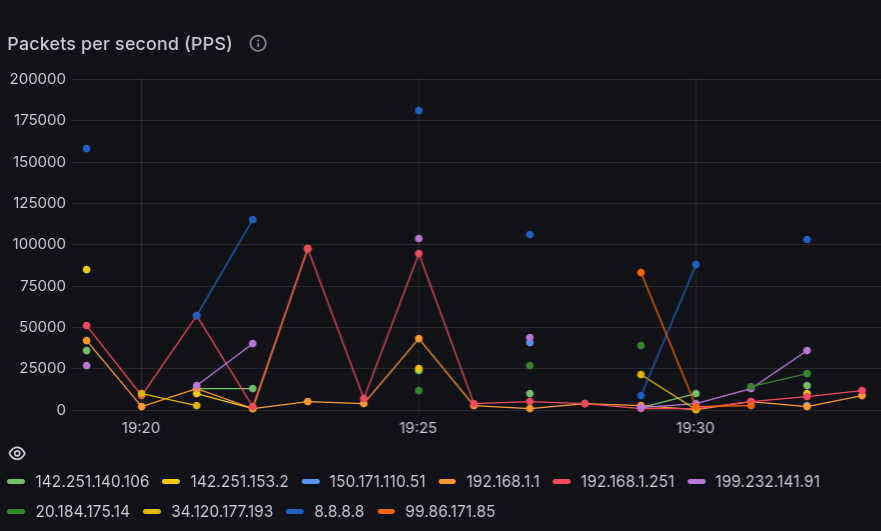
  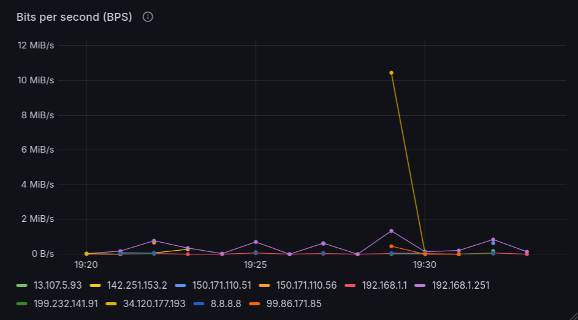

* **Protocol Distribution:** si appoggia a `chiba.service_view` per segmentare il traffico a livello L4 e
applicativo. Mostra la quota percentuale dei protocolli (TCP, UDP, ICMP), i servizi/porte di destinazione
dominanti e la persistenza dei volumi scambiati nel tempo.

  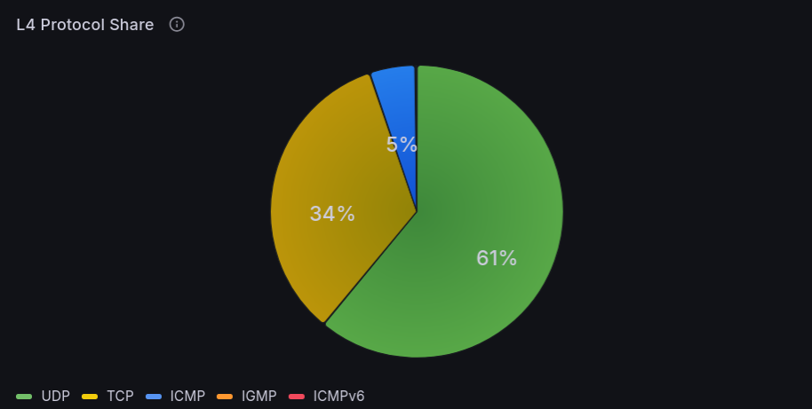
  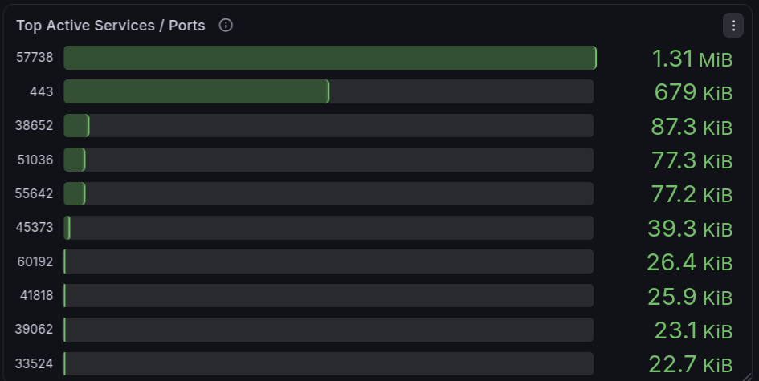
  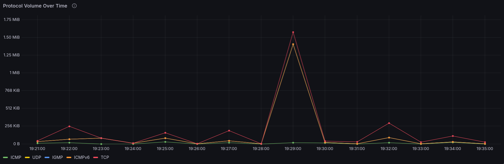

* **Security Alerts:** integra quattro pannelli di stato per il conteggio immediato degli host coinvolti in
attività malevole (DDoS, scan e anomalie volumetriche) e due tabelle di dettaglio per l'ispezione degli incidenti
a breve e lungo termine.

  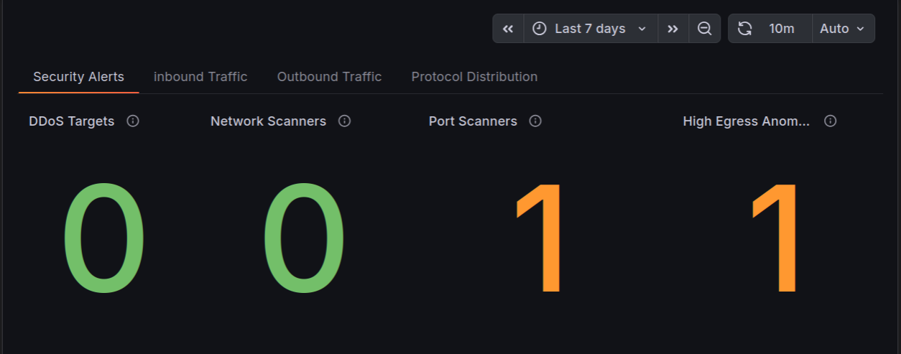
  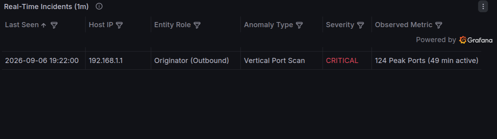
  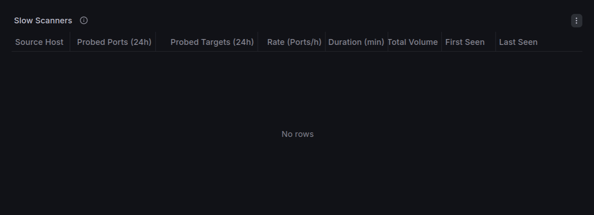

### 1.4.2 Regole di rilevamento, soglie, severità
Il motore di allarmistica separa l'identificazione di anomalie rapide e volumetriche su finestra di un minuto dall'analisi di anomalie lente e distribuite su finestra di 24 ore.

I valori numerici adottati costituiscono un compromesso euristico pensato per consentire una fase di testing
agevole e riproducibile, senza la pretesa di riflettere i volumi o la complessità di un ambiente di produzione
reale. Grazie al disaccoppiamento tra il layer di cattura in C e quello analitico, la logica di detection è
interamente confinata nelle query di Grafana e nelle viste logiche di ClickHouse: ciò consente di ricalibrare
qualsiasi soglia a runtime senza intaccare lo schema del database né richiedere modifiche o ricompilazioni del
demone.

#### 1. Rilevamento in tempo reale (Finestra: 1 minuto)
Le anomalie ad alta frequenza vengono rilevate aggregando per singolo `TIME_BUCKET` le viste `host_dst_view` e
`host_src_view`. I risultati confluiscono nella tabella unificata degli incidenti tramite `UNION ALL`, assegnando a ciascun evento un ruolo, una tipologia di minaccia e una severità dinamica basata sulla funzione `multiIf()`:

* **Distributed Flood / DDoS (Inbound):** scatta quando `UNIQUE_SRCADDR >= 50` verso un singolo `DSTADDR`. La
severità è graduata tramite `multiIf(max(UNIQUE_SRCADDR) >= 200, 'CRITICAL', 'WARNING')`. La convergenza di
flussi provenienti da decine o centinaia di sorgenti distinte nello stesso minuto verso un unico nodo evidenzia
la natura distribuita di un attacco volumetrico (come SYN/UDP flood o botnet).

* **Horizontal Network Sweep (Outbound):** intercetta host locali con `UNIQUE_DSTADDR >= 50`, scalando a
critico per `max(UNIQUE_DSTADDR) >= 200`. Il contatto verso un numero anomalo di destinazioni in soli 60 secondi
identifica un'attività di scan orizzontale.

* **Vertical Port Scan (Outbound):** rileva sorgenti con `UNIQUE_DSTPORT >= 20`, con severità critica per
`max(UNIQUE_DSTPORT) >= 100`. La dispersione su decine o centinaia di porte bersaglio in un minuto isola il port
scanning mirato alla mappatura dei servizi attivi.

* **Excessive Outbound Volume (Outbound):** monitora flussi con `TOTAL_DOCTETS >= 20971520` (20 MB/min),
assegnando severità critica a partire da `52428800` (50 MB/min). Consente di rilevare picchi anomali di traffico
uscente legati a trasferimenti massivi non autorizzati o all'impiego del nodo per attacchi verso
l'esterno.

In tutti i casi, la query quantifica la persistenza dell'incidente tramite `count()`, restituendo il numero di
minuti in cui l'anomalia è rimasta attiva nella finestra temporale selezionata.

#### 2. Rilevamento su orizzonte esteso (Finestra: 24 ore)
I port scanner avanzati e gli strumenti di ricognizione stealth (ad es. `nmap` con profili lenti o flag `--scan-delay`) diluiscono le sonde nel tempo per rimanere deliberatamente al di sotto della soglia al minuto (`UNIQUE_DSTPORT < 20`) ed eludere i controlli real-time.

Per intercettare questi pattern, la tabella *Slow Scanners* interroga la vista `slow_scanners_view`, che aggrega i bucket temporali mediante una finestra mobile di 24 ore (`WHERE TIME_BUCKET >= now() - INTERVAL 24 HOUR`), applicando un filtro congiunto di volume e persistenza:
```sql
WHERE TIME_BUCKET >= now() - INTERVAL 24 HOUR
GROUP BY SRCADDR
HAVING (UNIQUE_DSTPORT >= 50 OR UNIQUE_DSTADDR >= 100)
   AND ACTIVE_SPAN_MINUTES >= 30
```
* **Finestra scorrevole di 24 ore:** la clausola `WHERE TIME_BUCKET >= now() - INTERVAL 24 HOUR` cumula gli stati parziali dell'intera giornata, consentendo di rivelare sonde distanziate di diversi minuti o ore l'una dall'altra.
* **Persistenza temporale (`ACTIVE_SPAN_MINUTES >= 30`):** calcolato tramite `dateDiff('minute', toDateTime(EXACT_START), toDateTime(EXACT_END))`, isola le attività ricorsive escludendo burst isolati o falsi positivi transitori.
* **Frequenza normalizzata di scansione (`PORTS_PER_HOUR`):** calcolata come `round(UNIQUE_DSTPORT / greatest(1, (EXACT_END - EXACT_START) / 3600), 2)`. L'impiego di `greatest(1, ...)` previene divisioni per zero per attività inferiori all'ora, normalizzando la frequenza delle sonde su base oraria per stimare la velocità di probing del nodo malevolo.

## 2. Prerequisiti e istruzioni per l'esecuzione

### 2.1 Requisiti di sistema e installazione delle dipendenze
    
L'architettura software poggia su quattro componenti principali: il demone in C, softflowd, ClickHouse e Grafana.
I seguenti passaggi fanno riferimento a distribuzioni che derivano da Debian/Ubuntu.

#### 1. Toolchain di sviluppo, librerie e sonda di cattura
Per compilare il demone e consentire la cattura e decodifica dei flussi NetFlow, è necessario installare la
toolchain di compilazione, gli header di libcurl e softflowd:

```bash
sudo apt update
sudo apt install build-essential gcc make libcurl4-openssl-dev softflowd
```

#### 2. Installazione di ClickHouse (Server e Client)
Il DBMS può essere installato con lo script ufficiale, che predispone i binari e registra il servizio systemd:

```bash
# Scaricamento e installazione ufficiale dei binari
curl https://clickhouse.com/ | sh
sudo ./clickhouse install

# Avvio del servizio per la sessione di lavoro corrente
sudo systemctl start clickhouse-server

# (Opzionale) Abilitazione dell'avvio automatico a ogni boot:
# sudo systemctl enable clickhouse-server

# Verifica dello stato di esecuzione e della versione
clickhouse-client --query "SELECT version();"
```

#### 3. Installazione di Grafana e del plugin ClickHouse

```bash
# Configurazione del repository ufficiale e installazione di Grafana OSS
sudo apt install apt-transport-https software-properties-common wget
sudo mkdir -p /etc/apt/keyrings/
wget -q -O - https://apt.grafana.com/gpg.key | gpg --dearmor | sudo tee /etc/apt/keyrings/grafana.gpg > /dev/null
echo "deb [signed-by=/etc/apt/keyrings/grafana.gpg] https://apt.grafana.com stable main" | sudo tee /etc/apt/sources.list.d/grafana.list
sudo apt update && sudo apt install -y grafana

# Installazione del plugin ufficiale di ClickHouse per Grafana
sudo grafana-cli plugins install grafana-clickhouse-datasource

# Avvio del demone Grafana per la sessione corrente
sudo systemctl start grafana-server

# (Opzionale) Abilitazione al boot:
# sudo systemctl enable grafana-server
```

#### 4. Strumenti per la generazione del traffico di test
Per eseguire i test di sicurezza e le simulazioni di traffico descritte nella sezione 3:

```bash
sudo apt install nmap hping3 netcat-openbsd
```

### 2.2 Compilazione del demone CHIBA
La generazione dell'eseguibile è automatizzata dal `Makefile` presente nella root del progetto. L'invocazione
di `make` compila i moduli sorgente in `src/`, genera la directory degli oggetti intermedi `build/` e produce il
binario compilato in `bin/chiba` (path di esecuzione):

```bash
# Compilazione 
make

# Pulizia dei file oggetto e dei binari compilati
make clean
```

### 2.3 Inizializzazione e gestione del Database
Il `Makefile` integra target dedicati per automatizzare l'esecuzione in sequenza di tutti gli script SQL contenuti
nella cartella `sql/` (`00_init.sql` → `05_views.sql`), predisponendo il database `chiba`, le tabelle fisiche, gli
aggregati intermedi e le viste logiche:

```bash
# Inizializzazione dello schema completo:
make db-init

# Ripristino totale (Drop e Re-init):
# Particolarmente utile in fase di testing per azzerare lo stato delle tabelle.
# Il comando richiede una conferma esplicita digitando yes per prevenire la distruzione accidentale dei dati:
make db-reset
```

### 2.4 Configurazione ed Esecuzione del demone
I parametri di connessione HTTP verso ClickHouse sono definiti nel file `chiba.conf` nella root di progetto:

```ini
CH_HOST=http://127.0.0.1:8123
CH_DB=chiba
CH_TABLE=ingest_flows
```

Questi parametri possono essere sovrascritti a runtime mediante variabili d'ambiente omonime.

Come descritto nella sezione 1.2, l'invocazione del tool prevede due comandi operativi:

```bash
# Cattura live su interfaccia (necessari privilegi per socket raw gestito da softflowd)
sudo ./bin/chiba -i <network interface name>

# Analisi offline di file PCAP
./bin/chiba -r ./pcap/DHCPv6.pcap
```

### 2.5 Configurazione della Dashboard Grafana
1. Accedere all'interfaccia web di Grafana navigando su `http://localhost:3000` (credenziali predefinite: utente `admin`, password `admin`).
2. Dal menu laterale, selezionare **Connections** → **Data sources** → **Add data source** e scegliere **ClickHouse**:
   * Server address: `127.0.0.1`
   * Server port: `8123`
   * Default database: `chiba`
   * Cliccare su **Save & test** per verificare la connettività con il DBMS.
3. Selezionare **Dashboards** → **New** → **Import**, cliccare su **Upload dashboard JSON file** e selezionare il file [`grafana/chiba_dashboard.json`](grafana/chiba_dashboard.json).

## 3. Testing

### 3.1 Port Scan rapido
L'obiettivo del test è verificare l'intercettazione di una scansione verticale aggressiva verso un singolo
host, superando la soglia di allarme di 20 porte distinte nel bucket di un minuto.

Il comando utilizzato per generare l'anomalia sull'interfaccia di loopback è il seguente:

```bash
sudo nmap -sS -T4 -p 1-150 127.0.0.1
```

Al termine dell'intervallo di flushing (60 secondi), l'interrogazione diretta della vista `chiba.host_src_view` conferma la corretta aggregazione dei flussi:

```bash
clickhouse-client --query "
SELECT
    SRCADDR,
    UNIQUE_DSTPORT,
    PROT
FROM chiba.host_src_view
WHERE UNIQUE_DSTPORT >= 20;
"
```

Output:
```text
::ffff:127.0.0.1    150    6
```

Nella dashboard, l'incidente si riflette istantaneamente nel cruscotto di allarmistica:
* Il contatore **Port Scanners** si incrementa a `1`.
* **Tabella Real-Time Incidents (1m):** viene registrato l'host `127.0.0.1` con tipologia `Vertical Port Scan` e severità `CRITICAL` (avendo superato le 100 porte).

### 3.2 Network Sweep (Scansione orizzontale)
L'obiettivo del test è verificare il rilevamento di una ricognizione orizzontale volta a mappare host attivi nella sottorete, superando la soglia di allarme di 50 destinazioni distinte in un minuto.

In ambiente Linux l'intera subnet `127.0.0.0/8` risponde su interfaccia di loopback. Il comando utilizzato per generare sonde TCP verso 65 indirizzi distinti è il seguente:

```bash
sudo nmap -sS -T4 -p 80 127.0.0.1-65
```

Al termine dell'intervallo di aggregazione, l'interrogazione della vista `chiba.host_src_view` attesta il superamento della soglia:

```bash
clickhouse-client --query "
SELECT
    SRCADDR,
    UNIQUE_DSTADDR,
    PROT
FROM chiba.host_src_view
WHERE UNIQUE_DSTADDR >= 50;
"
```

Output:
```text
::ffff:127.0.0.1    65    6
```

Nella dashboard, l'evento viene tempestivamente visualizzato nella scheda di sicurezza:
* Il contatore **Network Scanners** si incrementa a `1`.
* **Tabella Real-Time Incidents (1m):** viene segnalato l'host `127.0.0.1` con ruolo `Originator (Outbound)`, anomalia `Horizontal Network Sweep` e severità `WARNING` (la severità scala a `CRITICAL` oltre 200 destinazioni).

### 3.3 Distributed Flood / DDoS
L'obiettivo del test è accertare la capacità del sistema di intercettare attacchi volumetrici convergenti, rilevando quando un singolo host target riceve traffico da almeno 50 sorgenti distinte in 60 secondi.

Il comando impiega `hping3` per emettere 80 pacchetti TCP SYN verso l'indirizzo di loopback, generando indirizzi IP sorgente casuali tramite il flag `--rand-source`:

```bash
sudo hping3 -c 80 -d 10 -S -p 80 --rand-source 127.0.0.1
```

L'interrogazione della vista `chiba.host_dst_view` evidenzia la concentrazione di sorgenti concorrenti sul target:

```bash
clickhouse-client --query "
SELECT
    DSTADDR,
    UNIQUE_SRCADDR
FROM chiba.host_dst_view
WHERE UNIQUE_SRCADDR >= 50;
"
```

Output:
```text
::ffff:127.0.0.1    80
```

L'incidente si riflette istantaneamente nei pannelli di monitoraggio:
* Il contatore **DDoS Targets** si incrementa a `1`.
* **Tabella Real-Time Incidents (1m):** viene registrato il target `127.0.0.1` con ruolo `Target (Inbound)`, anomalia `Distributed Flood` e severità `WARNING`.

### 3.4 Volume Egress anomalo (Esfiltrazione)
L'obiettivo del test è verificare l'allarmistica su flussi di traffico uscente anomali, superando la soglia volumetrica di 20 MB (20.971.520 byte) in un minuto.

Il test predispone un listener locale sulla porta 9999 e trasmette 30 MB di dati casuali su loopback tramite `dd` e `nc`:

```bash
# Avvio del listener locale in background
nc -l -p 9999 > /dev/null &

# Trasferimento bulk di 30 MB
dd if=/dev/urandom bs=1M count=30 | nc -w 1 127.0.0.1 9999
```

L'interrogazione della vista `chiba.host_src_view` conferma la corretta quantificazione del volume emesso:

```bash
clickhouse-client --query "
SELECT
    SRCADDR,
    formatReadableSize(TOTAL_DOCTETS) AS volume,
    TOTAL_DOCTETS
FROM chiba.host_src_view
WHERE TOTAL_DOCTETS >= 20971520;
"
```

Output:
```text
::ffff:127.0.0.1    30.00 MiB    31457280
```

Nella dashboard l'anomalia volumetrica viene esposta con formattazione automatica:
* Il contatore **High Egress Anomalies** si incrementa a `1`.
* **Tabella Real-Time Incidents (1m):** viene generato un record per l'host `127.0.0.1` con tipologia `Excessive Outbound Volume` e severità `WARNING` (diventa `CRITICAL` oltre i 50 MB).

### 3.5 Supporto Dual-Stack IPv6 da traccia PCAP
L'obiettivo del test è convalidare l'elaborazione offline di tracce PCAP statiche e dimostrare che il parser NetFlow v9 gestisce correttamente gli indirizzi IPv6 nativi a 128 bit senza corruzione di memoria o disallineamenti di endianness.

Il comando avvia il demone in modalità offline sul dump IPv6 di test:

```bash
./bin/chiba -r ./pcap/DHCPv6.pcap
```

L'interrogazione della tabella `chiba.ingest_flows` verifica la presenza di indirizzi IPv6 nativi privi del prefisso di mapping IPv4 (`::ffff:`):

```bash
clickhouse-client --query "
SELECT
    IPv6NumToString(SRCADDR) AS src,
    IPv6NumToString(DSTADDR) AS dst,
    PROT
FROM chiba.ingest_flows
WHERE notLike(IPv6NumToString(SRCADDR), '::ffff:%')
LIMIT 5;
"
```

Output:
```text
fe80::a00:27ff:fed4:10bb    ff02::16    58
fe80::a00:27ff:fefe:8f95    ff02::1:2    17
fe80::a00:27ff:fed4:10bb    fe80::a00:27ff:fefe:8f95    58
```

Nella scheda *Protocol Distribution*, i flussi IPv6 vengono aggregati con successo:
* Il grafico a torta **L4 Protocol Share** ripartisce correttamente il traffico UDP e ICMPv6.
* La tabella dei volumi registra le porte di servizio DHCPv6 (546 e 547) e i messaggi di Neighbor Discovery.

### 3.6 Port Scan lento (Finestra 24 ore)
L'obiettivo del test è dimostrare l'efficacia del motore su orizzonte esteso: una ricognizione stealth a bassa frequenza diluita nel tempo elude il controllo al minuto ma viene intercettata dalla vista a 24 ore.

Una scansione diluita (ad esempio condotta tramite `nmap -T1` o impostando un ritardo con `--scan-delay 15s`) mantiene il numero di sonde per singolo minuto costantemente al di sotto della soglia rapida (`UNIQUE_DSTPORT < 20`). 

Mentre la vista `host_src_view` non genera allarmi per i singoli minuti, l'interrogazione della vista su 24 ore `slow_scanners_view` correla le sonde complessive superando i criteri di persistenza (`ACTIVE_SPAN_MINUTES >= 30` e `UNIQUE_DSTPORT >= 50`):

```bash
clickhouse-client --query "
SELECT
    SRCADDR,
    UNIQUE_DSTPORT,
    ACTIVE_SPAN_MINUTES,
    PORTS_PER_HOUR
FROM chiba.slow_scanners_view;
"
```

Output:
```text
::ffff:127.0.0.1    60    35    102.86
```

Il comportamento dual-horizon si riflette in modo netto nella dashboard:
* **Tabella Real-Time Incidents (1m):** nessun allarme generato per i singoli bucket da 60 secondi (bypass riuscito delle soglie real-time).
* **Tabella Slow Scanners (24h Window):** l'host viene esposto con la metrica normalizzata `Rate (Ports/h)`, evidenziando l'avvenuta ricognizione stealth.

## 4. Conclusioni e sviluppi futuri
Traiamo ora alcune conclusioni sul progetto.

L'architettura è costruita attorno a un principio fondamentale: un sistema di monitoraggio deve essere
autonomo, senza richiedere passaggi manuali per aggregare dati o correlare anomalie che possono essere
individuate a livello software. Per questo motivo, il calcolo delle metriche e l'individuazione degli host
anomali avvengono interamente in automatico all'interno di ClickHouse.

Al tempo stesso, per evitare che troppi falsi allarmi portino a ignorare le minacce reali, il sistema separa
con chiarezza i preavvisi di anomalie statistiche (`WARNING`) dagli allarmi critici ed evidenti
(`CRITICAL`), e combina una finestra temporale a breve termine con una su 24 ore, filtrando le
normali oscillazioni di rete e facendo emergere solo le scansioni lente e persistenti. Infine, affinché le
segnalazioni non restino inosservate, le evidenze critiche sono collocate come primo elemento visivo nella
dashboard, così da attirare subito l'attenzione dell'operatore.

Qui di seguito riporto possibili sviluppi futuri del progetto.

* **Gestione con Docker Compose:** coordinare l'avvio e la configurazione dei servizi utilizzati tramite un unico file `docker-compose.yml`.
* **Sistema di logging in C:** sostituire le attuali stampe formattate a terminale con una gestione dei log
strutturata a livelli (`DEBUG`, `INFO`, `ERROR`), utile se la dimensione del codice del `main` dovesse aumentare.
* **Notifiche esterne:** inviare avvisi via email (o Telegram, Discord, etc...) per gli allarmi critici, così da segnalare il problema.
* **Soglie dinamiche:** affiancare alle soglie fisse un calcolo basato sullo storico del traffico della rete,
adattando i limiti di anomalia in modo continuo.

## 5. Riferimenti e bibliografia
* Brian "Beej Jorgensen" Hall, *Beej's Guide to Network Programming - Using Internet Sockets*: [https://beej.us/guide/bgnet/html/](https://beej.us/guide/bgnet/html/)
* Michael Kerrisk, *The Linux Programming Interface*: No Starch Press
* Luca Deri, *Network Monitoring in Practice*: [https://luca.ntop.org/gr2026/tm2026.pdf](https://luca.ntop.org/gr2026/tm2026.pdf)
* Cisco Systems, *RFC 3954 - Cisco Systems NetFlow Services Export Version 9*: [https://datatracker.ietf.org/doc/html/rfc3954](https://datatracker.ietf.org/doc/html/rfc3954)
* IANA (Internet Assigned Numbers Authority), *Protocol Numbers*: [https://www.iana.org/assignments/protocol-numbers/protocol-numbers.xhtml](https://www.iana.org/assignments/protocol-numbers/protocol-numbers.xhtml)
* ClickHouse Official Documentation: [https://clickhouse.com/docs](https://clickhouse.com/docs)
* Grafana Official Documentation: [https://grafana.com/docs](https://grafana.com/docs)
