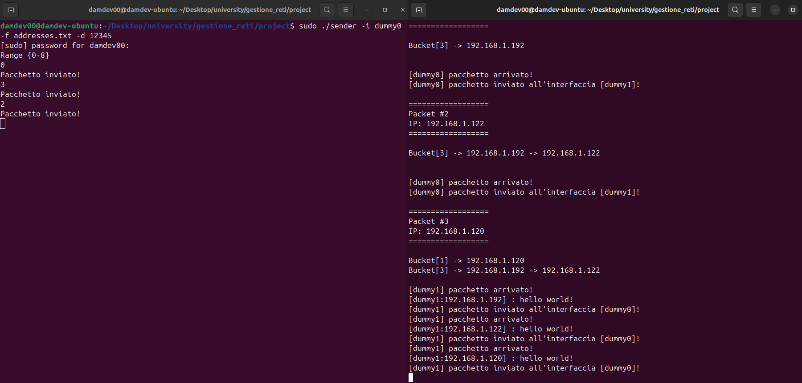
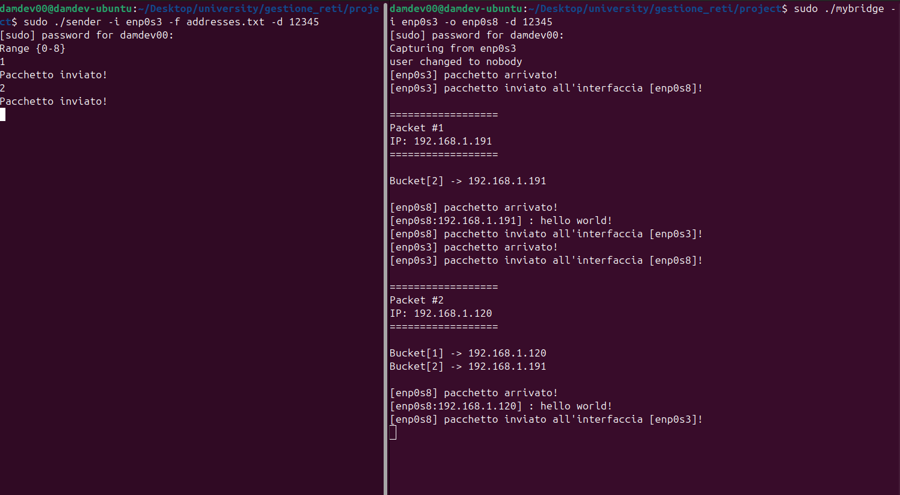
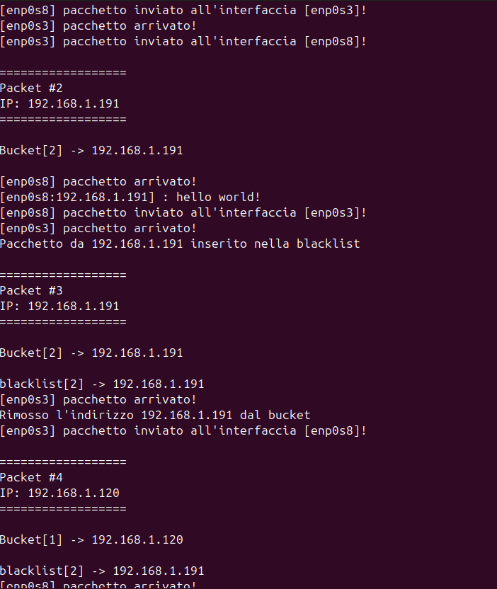

### Damiano Ottaviano 671944
# Introduzione

* Il progetto si basa sull’integrazione del leaky bucket, per limitare il traffico eccessivo dei dati, nel bridge bidirezionale. Il progetto è stato fatto con il **linguaggio c** utilizzando la libreria **pcap** per la trasmissione e ricezione di pacchetti. Come scelte progettuali, per rendere più facile la visione dei pacchetti in transito, ho inserito un filtro manuale (senza l’uso di pcap) che legge solamente pacchetti UDP (quindi con protocollo 17) e con un certo numero identificativo per evitare di leggere pacchetti UDP esterni, con una struttura del pacchetto leggermente diversa, a quelli che inviamo con sender.c. Questo per evitare di confondersi con altri pacchetti in transito ed evitare errori, visto che la struttura del pacchetto è stata leggermente alterata.
    
* Nel bridge, ogni volta che arriva un pacchetto, verranno stampati sullo schermo:
  * Counter attuale dei pacchetti con il relativo IP sorgente del pacchetto.
  * Lista degli indirizzi sorgenti che sono stati catturati di recente e la lista nera.
  * Viene specificato il nome dell’interfaccia che sta lavorando in quel momento. Più in avanti si vedrà meglio con degli esempi.
    
# Prerequisiti di sistema

### Pacchetti e librerie software
Il progetto richiede il compilatore `gcc`, il tool `make`e i file della libreria `pcap` (ad ogni file verrà aggiunto il flag -lpcap per la compilazione). Digitare la seguente combinazione di comandi:
1. **Aggiorna l'elenco dei pacchetti del sistema:**
```bash
   sudo apt update
```
2. **Installa il compilatore GCC e il tool make:**
```bash
  sudo apt install build-essential
```
3. **Installa la libreria pcap:**
```bash
  sudo apt-get install libpcap-dev
```

### Sistema operativo e ambiente
* **OS**: distribuzione linux
* **Configurazione interfacce di rete**: è necessario avere a disposizione due interfacce per far funzionare il bridge. Per cui si procede nel creare una finta scheda di rete, momentanea, che esiste solo nel sistema operativo. Digitare da riga di comando:
```bash
  # Creazione e attivazione della prima interfaccia dummy
  sudo ip link add dummy0 type dummy
  sudo ip link set dummy0 up

  # Creazione e attivazione della seconda interfaccia dummy
  sudo ip link add dummy1 type dummy
  sudo ip link set dummy1 up
```
**Alternativa sulla configurazione dell'interfaccia**: invece di aggiungere due interfacce fittizie, nel caso ci si trova in un ambiente virtualizzato (ad es. VirtualBox) si può aggiungere una nuova scheda di rete dalle impostazioni andando su:
* Impostazioni -> Esperto -> Rete -> Selezionare una scheda -> abilità scheda di rete

# Descrizione

Nel progetto sono presenti i seguenti file:

* mybridge.c: bridge bidirezionale
* sender.c: programma per inviare pacchetti all’interfaccia desiderata
* addresses.txt: file di testo da cui prelevare gli indirizzi ip che verranno usati dal sender.c che invia gli stessi pacchetti diversificati solamente dall’ip
* structure.h: contiene le strutture dati necessarie. Sia per la costruzione del pacchetto, e sia quelle per la costruzione di una lista concatenata.
* pcount.c: utilizzato per ricevere pacchetti e ri-inoltrarli sulla stessa interfaccia.
* utils.c: contiene la logica e l'implementazione del leaky bucket, utilizzato nel bridge.c
* utils_leaky_bucket.h: contiene le firme dei metodi implementati in utils.c

Come scelta progettuale, i pacchetti che verranno trasmessi sono di tipo UDP, aggiungendo un ulteriore struttura dati per l’header dell’udp, affiancato all’header ip. Il pacchetto è costituito anche da un header ethernet e un payload, che contiene:

* Hop: un intero che rappresenta la quantità di destinazioni raggiunte, utile per capire se il bridge deve inoltrare il pacchetto dalla prima interfaccia (evitando il loop infinito).
* Message: un messaggio che verrà letto sempre nel caso in cui l’indirizzo da cui proviene non si trova nella lista nera.

```bash
struct eth_header {
    uint8_t dst_mac[ETH_ALEN];
    uint8_t src_mac[ETH_ALEN];
    uint16_t ethertype;
} __attribute__((packed));

struct ip_header_ {
    uint8_t  vl;              
    uint8_t  type_service;    
    uint16_t total_length;
    uint16_t identification;
    uint16_t fo;              
    uint8_t  ttl;
    uint8_t  protocol;
    uint16_t checksum;
    uint32_t src_ip;
    uint32_t dst_ip;
} __attribute__((packed));

struct udp_header_ {
    uint16_t src_port;
    uint16_t dst_port;
    uint16_t length;
    uint16_t checksum;
} __attribute__((packed));

struct payload {
    uint32_t hop;
    char message[32];
} __attribute__((packed));
```

* Alla fine di ogni struct viene utilizzata la direttiva \_\_attribute\_\_((packed)) per evitare il padding nelle strutture e alcuni disagi per l'accesso ai campi per l'offset, ottimizzando l’uso della memoria.

* I pacchetti vengono inviati tramite sender.c, che permette di inviare gli stessi pacchetti, differenziati solamente dall’indirizzo ip, utile per capire l’approccio del leaky bucket nel bridge. Il sender prende come input nel prompt:

    * L’interfaccia a cui mandare pacchetti (che sarà l’interfaccia di ingresso del bridge).
    * Un file di testo contenente diversi indirizzi ip che verranno scelti, come ip sorgente del pacchetto, tramite un numero digitato sul prompt, utilizzato come indice identificativo di un certo ip all’interno dell’array contenente tutti gli indirizzi del file.
    * Il flag identificativo del pacchetto. Usato per differenziare i pacchetti UDP che arrivano da fonti esterne da quelli che vengono mandati con sender.c.

* Gli indirizzi ip verranno inseriti nelle due liste attraverso una funzione di hash che restituisce un indice di dove dovrà essere inserito quell'indirizzo. L'indice viene restituito sommando gli ottetti dell'indirizzo per poi fare il modulo della dimensione della lista. Prendendo ad esempio il file **addresses.txt** possiamo associare ad ognuno di loro il proprio l'indice dell'array in cui si trovano (ipotizzando che la dimensione della lista sia 10):
    * posizione 0: 192.168.1.192 -> (192+168+1+192 mod 10) 3
    * posizione 1: 192.168.1.191 ->  2
    * posizione 2: 192.168.1.120 ->  1
    * posizione 3: 192.168.1.122 ->  3
    * posizione 4: 192.168.1.190 ->  1
    * posizione 5: 192.168.1.123 ->  4
    * posizione 6: 192.168.1.154 ->  5
    * posizione 7: 192.168.1.90 -> 1
    * posizione 8: 192.168.1.100 -> 1


* In questo esempio ho digitato, in sender.c, i seguenti numeri:
    * 0 -> Invia un pacchetto con l'indirizzo 192.168.1.192 con hash=3
    * 3 -> Invia un pacchetto con l'indirizzo 192.168.1.122 con hash=3
    * 2 -> Invia un pacchetto con l'indirizzo 192.168.1.120 con hash=1
* Come si può notare gli indirizzi sono stati inseriti nelle posizioni corrette della lista secondo i loro hash. La stessa cosa vale anche per la blacklist ovviamente

# Come funziona il Leaky Bucket

* Vengono utilizzate due liste concatenate, dove una (chiamata table nel bridge di tipo **struct bucket**) serve per registrare gli indirizzi ip recenti, e l’altra (blacklist) per registrare gli indirizzi ip che hanno superato una certa soglia, limitando la loro analisi e l’inoltro dei loro pacchetti alla seconda interfaccia per un certo periodo di tempo.
* Ad ogni indirizzo presente nella lista degli ip recenti (table), viene associato un livello inizializzato ad 1 che rappresenta la frequenza dei pacchetti che arrivano con un quell’indirizzo. Chiaramente, un indirizzo non rimarrà all’infinito nella lista, per cui ho creato una costante che indica il tempo di vita rimasto per un livello che è uguale per ogni indirizzo. L’idea è che ad ogni nuovo pacchetto, viene fatta una revisione in **table**, e se c’è un indirizzo che era li da un certo periodo di tempo, il livello si può decrementare di un certo numero che dipende da quante volte rientra il valore della costante TTL da quanto tempo era passato dall’ultimo pacchetto. Se non arriveranno più pacchetti da quell’indirizzo dopo un po' di tempo, il suo livello può arrivare a 0, per poi eliminare quell’ip dalla **table**.
* Quando arriva un pacchetto, se l’indirizzo ip relativo a quel pacchetto è presente in **table**, il livello verrà incrementato di 1. Se il livello dovesse superare il limite, allora l’ip relativo a quel livello verrà inserito nella lista nera per un certo periodo di tempo.

* Macro importanti in utils_leacky_bucket:
  * Capacity: è la soglia massima. Se viene superato, l’indirizzo viene inserito nella blacklist.
  * TTL_IP_IN_BUCKET: è il timer dopo il quale il livello del secchio di un ip si abbassa se smette di inviare pacchetti.
  * TTL_IP_IN_BLACKLIST: tempo rimanente dell’indirizzo nella blacklist.
```bash
struct Bucket {
    uint32_t ip;
    unsigned int level;
    time_t timestamp;
    struct Bucket* next;
};

struct Address_node {
    uint32_t ip;
    time_t timestamp;
    struct Address_node* next;
};
```
* Primo esempio di simulazione

* Dietro le quinte ovviamente, c’erano anche due pcount attivi per ogni interfaccia. Ogni pacchetto che arriva, viene inserito in **table** tramite un hash che calcola l’indice sommando gli ottetti dell’indirizzo. Quando il pacchetto giunge nella seconda interfaccia del bridge, viene stampato il testo del messaggio (in questo caso hello world). 
* Viene sempre specificato il numero dei pacchetti che sono transitati nel bridge e l’ip sorgente del pacchetto. Inoltre, viene anche specificato da quale interfaccia arriva il pacchetto, segnalando anche l’inoltro alla [seconda|prima] interfaccia.

* Secondo esempio di simulazione

 * Qui c’è un caso di spedizione eccessiva di pacchetti da parte dell’indirizzo 192.168.1.191. In questo esempio, CAPACITY è uguale a 2. Infatti, l’indirizzo, al terzo invio, è stato inserito nella blacklist in un intervallo di tempo troppo piccolo rispetto a TTL_IP_IN_BUCKET.
* Bisogna notare che entrando nella lista nera, non è stato analizzato il contenuto del pacchetto, e quindi nessun print di hello world.
# Istruzioni

* Indispensabile specificare due interfacce nel bridge, in entrata e in uscita, e avviare due pcount.c ognuno per ogni interfaccia. Inoltre, per ogni file.c bisogna inserire una flag che indica il numero identificativo del pacchetto che, come detto nell’introduzione, serve per evitare di leggere altri pacchetti UDP esterni non inviati con sender.c per non andare in confusione cercando di comprendere al meglio come funziona l’algoritmo introdotto.

* Compilazione:
  * Utilizzare il makefile digitando il comando **make** producendo gli eseguibili: mybridge, pcount, sender.
  * In caso di problemi con il makefile, compilare i programmi in questo modo:
    * ```bash
      gcc bridge.c utils.c -o bridge -lpcap
      gcc pcount.c -o pcount -lpcap
      gcc sender.c -o sender -lpcap
      ```

* Esecuzione:
  * ```bash
    Sudo ./sender -i [interface 1] -f [file_indirizzi.txt] -d [packet_id]
    Sudo ./bridge -i [interface 1] -o [interface 2] -d [packet_id]
    Sudo ./pcount -i [interface1] -d [packet_id] 
    Sudo ./pcount -i [interface2] -d [packet_id] 
    ```

  * Esempio:
  * sudo ./pcount -i dummy0 -d 12345
  * sudo ./pcount -i dummy1 -d 12345
  * sudo ./mybridge -i dummy0 -o dummy1 -d 12345
  * sudo ./sender -i dummy0 -f addresses.txt -d 12345

# Testing e verifica

### Preparazione dei terminali

* **Terminale 1 (monitor di entrata):** si mette in ascolto sulla prima interfaccia
```bash
  sudo ./pcount -i dummy0 -d 12345
```
* **Terminale 2 (monitor di uscira):** si mette in ascolto sulla seconda interfaccia
```bash
 sudo ./pcount -i dummy1 -d 12345
```
* **Terminale 3 (bridge):** bridge bidirezionale specificando l'interfaccia di uscita e di entrata, e il flag di identficazione dei pacchetti che deve leggere.
```bash
 sudo ./mybridge -i dummy0 -o dummy1 -d 12345
```
* **Terminale 4 (sender):** generatore di pacchetti da inviare sulla prima interfaccia.
```bash
 sudo ./sender -i dummy0 -f addresses.txt -d 12345
```
### Esempi di come funziona il sistema nel tempo
#### Parametri di test in `utils_leaky_bucket.h` 
per questa simulazione sono state configurate le seguenti macro di controllo:
* `CAPACITY = 3`: il secchio può contenere al massimo 3 pacchetti prima di traboccare.
* `TTL_IP_IN_BLACKLIST = 5`: durata della punizione (in secondi) per l'ip che esagera con il traffico.
* `TTL_IP_IN_BUCKET = 3`: è il timer dopo il quale il livello del secchio di un ip si decrementa se smette di inviare pacchetti.
  
### Esecuzione dei test (verifica del Leaky Bucket)
* **Caso A** traffico regolare (nessun blocco): dal terminale 4 (sender) si inseriscono una serie di numeri (che indicano le posizioni degli ip nell'array in cui vengono salvati), selezionado un ip, inviando un paio di pacchetti a distanza di qualche secondo l'uno dall'altro. Se per ogni ip, il pacchetto viene inviato  almeno dopo TTL_IP_IN_BUCKET secondi dopo l'ultimo invio del pacchetto con lo stesso ip, non supererà mai la soglia, e quindi non verrà aggiunto mai nella lista nera. Si possono mandare pacchetti, con un determinato ip, con un alta frequenza arrivando massimo a level = CAPACITY per poi aspettare almeno TTL_IP_IN_BUCKET secondi per l'invio del prossimo pacchetto con quell'ip. Anche in questo caso, l'ip non verrà mai inserito nella blacklist.
* **Caso B** raffica di pacchetti (inserimento nella blacklist): dal terminale 4 viene inviata una raffica di una decina di pacchetti, con lo stesso ip (e quindi digitando sempre lo stesso numero) in 1-2 secondi. Il risultato è che il livello del secchio di quell'ip supera la capacità (dato che in questo esempio, la capacità = 3, lo supera sicuramente) già dal quarto pacchetto. Di conseguenza, l'ip viene inserito nella blacklist, e gli altri pacchetti rimanenti vengono scartati senza stampare il contenuto del messaggio.
* **Caso C** (scadenza timer): sia nella lista (table) degli indirizzi ip recenti e sia nella blacklist, dopo un certo periodo di tempo vengono rimossi dalla lista:
* Dopo un certo periodo di inattività di invio di pacchetti da parte di un indirizzo, si arriverà in un punto in cui il suo livello andrà a 0, per cui verrà rimosso dalla lista table.
* Dopo tot secondi che un indirizzo è stato inserito nella blacklist, verrà anch'esso rimosso, con la possibilità di riprendere l'analisi dei pacchetti di quell'indirizzo.

### Scenari possibili con linea temporale

* **scenario di traffico regolare:**

* t0: Invio pacchetto con IP = 192.168.1.90
* t1: arriva il pacchetto al bridge. livello del secchio dell'ip viene aumentato di 1, quindi level=1, e viene inizializzato il suo timestamp=t1.
effettuo un controllo level (1) > CAPACITY (3) é falso e quindi non faccio nulla. Viene stampato hello world!
* t2: Invio pacchetto con IP = 192.168.1.90.
* t3: In questo caso verifico se il timer del livello del secchio rientra in un intervallo di tempo > 3, in questo caso t3 (timestamp corrente) - t1 (timestamp dell'arrivo del pacchetto nel tempo t1) = 2 < TTL_IP_IN_BUCKET, per cui il livello non viene decrementato, ma viene portato da level=1 a level=2, e aggiorno il suo timestamp=t3. Il bridge stampa hello world!
* t10: nessun arrivo di un pacchetto, viene fatto un controllo sul registro degli indirizzi ip recenti che hanno inviato pacchetti. In questo caso abbiamo solo 192.168.1.90, si verifica t10 (timestamp corrente) - t3 (ultimo timestamp dell'indirizzo) = 7 < TTL_IP_IN_BUCKET (3), in questo caso la condizione è violata e di conseguenza il livello del secchio dell'ip viene decrementato, ma non di 1, ma ben 2 volte visto che ci sono ben due intervalli di TTL_IP_IN_BUCKET nel tempo passato. Quindi, level -=2, passando a level=0, in questo caso l'ip viene rimosso dalla lista.

* **Scenario di traffico eccessivo:**

* t0 e t1 uguali al primo esempio.
* t2: Invio pacchetto con IP = 192.168.1.90.
* t3: arrivo del pacchetto al bridge. Le variabili si aggiornano con level=2 e timestamp=t3. Stampa hello world!
* t4: Invio pacchetto con IP = 192.168.1.90.
* t5: arrivo del pacchetto al bridge. Le variabili si aggiornano con level=3 e timestamp=t5. Stampa hello world!
* t6: Invio pacchetto con IP = 192.168.1.90.
* t7: arrivo del pacchetto al bridge. Le variabili si aggiornano con level=4 e timestamp=t6. in questo caso, c'è stato un eccessivo di invio di
pacchetti in un intervallo di tempo molto piccolo rispetto alla macro TTL_IP_IN_BUCKET dove non c'è stato alcun decremento del livello del secchio.
A questo punto level (4) > CAPACITY (3) superando la soglia, e di conseguenza verrà aggiunto nella blacklist.
* t8: Invio pacchetto con IP = 192.168.1.90.
* t9: arrivo del pacchetto al bridge. Il programma vede che si trova nella lista nera e controlla se ha fatto il suo tempo verificando se sono passati 5 secondi (TTL_IP_IN_BLACKLIST), facendo t9 (timestamp attuale) - t7 (ultimo timestamp dell'ip) = 2 < TTL_IP_IN_BLACKLIST, mancano altri 3 secondi per cui rimane ancora. Non viene stampato il contenuto del pacchetto di quell'indirizzo.
* t13: Invio pacchetto con IP = 192.168.1.90.
* t14: arrivo del pacchetto al bridge. Il programma vede che si trova nella lista nera e fa lo stesso gioco di prima. t14 - t7 = 7 > TTL_IP_IN_BLACKLIST, sono passagi più di 5 secondi per cui viene rimosso il pacchetto dalla lista nera e viene stampato il contenuto del suo messaggio.
